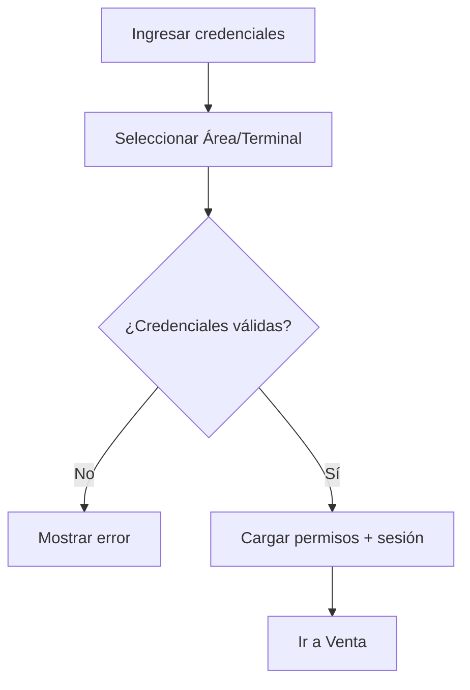
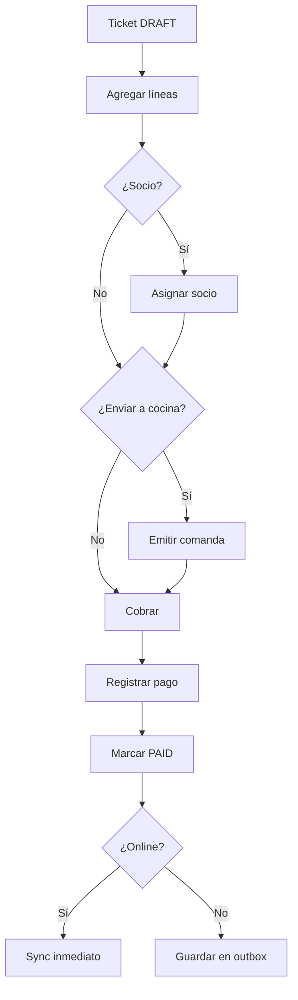
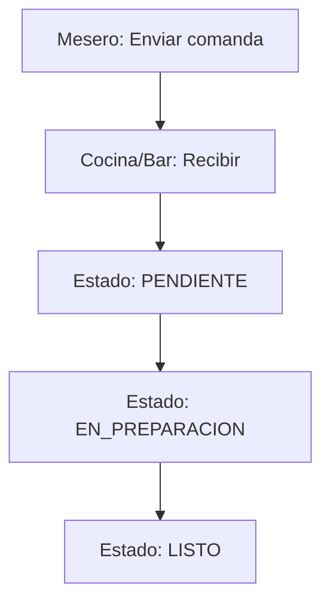
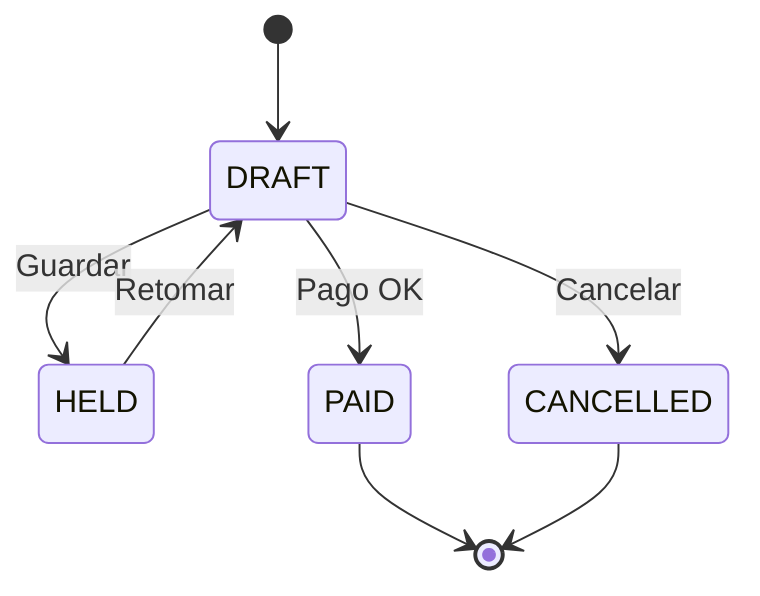
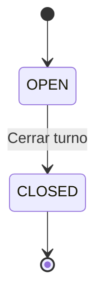
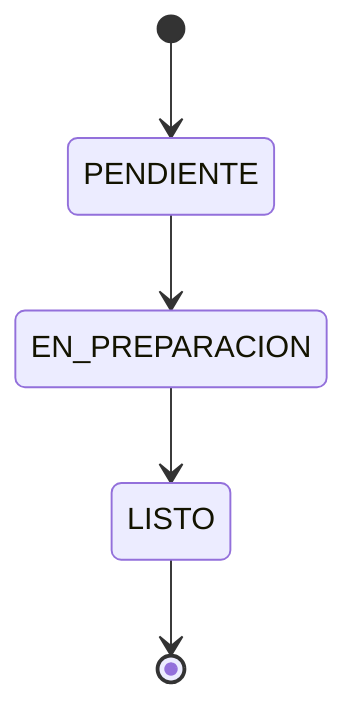
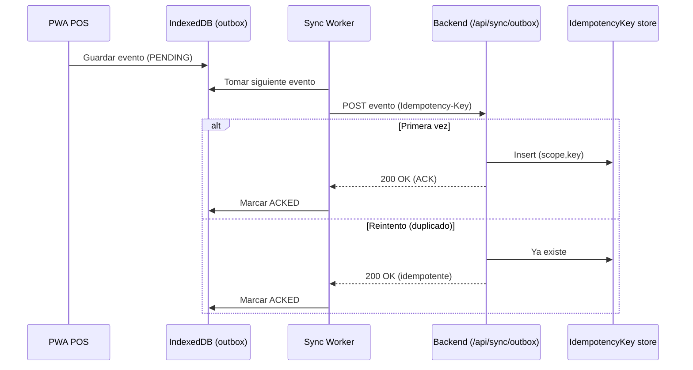

# Documentación Completa — POS Country Club Mérida

---

## Índice
1. [Fase 0 — Aterrizaje y Priorización](#fase-0)
   1.1. [1‑Pager (Resumen)](#1-pager)
   1.2. [Priorización Must / Should / Could](#must-should-could)
2. [Fase 1 — Requerimientos y Diseño Funcional](#fase-1)
   2.1. [User Stories](#user-stories)
   2.2. [Flujos y Diagramas](#flujos-y-diagramas)
   2.3. [Pantallas y Navegación](#pantallas-y-navegación)
   2.4. [Reglas de Negocio](#reglas-de-negocio)
   2.5. [State Machines y Secuencias](#state-machines-y-secuencias)
3. [Anexos](#anexos)
   3.1. [Guía para Visualizar Diagramas Mermaid](#guia-mermaid)
   3.2. [Referencia a Documentos Detallados](#referencia)

---

<a name="fase-0"></a>
## Fase 0 — Aterrizaje y Priorización

<a name="1-pager"></a>
### 1.1 1‑Pager (Resumen)

#### Objetivo (qué problema resuelve y para quién)
**Problema**
- Cobro en múltiples puntos del club (restaurante/bar/pro-shop/eventos) con necesidad de continuidad operativa aun con fallas de red.
- Trazabilidad y control (caja, cancelaciones, descuentos, cargos a socio) con auditoría.
- Base para integraciones futuras (socios, contabilidad/ERP, facturación MX).

**Para quién**
- Operación: cajeros, meseros/runner, supervisores.
- Administración: finanzas/contabilidad, almacén, TI.

#### Solución propuesta (resumen)
POS **web responsive** (tablet/PC) con adaptación a móvil vía **PWA**, enfoque **offline-first** (captura local + sincronización), y backend con **idempotencia** y **auditoría append-only**.

#### MVP (alcance mínimo)
Imprescindible para iniciar operación controlada:
- **Login + roles (RBAC)**.
- **Venta (ticket)**:
  - Alta de ticket, líneas, impuestos, totales.
  - Guardar ticket (HELD) y retomarlo.
  - Cancelación con motivo y permisos.
- **Pagos**:
  - Efectivo.
  - Tarjeta (registro de referencia/voucher/token; sin almacenar PAN/CVV).
  - Cargo a cuenta de socio (validación básica de estatus/límite).
- **Caja/turnos**:
  - Apertura y cierre (corte X/Z), retiros/depósitos.
- **Offline + sync**:
  - Persistencia local (IndexedDB) + outbox.
  - Endpoint de sync (push/pull) con idempotencia.
- **Auditoría**:
  - Registro de eventos clave (ventas, cancelaciones, cierres, movimientos de efectivo).

#### No‑MVP (se deja para después)
- CFDI / facturación electrónica.
- Integración completa con ERP/contabilidad del club.
- Inventario avanzado (kardex completo, lotes, producción, etc.).
- Promociones avanzadas (motor complejo por reglas).
- Reportería avanzada y dashboards.
- KDS completo / enrutamiento por estación (solo básico en MVP).

#### Criterios de éxito (métricas)
##### Operación
- **Tiempo de captura de ticket** (promedio): <= 30–60s para venta simple.
- **Tiempo de cobro** (desde "Cobrar" a confirmación):
  - Online: <= 2s (sin integración de pago) / <= 5s (con integración).
  - Offline: <= 1s (persistencia local).
- **Disponibilidad operativa**: el POS permite vender en modo offline durante fallas.

##### Calidad
- **Errores de sincronización**: < 0.5% de eventos con rechazo (excluye validaciones de negocio).
- **Duplicados**: 0 ventas duplicadas por reintentos (idempotencia).
- **Integridad de auditoría**: 100% de operaciones críticas generan `AuditEvent`.

##### Negocio
- **Ventas/día capturadas**: 100% de ventas registradas por terminal.
- **Diferencias de caja**: tendencia a disminuir (definir línea base con operación actual).

#### Entregables
##### Entregables Fase 0
- Este **1‑pager**.
- Lista priorizada **Must / Should / Could** (documento separado).

##### Entregables Fase 1
- User stories.
- Flujos (login, compra, caja, cargo a socio, etc.).
- Documentación de pantallas (elementos por pantalla).
- Reglas de negocio (validaciones, estados, permisos, cálculos).
- Diagramas visuales (Mermaid):
  - Flujos (activity/flow)
  - Navegación
  - Secuencias (sync/outbox)
  - State machines de procesos clave

<a name="must-should-could"></a>
### 1.2 Priorización Must / Should / Could

#### Must (imprescindible)
- Login y sesión.
- Roles/permisos (RBAC) por acción.
- Catálogo de productos/servicios (consulta/búsqueda).
- Venta (ticket):
  - Agregar/eliminar líneas.
  - Cálculo de subtotal/impuestos/total.
  - Guardar ticket (HELD) y retomarlo.
  - Cancelar ticket con motivo + permiso.
- Pagos:
  - Efectivo (cambio).
  - Tarjeta (registro voucher/referencia; sin almacenar PAN/CVV).
  - Cargo a socio (búsqueda + validación de estatus; reglas mínimas).
- Caja/turnos:
  - Apertura de turno.
  - Corte X/Z y cierre.
  - Retiros/depósitos con motivo.
- Offline-first:
  - Persistencia local (IndexedDB).
  - Cola local (outbox) y sincronización al reconectar.
  - Idempotencia en backend para evitar duplicados.
- Auditoría:
  - Eventos críticos (venta pagada, cancelación, cierre turno, movimientos efectivo, descuentos).

#### Should (debería tener pronto)
- Comandas básicas (enviar a cocina/bar + estado).
- Descuentos con autorización de supervisor (umbral configurable).
- Pagos mixtos (ej. efectivo + tarjeta).
- Reimpresión de ticket / envío por email/WhatsApp (sin CFDI).
- Reportes básicos:
  - Ventas por día/turno/terminal.
  - Métodos de pago.
  - Diferencias de caja.
- Inventario básico:
  - Decremento por venta.
  - Ajustes manuales.

#### Could (nice-to-have)
- Motor de promociones avanzado.
- Integración con terminal de pago (API) en lugar de solo registrar voucher.
- KDS completo (ruteo por estación, tiempos, métricas).
- Inventario avanzado (lotes, caducidades, conteos cíclicos).
- Integración con reservas / tee times.
- Dashboards en tiempo real.

#### Notas
- Las listas se ajustan una vez se definan reglas del club (propina, autorización de cargo a socio, políticas de cancelación).

---

<a name="fase-1"></a>
## Fase 1 — Requerimientos y Diseño Funcional

<a name="user-stories"></a>
### 2.1 User Stories

#### Autenticación y operación
- Como **cajero** quiero **iniciar sesión** para **registrar ventas en mi terminal**.
- Como **supervisor** quiero **autorizar descuentos/cancelaciones** para **controlar desviaciones y fraudes**.
- Como **admin** quiero **administrar usuarios y roles** para **controlar permisos por área**.

#### Venta
- Como **cajero** quiero **crear un ticket** para **cobrar productos/servicios**.
- Como **cajero** quiero **buscar productos** por nombre/SKU para **agregar rápidamente al ticket**.
- Como **cajero** quiero **guardar un ticket pendiente (HELD)** para **continuar después**.
- Como **cajero** quiero **cancelar un ticket** con motivo para **corregir errores**, respetando permisos.

#### Pagos
- Como **cajero** quiero **cobrar en efectivo** para **finalizar la venta con cambio correcto**.
- Como **cajero** quiero **registrar un pago con tarjeta** para **cerrar el ticket sin almacenar datos sensibles**.
- Como **cajero** quiero **cargar a cuenta de socio** para **permitir consumo a crédito**, validando estatus/reglas.

#### Caja/turnos
- Como **cajero** quiero **abrir turno** para **iniciar operaciones con fondo inicial**.
- Como **cajero** quiero **registrar movimientos de efectivo** para **controlar retiros/depósitos**.
- Como **supervisor** quiero **realizar corte X/Z** para **corte de turno y auditoría**.

#### Comandas (restaurante/bar)
- Como **mesero** quiero **enviar comanda** para **que cocina/bar reciba y prepare**.
- Como **cocina/bar** quiero **marcar estados** para **progreso visible en sala**.

#### Offline/sincronización
- Como **cajero** quiero **vender sin internet** para **continuar operando en fallas**.
- Como **sistema** quiero **sincronizar automáticamente** para **consistencia al reconectar**.

<a name="flujos-y-diagramas"></a>
### 2.2 Flujos y Diagramas

#### 2.0 Diagrama de flujos (resumen)
```mermaid
flowchart LR
  L[Login] --> V[Venta (Ticket)]
  V --> P[Pago]
  V --> C[Comandas]
  V --> X[Guardar (HELD)]
  P --> S[Sync (si online)]
  P --> O[Outbox (si offline)]
  O --> S
  V --> CJ[Caja/Turno]
  CJ --> Z[Corte Z]
```

#### 2.1 Login y selección de terminal/área
**Flujo**:
1) Ingresar credenciales.
2) Seleccionar área/terminal (si aplica).
3) Validar credenciales.
4) Cargar permisos y sesión.
5) Ir a pantalla principal (Venta).

Diagrama:


#### 2.2 Venta + pago
**Flujo**:
1) Crear ticket (estado DRAFT).
2) Agregar líneas (productos/servicios).
3) Opcional: asignar socio.
4) Opcional: enviar a cocina/bar (comanda).
5) Cobrar:
   - Efectivo: registrar pago, calcular cambio.
   - Tarjeta: registrar referencia/voucher.
   - Cargo a socio: validar socio, registrar cargo.
6) Marcar ticket PAID.
7) Si online: sincronizar inmediato.
8) Si offline: guardar en outbox para sync.

Diagrama:


#### 2.3 Caja/turnos
**Flujo**:
1) Abrir turno (fondo inicial).
2) Registrar ventas durante turno.
3) Registrar movimientos de efectivo (retiros/depósitos).
4) Opcional: corte X (parcial, sin cerrar turno).
5) Cerrar turno:
   - Capturar efectivo real.
   - Registrar diferencias.
   - Generar corte Z (final).

Diagrama:
```mermaid
flowchart TD
  A[Abrir turno] --> B[Registrar ventas]
  B --> C[Movimientos de efectivo]
  C --> D{¿Corte X?}
  D -->|Sí| E[Corte X (parcial)]
  D -->|No| F[Cerrar turno]
  E --> F
  F --> G[Capturar contado real]
  G --> H[Registrar diferencias]
  H --> I[Generar Corte Z]
```

#### 2.4 Comandas (restaurante/bar)
**Flujo**:
1) Mesero crea comanda desde ticket.
2) Cocina/bar recibe y marca PENDIENTE.
3) Cocina/bar marca EN_PREPARACIÓN.
4) Cocina/bar marca LISTO.
5) Mesero retira producto.

Diagrama:


<a name="pantallas-y-navegación"></a>
### 2.3 Pantallas y Navegación

#### 2.5 Navegación principal
```mermaid
flowchart TD
  Login --> POS
  POS --> Venta
  Venta --> Pago
  Venta --> Caja
  Venta --> Comandas
  POS --> Admin[Usuarios/Roles (opcional)]
  Pago --> Venta
  Caja --> Venta
  Comandas --> Venta
```

#### 2.6 Pantallas y elementos
- **Login**: usuario, contraseña, selección área/terminal.
- **Venta**:
  - Lista de líneas (producto, cantidad, precio, subtotal).
  - Buscador de productos.
  - Totales (subtotal, impuestos, total).
  - Botones: Guardar (HELD), Cancelar, Cobrar.
  - **Calculadora integrada**: para cálculos rápidos (descuentos, propinas, devoluciones).
- **Cobro**:
  - Métodos: Efectivo, Tarjeta, Cargo a socio.
  - Campos: monto, referencia (tarjeta), búsqueda socio.
  - Cambio calculado (efectivo).
  - **Calculadora de cambio**: muestra desglose de billetes/monedas óptimo.
- **Caja/turnos**:
  - Apertura: fondo inicial.
  - Movimientos: tipo, monto, motivo.
  - Cierre: corte X/Z, diferencias.
  - **Resumen de turno**: gráfico simple de ventas por método.
- **Comandas**:
  - Lista de comandas con estado.
  - Detalle: líneas, mesa/mesa, notas.
  - Acciones: marcar estado (cocina/bar).
  - **Temporizador**: tiempo transcurrido por comanda.
- **Reportes básicos**:
  - Filtros: fecha, turno, terminal, usuario.
  - Métricas: ventas totales, tickets promedio, métodos de pago.
  - **Exportación**: CSV/PDF simple.
- **Admin (opcional)**:
  - Usuarios: crear, editar, desactivar.
  - Roles: permisos por acción/área.
  - **Auditoría**: vista de eventos con filtros y búsqueda.
- **Configuración**:
  - Datos del club: nombre, logo, dirección.
  - Impuestos: configuración de tasas.
  - Métodos de pago: habilitar/deshabilitar.
  - **Impresora**: seleccionar y probar impresora de tickets.

<a name="reglas-de-negocio"></a>
### 2.4 Reglas de Negocio

#### 2.7 Estados y validaciones
- **Ticket**: DRAFT → HELD → PAID / CANCELLED.
- **Comanda**: PENDIENTE → EN_PREPARACION → LISTO.
- **Turno**: OPEN → CLOSED.
- **Pago**: REGISTERED → CONFIRMED (si integración) / SETTLED (efectivo).

#### 2.8 Permisos (RBAC)
- **Cajero**: crear/retomar/cancelar tickets, cobrar, abrir/cerrar turno.
- **Supervisor**: autorizar descuentos/cancelaciones, corte X/Z.
- **Admin**: gestión de usuarios/roles, configuración.

#### 2.9 Cálculos
- **Totales**: Σ(líneas.precio * cantidad) + impuestos.
- **Cambio**: efectivo_recibido - total.
- **Diferencias de caja**: contado_real - esperado.
- **Descuentos**: porcentaje o monto fijo (con autorización si > umbral).
- **Propinas**: cálculo automático (configurable %) o manual.
- **Devoluciones**: cálculo de monto a devolver con impuestos prorrateados.

#### 2.10 Offline/Sync
- Cada venta pagada genera evento con `Idempotency-Key`.
- Backend debe ser idempotente: misma key no duplica.
- En caso de rechazo por validación, devolver error y marcar evento como rechazado para intervención.

#### 2.11 Auditoría
- Registrar `AuditEvent` para:
  - venta pagada
  - venta cancelada
  - cierre turno
  - movimientos de efectivo
  - descuentos autorizados
  - cambios de estado de comanda
  - inicio/cierre de sesión
  - configuraciones modificadas
  - errores de sincronización

<a name="state-machines-y-secuencias"></a>
### 2.5 State Machines y Secuencias

#### 2.12 State machine: Venta


#### 2.13 State machine: Turno


#### 2.14 State machine: Comanda


#### 2.15 Secuencia (sync outbox)


#### 2.16 Diagrama de despliegue (simplificado)
```mermaid
flowchart LR
  subgraph Client[PWA en Tablet/Móvil/PC]
    Browser[Navegador]
    Local[IndexedDB + Service Worker]
  end
  subgraph Server[Servidor App]
    Next[Next.js (UI + API)]
    Prisma[Prisma ORM]
    DB[(SQLite local / Postgres prod)]
  end
  Browser --> Next
  Next --> Prisma --> DB
  Browser <---> Local
```

---

<a name="anexos"></a>
## Anexos

<a name="guia-mermaid"></a>
### 3.1 Guía para Visualizar Diagramas Mermaid
Ver documento: `Guia_VisualizarDiagramas_Mermaid.md`

<a name="referencia"></a>
### 3.2 Referencia a Documentos Detallados
- **Arquitectura, wireframes, endpoints y schema.prisma**: `Proyecto_POS_CountryClubMerida_Handoff.md`
- **Brief para ingeniería**: `Brief_POS_CountryClubMerida_Ingenieria.md`
- **Análisis comparativo inicial**: `Analisis_POS.txt`

---

*Fin del documento consolidado*
