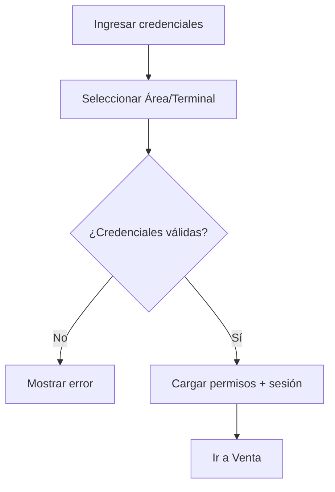
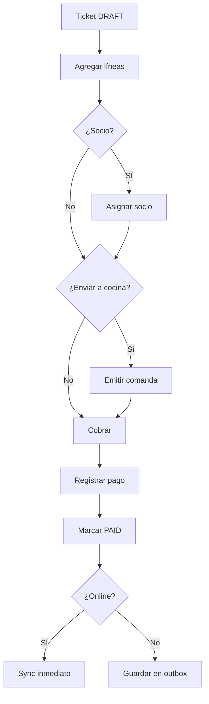
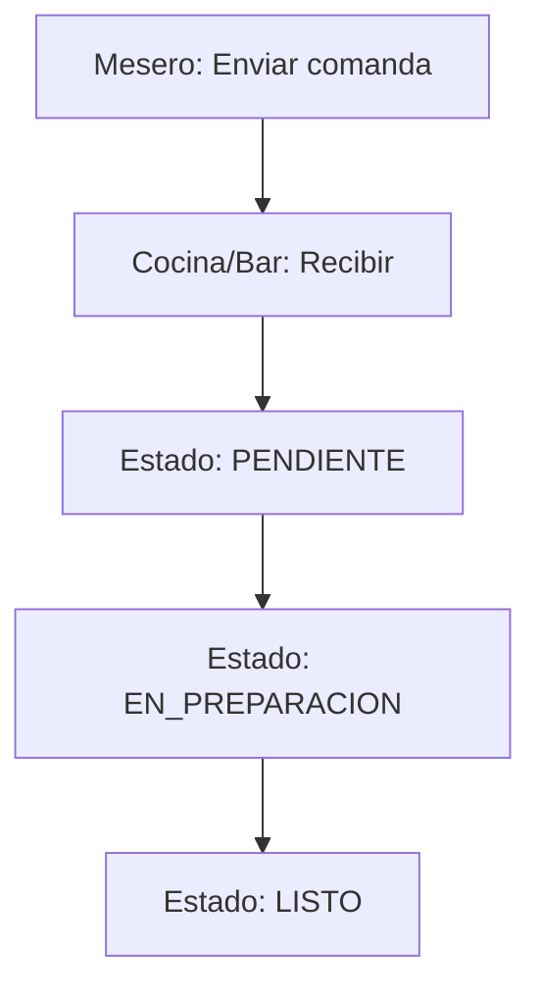
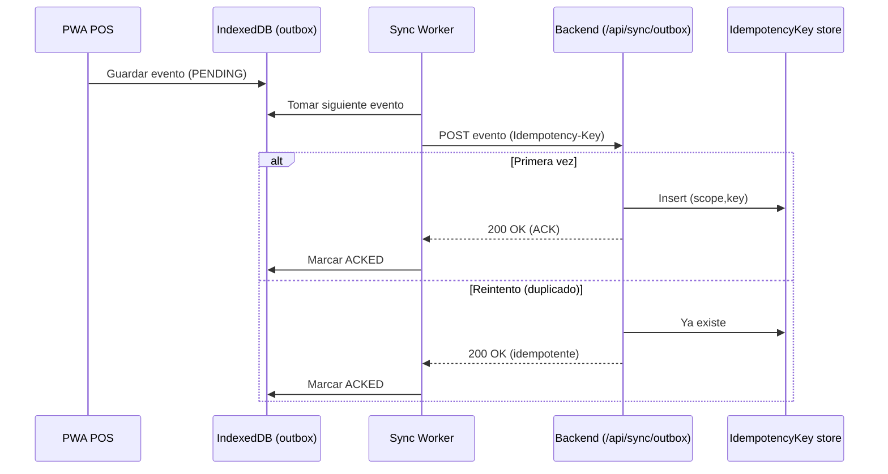
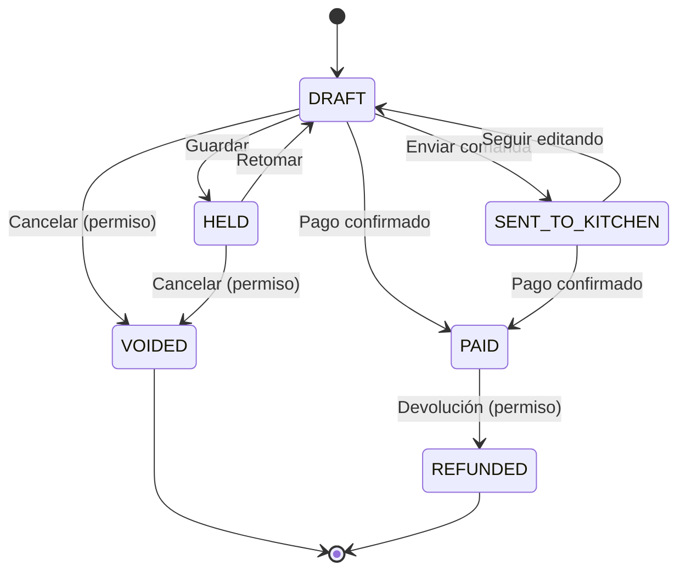
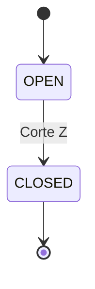
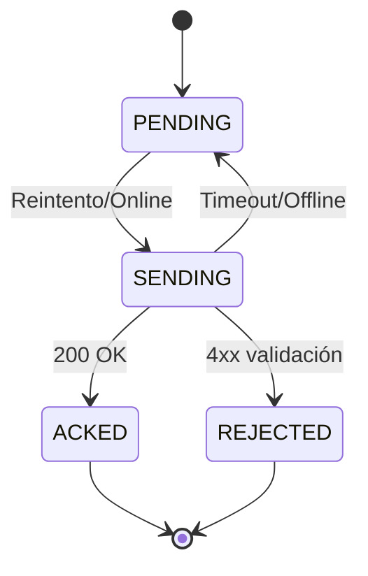

# Fase 1 — Requerimientos y Diseño Funcional — POS Country Club Mérida

## 1) User stories

### Autenticación y operación
- Como **cajero** quiero **iniciar sesión** para **registrar ventas en mi terminal**.
- Como **supervisor** quiero **autorizar descuentos/cancelaciones** para **controlar desviaciones y fraudes**.
- Como **admin** quiero **administrar usuarios y roles** para **controlar permisos por área**.

### Venta
- Como **cajero** quiero **crear un ticket** para **cobrar productos/servicios**.
- Como **cajero** quiero **buscar productos** por nombre/SKU para **agregar rápidamente al ticket**.
- Como **cajero** quiero **guardar un ticket pendiente (HELD)** para **continuar después**.
- Como **cajero** quiero **cancelar un ticket** con motivo para **corregir errores**, respetando permisos.

### Pagos
- Como **cajero** quiero **cobrar en efectivo** para **finalizar la venta con cambio correcto**.
- Como **cajero** quiero **registrar un pago con tarjeta** para **cerrar el ticket sin almacenar datos sensibles**.
- Como **cajero** quiero **cargar a cuenta de socio** para **permitir consumo a crédito**, validando estatus/reglas.

### Caja/turnos
- Como **cajero** quiero **abrir turno** con fondo inicial para **iniciar operación**.
- Como **cajero** quiero **hacer retiros/depósitos** con motivo para **resguardar efectivo**.
- Como **supervisor** quiero **cerrar turno (Corte Z)** para **conciliar efectivo/tarjeta vs esperado**.

### Comandas (F&B)
- Como **mesero** quiero **enviar comanda a cocina/bar** para **iniciar preparación**.
- Como **cocina/bar** quiero **ver comandas y cambiar estado** para **coordinar preparación**.

### Offline/Sync
- Como **cajero** quiero **seguir vendiendo sin internet** para **no detener la operación**.
- Como **sistema** quiero **sincronizar al reconectar sin duplicar ventas** para **mantener integridad**.

### Auditoría
- Como **finanzas** quiero **bitácora de operaciones críticas** para **investigar cancelaciones y diferencias de caja**.

## 2) Flujos (alto nivel)

### 2.0 Diagrama de flujos (resumen)
```mermaid
flowchart LR
  L[Login] --> V[Venta (Ticket)]
  V --> P[Pago]
  V --> C[Comandas]
  V --> X[Guardar (HELD)]
  P --> S[Sync (si online)]
  P --> O[Outbox (si offline)]
  O --> S
  V --> CJ[Caja/Turno]
  CJ --> Z[Corte Z]
```

### 2.1 Login
1) Usuario ingresa credenciales.
2) Selecciona Área y Terminal.
3) Sistema valida credenciales y carga permisos.
4) Redirige a Venta.

Diagrama:


### 2.2 Venta + Pago
1) Crear ticket (DRAFT).
2) Agregar líneas.
3) (Opcional) asignar socio.
4) (Opcional) enviar a cocina (SENT_TO_KITCHEN).
5) Cobrar.
6) Registrar pago (CASH/CARD/MEMBER_CHARGE).
7) Marcar venta como PAID.
8) Encolar evento en outbox local.
9) Si online: sync inmediato; si offline: sync diferido.

Diagrama:


### 2.3 Turno (Caja)
1) Abrir turno (fondo inicial).
2) Registrar ventas en turno.
3) Registrar movimientos de efectivo.
4) Corte X (parcial) (opcional).
5) Cierre turno / Corte Z: capturar contado real y diferencias.

Diagrama:
```mermaid
flowchart TD
  A[Abrir turno] --> B[Registrar ventas]
  B --> C[Movimientos de efectivo]
  C --> D{¿Corte X?}
  D -->|Sí| E[Corte X (parcial)]
  D -->|No| F[Cerrar turno]
  E --> F
  F --> G[Capturar contado real]
  G --> H[Registrar diferencias]
  H --> I[Generar Corte Z]
```

### 2.4 Comandas
1) Mesero envía comanda.
2) Cocina/Bar recibe y cambia estado (pendiente → preparación → listo).

Diagrama:


## 3) Pantallas y navegación

### Mapa de navegación (MVP)
- Login
- POS
  - Venta (Ticket)
  - Pago
  - Caja/Turno
  - Comandas
  - (Admin mínimo) Usuarios/Roles (opcional si no se administra por seed)

Diagrama:
```mermaid
flowchart TD
  Login --> POS
  POS --> Venta
  Venta --> Pago
  Venta --> Caja
  Venta --> Comandas
  POS --> Admin[Usuarios/Roles (opcional)]
  Pago --> Venta
  Caja --> Venta
  Comandas --> Venta
```

### 3.1 Login
**Elementos**
- Usuario
- Password
- Select Terminal
- Select Área
- Botón Ingresar

**Validaciones**
- Credenciales válidas.
- Usuario activo.

### 3.2 Venta (Ticket)
**Elementos**
- Indicador online/offline.
- Buscador de producto.
- Lista de líneas (qty, nombre, precio, modificadores).
- Totales (subtotal, impuestos, total).
- Botones: Guardar (HELD), Cobrar, Cancelar, Socio, Enviar a cocina.

**Validaciones**
- No permitir cobro si ticket sin líneas.
- Si descuento requiere autorización, bloquear acción hasta autorizar.

### 3.3 Pago
**Elementos**
- Total.
- Selector de método.
- Campos dinámicos por método.
- Confirmar.

**Validaciones**
- Efectivo: recibido >= total.
- Tarjeta: capturar referencia si se requiere.
- Cargo socio: socio activo + validación de límite/regla.

### 3.4 Caja/Turno
**Elementos**
- Estado de turno.
- Fondo inicial.
- Esperado por método.
- Botones: Retiro, Depósito, Corte X, Cerrar turno (Corte Z).

**Validaciones**
- No cerrar turno si hay ventas en estado inconsistente (definir regla: permitir si PAID aunque pendiente de sync).

### 3.5 Comandas
**Elementos**
- Lista de comandas.
- Detalle de comanda.
- Acciones de estado.

## 4) Reglas de negocio (MVP)

### 4.1 Estados
- Ticket/Venta: `DRAFT`, `HELD`, `SENT_TO_KITCHEN`, `PAID`, `VOIDED`, `REFUNDED`.
- Turno: `OPEN`, `CLOSED`.

### 4.2 Permisos (RBAC)
- Cancelación: sólo supervisor o cajero con permiso.
- Descuentos: umbral configurable; arriba del umbral requiere supervisor.
- Movimientos de efectivo: permitido a cajero; cierre turno preferente supervisor.

### 4.3 Cálculos
- Totales = sum(líneas) + impuestos.
- Impuestos por línea (`taxRate`).
- Evitar float: usar `Decimal`.

### 4.4 Offline/Sync
- Cada venta pagada genera evento con `Idempotency-Key`.
- Backend debe ser idempotente: misma key no duplica.
- En caso de rechazo por validación, devolver error y marcar evento como rechazado para intervención.

Secuencia (sync outbox):


Diagrama de despliegue (simplificado):
```mermaid
flowchart LR
  subgraph Client[PWA en Tablet/Móvil/PC]
    Browser[Navegador]
    Local[IndexedDB + Service Worker]
  end
  subgraph Server[Servidor App]
    Next[Next.js (UI + API)]
    Prisma[Prisma ORM]
    DB[(SQLite local / Postgres prod)]
  end
  Browser --> Next
  Next --> Prisma --> DB
  Browser <---> Local
```

### 4.5 Auditoría
- Registrar `AuditEvent` para:
  - venta pagada
  - venta cancelada
  - cierre turno
  - movimientos de efectivo
  - aplicación de descuento

## 5) State machines (procesos clave)

### 5.1 State machine — Venta


### 5.2 State machine — Turno


### 5.3 State machine — Sync (evento outbox)


## 6) Entregables
- Documento actual (Fase 1).
- Referencia técnica detallada: `Proyecto_POS_CountryClubMerida_Handoff.md`.
