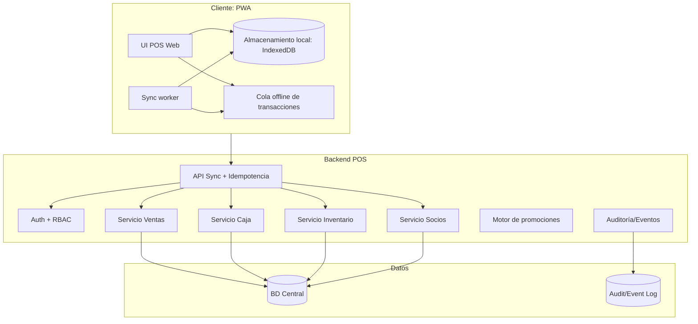
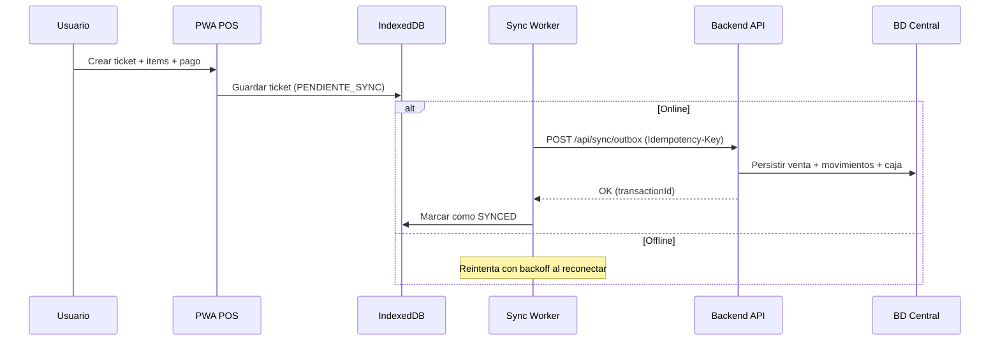
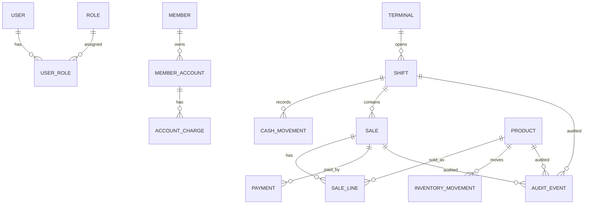
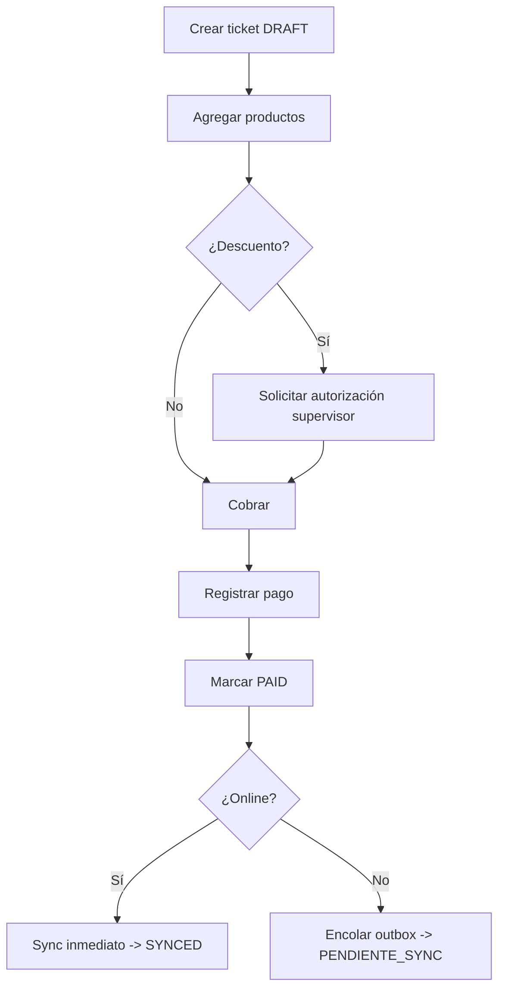
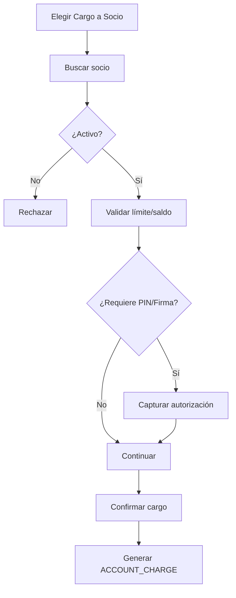
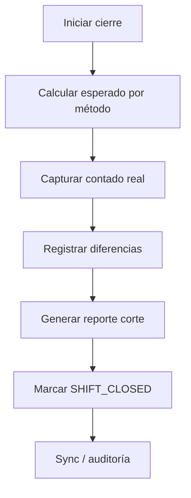

# POS Country Club Mérida — Handoff / Estado del Proyecto

## 1. Objetivo
Construir un **Punto de Venta (POS) web** para Country Club Mérida, con enfoque en:
- Operación **web responsive** (tablet/PC) y **adaptable a móvil**.
- Modo **offline** robusto con **sincronización automática** (store-and-forward).
- Integración futura con:
  - **Socios / cuenta corriente del club** (cargos a cuenta).
  - **Pagos con tarjeta** (PCI: tokenización, no almacenar PAN/CVV).
  - **Facturación electrónica (MX)**.
  - **Contabilidad / inventario / reservas** (ecosistema del club).

El diseño se inspira en:
- SoluOne Retail One + SAP B1: offline + sync + operaciones de tienda.
- Jonas Club Software: POS para clubes, móvil, cargos a cuenta, módulos integrados.

## 2. Alcance MVP (propuesto)
### Roles
- Cajero
- Mesero/Runner (móvil)
- Supervisor
- Almacén
- Admin TI/Finanzas

### Módulos MVP
- Ventas: tickets, impuestos, propina (si aplica), descuentos, cancelaciones.
- Pagos: efectivo, tarjeta (inicialmente registro/“simulado” si no hay proveedor definido), cargo a cuenta de socio.
- Pedidos (F&B): comanda y envío a cocina/bar (KDS o impresora).
- Caja: apertura, cortes X/Z, retiros, depósitos, arqueo.
- Inventario básico: decremento por venta + ajustes + conteo.
- Promociones (básico): % descuento / 2x1 / combos.
- Sincronización offline.
- Auditoría (bitácora de eventos y cambios).

## 3. Arquitectura objetivo (alto nivel)
### Principios
- **Offline-first** en clientes (PWA): datos locales + cola de eventos.
- Backend con **idempotencia**: evita duplicados al reintentar sync.
- Auditoría “append-only” (event log).

### Diagrama de contexto (C4 N1)
```mermaid
flowchart LR
  Staff[Personal (Cajero/Mesero/Supervisor)] --> POS[POS Web (PWA)]
  POS --> API[Backend POS / API]
  API --> DB[(BD Central)]
  API --> Payments[Proveedor pagos / TPV]
  API --> EInvoice[Facturación electrónica MX]
  API --> ClubCore[Sistema Club: Socios/Reservas/Contabilidad]
  POS <-->|offline sync| API
```

### Componentes (C4 N2)


### Secuencia: venta offline + sincronización


## 4. Modelo de datos (mínimo sugerido)
Entidades mínimas para soportar: ventas, caja/turnos, socios, inventario, auditoría.



## 5. Auditoría y controles
### Eventos a auditar (mínimo)
- SALE_CREATED / SALE_VOIDED / SALE_REFUNDED
- DISCOUNT_APPLIED (incluye motivo y autorizador)
- SHIFT_OPENED / SHIFT_CLOSED
- CASH_IN / CASH_OUT / SAFE_DROP / BANK_DEPOSIT
- INVENTORY_ADJUSTMENT / STOCKTAKE_POSTED
- SYNC_ENQUEUED / SYNC_SENT / SYNC_CONFLICT

### Controles
- **RBAC** por rol.
- **Aprobación de supervisor** para descuentos altos, cancelaciones tardías, ajustes de inventario.
- **Idempotencia** en sync por transacción y pago.
- **PCI**: no almacenar datos sensibles de tarjeta.
- Conciliación: corte de caja vs pagos por método.

## 6. Backlog priorizado
### P0
- Login + roles.
- Venta + cálculo de totales/impuestos.
- Pagos: efectivo + registro tarjeta.
- Apertura/cierre de turno, arqueo.
- Offline (IndexedDB) + cola + sync.
- Auditoría.

### P1
- Cargo a cuenta de socio + límites.
- Comandas a cocina/bar.
- Promociones simples.
- Inventario básico.

### P2
- CFDI (facturación electrónica MX).
- Integración con ERP/contabilidad/club core.
- Reportería avanzada.

## 7. Preguntas abiertas (para aterrizar a Country Club Mérida)
1) Áreas: restaurante/bar/pro-shop/eventos/alberca/etc.
2) Socios: ¿cargo a cuenta? ¿firma? ¿límite? ¿reglas de autorización?
3) Facturación: ¿CFDI desde POS o backoffice?
4) Tarjetas: proveedor/terminal (Stripe/Clip/BBVA/etc.) o solo registro.
5) Offline: número de terminales y frecuencia de caídas.

## 8. Stack sugerido (para prototipo web)
### Decisión (recomendada)
- **Framework**: **Next.js** (App Router) para UI + API en el mismo proyecto.
- **PWA**: `next-pwa` (o Service Worker propio) para cache de assets y soporte offline.
- **BD en prototipo local**: **SQLite**.
- **Migración a producción**: **Postgres** (misma capa ORM y mismas migraciones).
- **ORM/Migraciones**: **Prisma** (migraciones versionadas; cambia el provider SQLite→Postgres).

**Por qué esta opción**
- Un solo repo/proyecto para prototipo acelera iteración.
- PWA permite tablet/PC y móvil sin reescritura.
- SQLite simplifica el arranque local.
- Prisma facilita migraciones y posterior cambio a Postgres.

### Offline (cliente)
- **PWA + Service Worker** para:
  - Cache de UI y assets.
  - Funcionamiento “sin internet” para captura de ventas.
- **Persistencia local**: **IndexedDB** (no usar LocalStorage para transacciones).
- **Cola de sincronización**: tabla/colección local `outbox` con:
  - `id` (UUID)
  - `type` (SALE_CREATED, PAYMENT_CAPTURED, SHIFT_OPENED, etc.)
  - `payload`
  - `createdAt`
  - `attempts`
  - `nextAttemptAt`
  - `status`

### Sync (backend)
Contrato recomendado:
- `GET /sync/bootstrap` (maestros mínimos: productos, impuestos, socios “lite”, promos activas, permisos)
- `POST /sync/outbox` (empuja eventos; requiere `idempotencyKey` por evento)
- `GET /sync/ack?since=...` (confirmaciones/estado; opcional)

Reglas:
- **Idempotencia obligatoria**: cada evento se procesa una sola vez.
- **Conflictos**:
  - En MVP: “server-wins” para maestros, “append-only” para transacciones.
  - Detectar duplicados por `idempotencyKey`.

### Estrategia de migración SQLite → Postgres
- Mantener el **mismo esquema Prisma**.
- En local: `DATABASE_URL="file:./dev.db"`.
- En producción: `DATABASE_URL="postgresql://..."`.
- Migración:
  - Ejecutar `prisma migrate deploy` en el entorno de Postgres.
  - Si hay datos que mover desde SQLite (prototipo), exportar e importar con un script ETL (P2).

### Estructura de proyecto (propuesta)
```
/app
  /(pos)
    /venta
    /pago
    /caja
    /inventario
  /api
    /sync
    /auth
    /sales
    /cash
/prisma
  schema.prisma
  /migrations
/docs
  (documentación adicional)
```

### Seguridad mínima (MVP)
- **Auth**: sesión segura (cookies httpOnly) + expiración.
- **RBAC**: permisos por endpoint y por acción en UI.
- **PCI**: no almacenar tarjeta; solo token/voucher.
- **Auditoría**: `AUDIT_EVENT` append-only; capturar actor, terminal, timestamp, payload.

## 9. Prompts sugeridos para continuar con otra IA
Copia/pega según lo que necesites:

### Prompt: “Genera wireframes y flujos”
"Diseña pantallas y flujos (venta, pago, cierre de caja, cargo a socio, comanda a cocina) para un POS web PWA offline-first para Country Club Mérida. Entrega wireframes en texto y lista de componentes UI." 

### Prompt: “Diseña el esquema de BD”
"Propón esquema SQL (Postgres) para ventas, pagos, turnos, caja, socios, inventario y auditoría append-only. Incluye claves, índices, y estrategia de idempotencia para sincronización." 

### Prompt: “Diseña el protocolo de sync offline”
"Define endpoints REST para sincronización offline (pull masters, push transactions) con idempotency keys, resolución de conflictos y backoff. Incluye ejemplos JSON." 

## 10. Wireframes (texto) + Componentes UI (MVP)

### 10.1 Login
**Objetivo**: autenticar y seleccionar terminal/área.

Wireframe:
```
[Country Club Mérida POS]

 Usuario:   [__________]
 Password:  [__________]

 Terminal:  [Caja 1 v]
 Área:      [Restaurante v]

 [ Ingresar ]
```

Componentes:
- Input usuario/password
- Select terminal/área
- Botón primary

### 10.2 Venta (Ticket)
**Objetivo**: capturar productos/servicios y preparar cobro.

Wireframe:
```
 [Área: Restaurante] [Caja 1] [Usuario: Cajero]   (Online/Offline)

 Buscar producto: [______________] [Scan]

 Ticket #TEMP-001
 -------------------------------------------------
  1  Agua mineral              35.00
  2  Club sandwich             220.00
     Modificadores: Sin cebolla
  1  Cerveza                   70.00
 -------------------------------------------------
 Subtotal:                     395.00
 Impuestos:                     63.20
 Total:                        458.20

 [ Descuento ] [ Socio ] [ Enviar a cocina ]
 [ Cobrar ]    [ Guardar ] [ Cancelar ticket ]
```

Componentes:
- Barra de estado Online/Offline
- Buscador + lector código barras
- Lista de líneas con qty y modificadores
- Totales sticky
- Acciones rápidas

### 10.3 Pago
**Objetivo**: cerrar ticket con efectivo/tarjeta/cargo socio (o mixto).

Wireframe:
```
 Ticket #TEMP-001
 Total: 458.20

 Método:
 ( ) Efectivo
 ( ) Tarjeta
 ( ) Cargo a socio

 Si Efectivo:
  Recibido: [_____]   Cambio: 0.00

 Si Tarjeta:
  Referencia/Voucher: [________]

 Si Cargo socio:
  Socio: [Buscar...]  Cuenta: [Principal v]
  Autorización: [PIN/Firma] (según regla)

 [ Confirmar pago ]  [ Volver ]
```

Componentes:
- Selector de método
- Form dinámico por método
- Validaciones (montos, límites, autorización)

### 10.4 Caja (Turno)
**Objetivo**: apertura/corte/retiros/depósitos.

Wireframe:
```
 Turno actual: ABIERTO  (desde 09:00)
 Fondo inicial: 2,000.00

 Ventas:  12     Total: 9,830.00
 Efectivo esperado: 3,120.00
 Tarjeta esperado:  6,710.00

 [ Retiro ] [ Depósito ] [ Corte X ] [ Cerrar turno (Corte Z) ]
```

### 10.5 Comandas (Cocina/Bar)
**Objetivo**: enviar y monitorear preparación.

Wireframe:
```
 Comandas pendientes
 - Mesa 12  (2 items)  12:10  [Ver]
 - Mesa 05  (4 items)  12:12  [Ver]

 Detalle Comanda #K-1021
  1 Club sandwich (Sin cebolla)
  2 Cerveza

 [ Marcar en preparación ] [ Listo ]
```

## 11. Flujos clave (con estados)

### 11.1 Estados de Ticket/Venta
- `DRAFT`: capturando líneas.
- `HELD`: guardado sin cobrar (pendiente).
- `SENT_TO_KITCHEN`: comanda emitida.
- `PAID`: pagado (puede estar `PENDIENTE_SYNC`).
- `VOIDED`: cancelado (con autorización y motivo).
- `REFUNDED`: devolución (si aplica).

### 11.2 Flujo: Venta rápida (mostrador)


### 11.3 Flujo: Cargo a socio
Reglas a parametrizar:
- Validar socio activo.
- Validar límite y saldo.
- Requerir autorización (PIN/firma) si aplica.



### 11.4 Flujo: Cierre de turno (Corte Z)


## 12. Modelo de datos (campos sugeridos para implementación)
Nota: es un borrador orientado a Prisma. Se puede simplificar para el primer prototipo.

### 12.1 Venta
- `Sale`
  - `id` (UUID)
  - `folio` (string, único por terminal/serie)
  - `status` (enum: DRAFT, HELD, PAID, VOIDED, REFUNDED)
  - `areaId`, `terminalId`, `shiftId`
  - `memberId` (nullable)
  - `subtotal`, `tax`, `total` (decimal)
  - `createdAt`, `updatedAt`

- `SaleLine`
  - `id`, `saleId`
  - `productId`
  - `qty` (decimal)
  - `unitPrice` (decimal)
  - `taxRate` (decimal)
  - `lineTotal` (decimal)
  - `notes/modifiers` (json/text)

- `Payment`
  - `id`, `saleId`
  - `method` (enum: CASH, CARD, MEMBER_CHARGE)
  - `amount` (decimal)
  - `reference` (voucher/token)
  - `capturedAt`

### 12.2 Caja/Turno
- `Shift`
  - `id`, `terminalId`
  - `openedByUserId`, `closedByUserId` (nullable)
  - `openedAt`, `closedAt` (nullable)
  - `openingFloat` (decimal)
  - `status` (OPEN, CLOSED)

- `CashMovement`
  - `id`, `shiftId`
  - `type` (CASH_IN, CASH_OUT, SAFE_DROP, BANK_DEPOSIT)
  - `amount`
  - `reason`
  - `createdByUserId`
  - `createdAt`

### 12.3 Socios
- `Member`
  - `id`, `memberNo`, `name`
  - `status` (ACTIVE, INACTIVE)

- `MemberAccount`
  - `id`, `memberId`
  - `name` (Principal, Familia, etc.)
  - `creditLimit` (decimal)
  - `balance` (decimal, opcional si se calcula)

- `AccountCharge`
  - `id`, `memberAccountId`
  - `saleId`
  - `amount`
  - `authorizedBy` (usuario o método)
  - `createdAt`

### 12.4 Auditoría (append-only)
- `AuditEvent`
  - `id`
  - `at`
  - `actorUserId`
  - `terminalId` (nullable)
  - `entityType`, `entityId`
  - `action`
  - `payloadJson`
  - `prevHash`, `hash`

## 13. Endpoints REST (borrador)

### 13.1 Sync bootstrap (pull)
`GET /api/sync/bootstrap?since=2026-01-01T00:00:00Z`

Respuesta (ejemplo):
```json
{
  "serverTime": "2026-02-17T18:00:00Z",
  "products": [{"id":"p1","sku":"AGUA","name":"Agua mineral","price":35.0,"taxRate":0.16}],
  "members": [{"id":"m1","memberNo":"001234","name":"SOCIO EJEMPLO","status":"ACTIVE"}],
  "promotions": [],
  "permissions": {"canVoid": true, "maxDiscountPct": 10}
}
```

### 13.2 Sync outbox (push)
`POST /api/sync/outbox`

Headers:
- `Idempotency-Key: <uuid>`

Body (ejemplo):
```json
{
  "events": [
    {
      "id": "evt-1",
      "type": "SALE_PAID",
      "occurredAt": "2026-02-17T17:59:00Z",
      "terminalId": "t1",
      "payload": {
        "sale": {"id":"s1","folio":"C1-000123","total":458.2},
        "lines": [{"productId":"p1","qty":1,"unitPrice":35.0}],
        "payments": [{"method":"CASH","amount":458.2}]
      }
    }
  ]
}
```

Respuesta (ejemplo):
```json
{
  "accepted": [{"eventId":"evt-1","status":"OK"}],
  "rejected": []
}
```

## 14. Borrador `schema.prisma` (MVP)
Este esquema está pensado para:
- **Prototipo local** con SQLite.
- Migración a **Postgres** cambiando el provider y `DATABASE_URL`.

```prisma
generator client {
  provider = "prisma-client-js"
}

datasource db {
  provider = "sqlite" // cambiar a "postgresql" al migrar
  url      = env("DATABASE_URL")
}

enum RoleName {
  CASHIER
  WAITER
  SUPERVISOR
  WAREHOUSE
  ADMIN
}

enum SaleStatus {
  DRAFT
  HELD
  SENT_TO_KITCHEN
  PAID
  VOIDED
  REFUNDED
}

enum PaymentMethod {
  CASH
  CARD
  MEMBER_CHARGE
}

enum ShiftStatus {
  OPEN
  CLOSED
}

enum CashMovementType {
  CASH_IN
  CASH_OUT
  SAFE_DROP
  BANK_DEPOSIT
}

model User {
  id           String     @id @default(uuid())
  username     String     @unique
  passwordHash String
  active       Boolean    @default(true)
  createdAt    DateTime   @default(now())
  updatedAt    DateTime   @updatedAt

  roles        UserRole[]
  openedShifts Shift[]    @relation("ShiftOpenedBy")
  closedShifts Shift[]    @relation("ShiftClosedBy")
  cashMoves    CashMovement[]
  auditEvents  AuditEvent[]
}

model Role {
  id   String   @id @default(uuid())
  name RoleName @unique

  users UserRole[]
}

model UserRole {
  userId String
  roleId String

  user User @relation(fields: [userId], references: [id])
  role Role @relation(fields: [roleId], references: [id])

  @@id([userId, roleId])
}

model Area {
  id        String   @id @default(uuid())
  code      String   @unique
  name      String
  active    Boolean  @default(true)
  createdAt DateTime @default(now())
  updatedAt DateTime @updatedAt

  terminals Terminal[]
  sales     Sale[]
}

model Terminal {
  id        String   @id @default(uuid())
  code      String   @unique
  name      String
  active    Boolean  @default(true)
  createdAt DateTime @default(now())
  updatedAt DateTime @updatedAt

  areaId String
  area   Area @relation(fields: [areaId], references: [id])

  shifts     Shift[]
  sales      Sale[]
  auditEvents AuditEvent[]

  @@index([areaId])
}

model Product {
  id        String   @id @default(uuid())
  sku       String   @unique
  name      String
  price     Decimal
  taxRate   Decimal  @default(0)
  active    Boolean  @default(true)
  createdAt DateTime @default(now())
  updatedAt DateTime @updatedAt

  saleLines SaleLine[]
}

model Member {
  id        String   @id @default(uuid())
  memberNo  String   @unique
  name      String
  status    String   @default("ACTIVE")
  createdAt DateTime @default(now())
  updatedAt DateTime @updatedAt

  accounts MemberAccount[]
  sales    Sale[]
}

model MemberAccount {
  id          String   @id @default(uuid())
  memberId    String
  name        String
  creditLimit Decimal  @default(0)
  createdAt   DateTime @default(now())
  updatedAt   DateTime @updatedAt

  member  Member @relation(fields: [memberId], references: [id])
  charges AccountCharge[]

  @@index([memberId])
  @@unique([memberId, name])
}

model Sale {
  id         String     @id @default(uuid())
  folio      String
  status     SaleStatus @default(DRAFT)

  subtotal   Decimal    @default(0)
  tax        Decimal    @default(0)
  total      Decimal    @default(0)

  createdAt  DateTime   @default(now())
  updatedAt  DateTime   @updatedAt

  areaId     String
  terminalId String

  shiftId    String?
  memberId   String?

  area     Area     @relation(fields: [areaId], references: [id])
  terminal Terminal @relation(fields: [terminalId], references: [id])
  shift    Shift?   @relation(fields: [shiftId], references: [id])
  member   Member?  @relation(fields: [memberId], references: [id])

  lines     SaleLine[]
  payments  Payment[]
  charges   AccountCharge[]
  audit     AuditEvent[]

  @@unique([terminalId, folio])
  @@index([createdAt])
  @@index([status])
  @@index([shiftId])
  @@index([memberId])
  @@index([areaId])
}

model SaleLine {
  id        String  @id @default(uuid())
  saleId    String
  productId String

  qty       Decimal
  unitPrice Decimal
  taxRate   Decimal @default(0)
  lineTotal Decimal

  modifiers Json?

  sale    Sale    @relation(fields: [saleId], references: [id], onDelete: Cascade)
  product Product @relation(fields: [productId], references: [id])

  @@index([saleId])
  @@index([productId])
}

model Payment {
  id        String        @id @default(uuid())
  saleId    String
  method    PaymentMethod
  amount    Decimal
  reference String?
  capturedAt DateTime?
  createdAt DateTime      @default(now())

  sale Sale @relation(fields: [saleId], references: [id], onDelete: Cascade)

  @@index([saleId])
  @@index([method])
}

model Shift {
  id           String      @id @default(uuid())
  terminalId   String
  status       ShiftStatus @default(OPEN)
  openingFloat Decimal     @default(0)
  openedAt     DateTime    @default(now())
  closedAt     DateTime?

  openedByUserId String
  closedByUserId String?

  terminal Terminal @relation(fields: [terminalId], references: [id])
  openedBy User     @relation("ShiftOpenedBy", fields: [openedByUserId], references: [id])
  closedBy User?    @relation("ShiftClosedBy", fields: [closedByUserId], references: [id])

  sales      Sale[]
  movements  CashMovement[]
  audit      AuditEvent[]

  @@index([terminalId])
  @@index([status])
  @@index([openedAt])
}

model CashMovement {
  id        String           @id @default(uuid())
  shiftId   String
  type      CashMovementType
  amount    Decimal
  reason    String?
  createdAt DateTime         @default(now())

  createdByUserId String
  createdBy User @relation(fields: [createdByUserId], references: [id])
  shift     Shift @relation(fields: [shiftId], references: [id], onDelete: Cascade)

  @@index([shiftId])
  @@index([type])
  @@index([createdAt])
}

model AccountCharge {
  id              String   @id @default(uuid())
  memberAccountId String
  saleId          String
  amount          Decimal
  authorizedBy    String?
  createdAt       DateTime @default(now())

  memberAccount MemberAccount @relation(fields: [memberAccountId], references: [id])
  sale          Sale          @relation(fields: [saleId], references: [id], onDelete: Cascade)

  @@index([memberAccountId])
  @@unique([saleId])
}

model AuditEvent {
  id          String   @id @default(uuid())
  at          DateTime @default(now())
  action      String
  entityType  String
  entityId    String
  payloadJson Json

  actorUserId String
  actor       User     @relation(fields: [actorUserId], references: [id])

  terminalId  String?
  terminal    Terminal? @relation(fields: [terminalId], references: [id])

  prevHash    String?
  hash        String

  @@index([at])
  @@index([entityType, entityId])
  @@index([actorUserId])
  @@index([terminalId])
}

model IdempotencyKey {
  id        String   @id @default(uuid())
  key       String
  scope     String
  createdAt DateTime @default(now())

  @@unique([scope, key])
  @@index([createdAt])
}
```

Notas:
- En Postgres, los `Decimal` funcionan perfecto; en SQLite también para prototipo.
- `IdempotencyKey` se usa para deduplicar eventos del sync (`scope` puede ser `sync/outbox`, `payments`, etc.).

## 15. Runbook: arranque local (prototipo) y migración

### 15.1 Requisitos locales
- Node.js LTS.
- NPM (o PNPM/Yarn).

### 15.2 Inicialización del proyecto (Next.js + Prisma + SQLite)
Objetivo: tener el POS corriendo local con BD SQLite y migraciones.

Pasos (alto nivel):
1) Crear app Next.js.
2) Instalar Prisma.
3) Configurar `DATABASE_URL` a SQLite.
4) Pegar el esquema (sección 14) en `prisma/schema.prisma`.
5) Ejecutar migración inicial.
6) Correr seeds mínimos.
7) Iniciar servidor.

`.env` (ejemplo local):
```
DATABASE_URL="file:./dev.db"
```

Comandos típicos (referencia):
```
npm i
npm run dev

npx prisma generate
npx prisma migrate dev --name init
npx prisma db seed
```

### 15.3 Seeds mínimos (para demo)
Para poder usar el prototipo desde el día 1, se recomienda sembrar:
- Roles (`CASHIER`, `SUPERVISOR`, `ADMIN`).
- 1 usuario admin + 1 cajero.
- 1 área (Restaurante) + 1 terminal (Caja 1).
- Catálogo básico de productos.
- 1 socio + 1 cuenta.

Checklist de datos demo:
- Un producto con impuesto 0%.
- Un producto con impuesto 16%.
- Un socio ACTIVO y uno INACTIVO para probar reglas.

### 15.4 Checklist funcional (MVP) para validar que “ya sirve”
- Login exitoso.
- Crear ticket, agregar líneas, calcular totales.
- Cobrar en efectivo.
- Cobrar con “tarjeta registrada” (solo referencia/voucher).
- Guardar ticket HELD y retomarlo.
- Apertura de turno y cierre (corte).
- Generación de 1 evento de auditoría por operación clave.

### 15.5 Migración a Postgres (cuando el prototipo madure)
Objetivo: pasar de SQLite local a Postgres sin perder control del esquema.

1) Cambiar datasource en `schema.prisma`:
```prisma
datasource db {
  provider = "postgresql"
  url      = env("DATABASE_URL")
}
```

2) Configurar `DATABASE_URL` a Postgres.

3) Desplegar migraciones:
```
npx prisma migrate deploy
```

4) Seeds en entorno de staging (roles/usuario inicial/área/terminal).

Nota de datos:
- Si necesitas mover ventas históricas desde SQLite (solo si el prototipo se usó en operación real), se sugiere un ETL (P2) y validación con conciliación.

## 16. Notas de portabilidad y decisiones técnicas

### 16.1 `Decimal` y totales
- En POS es crítico evitar errores de coma flotante.
- Guardar importes como `Decimal` (Prisma) o alternativamente como enteros “centavos” (no aplicado en este MVP).

### 16.2 `Json` en SQLite/Postgres
- Prisma soporta `Json` en ambos; en SQLite se serializa.
- Usar `Json` para `SaleLine.modifiers` y `AuditEvent.payloadJson`.

### 16.3 Hashing en auditoría (append-only)
Recomendación:
- `hash = sha256(prevHash + canonicalJson(payload) + at + actorUserId + action + entityType + entityId)`
- Guardar `prevHash` para encadenar y detectar alteraciones.

### 16.4 Idempotencia
- Persistir `IdempotencyKey` por request/evento aceptado.
- En el backend, rechazar/aceptar como OK si la key ya existe (misma respuesta) para tolerar reintentos offline.
