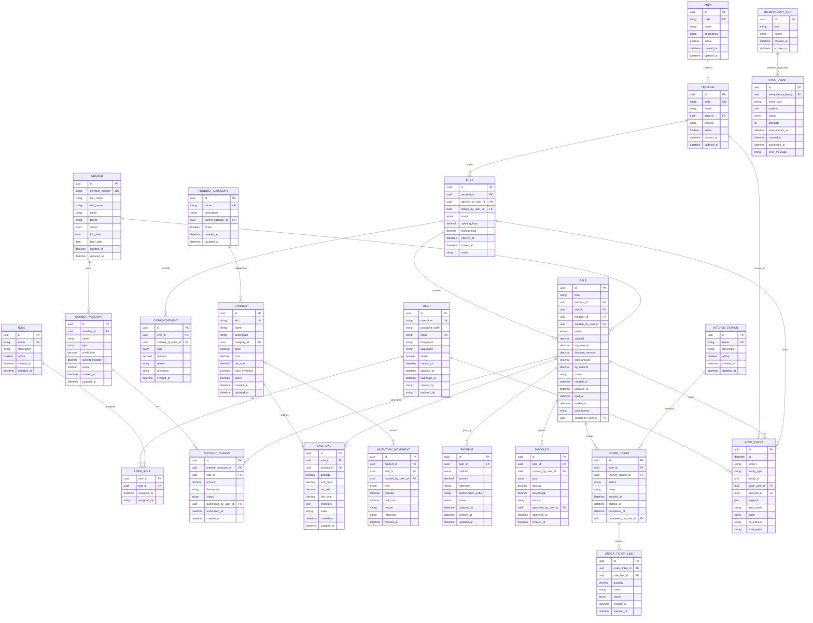

# ERD - Country Club POS

## Diagrama de Entidades-Relaciones

## Estados Definidos

### Estados de Venta (Sale.status)
- `DRAFT` - En creación
- `HELD` - Guardado temporalmente
- `SENT_TO_KITCHEN` - Enviado a cocina
- `PAID` - Pagado
- `VOIDED` - Cancelado
- `REFUNDED` - Devuelto

### Estados de Pago (Payment.status)
- `PENDING` - Pendiente de captura
- `CAPTURED` - Capturado exitosamente
- `FAILED` - Falló la captura
- `REFUNDED` - Devuelto

### Estados de Turno (Shift.status)
- `OPEN` - Abierto
- `CLOSED` - Cerrado

### Estados de Socio (Member.status)
- `ACTIVE` - Activo
- `INACTIVE` - Inactivo
- `SUSPENDED` - Suspendido

### Tipos de Movimiento de Efectivo (CashMovement.type)
- `CASH_IN` - Entrada de efectivo
- `CASH_OUT` - Salida de efectivo
- `SAFE_DROP` - Depósito en caja fuerte
- `BANK_DEPOSIT` - Depósito bancario

### Métodos de Pago (Payment.method)
- `CASH` - Efectivo
- `CARD` - Tarjeta
- `MEMBER_CHARGE` - Cargo a socio
- `MIXED` - Mixto

## Convenciones de Nomenclatura

### Tablas
- Nombres en plural y mayúsculas: `USERS`, `SALES`, `PRODUCTS`
- Separación con guion bajo: `CASH_MOVEMENTS`, `ORDER_TICKETS`

### Campos
- `id` como UUID primary key
- Foreign keys: `table_name_id` (ej: `user_id`, `sale_id`)
- Timestamps: `created_at`, `updated_at`
- Booleanos: prefijo `is_` o `has_` (ej: `is_active`, `has_inventory`)
- Enums: nombre descriptivo en minúsculas

### Índices
- Primary key en todas las tablas
- Foreign keys indexados
- Campos de búsqueda frecuentes indexados
- Timestamps para consultas por rango de fechas

## Relaciones Principales

1. **Usuario ↔ Rol**: Muchos a muchos através de `USER_ROLE`
2. **Terminal ↔ Turno**: Uno a muchos
3. **Turno ↔ Venta**: Uno a muchos
4. **Venta ↔ Líneas de Venta**: Uno a muchos
5. **Venta ↔ Pagos**: Uno a muchos
6. **Socio ↔ Cuentas**: Uno a muchos
7. **Producto ↔ Movimientos de Inventario**: Uno a muchos
8. **Venta ↔ Eventos de Auditoría**: Uno a muchos

## Campos Críticos de Auditoría

- **Timestamps**: `created_at`, `updated_at` en todas las tablas
- **Soft Delete**: Campo `deleted_at` en tablas principales (no mostrado en ERD para simplicidad)
- **Audit Trail**: Tabla `AUDIT_EVENT` con hash encadenado
- **User Tracking**: `created_by`, `updated_by` en tablas críticas
- **Idempotency**: `IDEMPOTENCY_KEY` para sincronización offline
