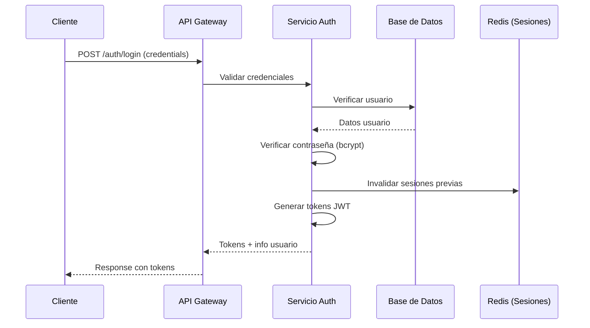

# Plan de Seguridad - Country Club POS

## 1. Resumen Ejecutivo

Este documento establece el plan de seguridad integral para el sistema de Punto de Venta (POS) del Country Club Mérida, cubriendo aspectos de autenticación, autorización, protección de datos, monitoreo y respuesta a incidentes.

### 1.1 Objetivos de Seguridad
- **Confidencialidad**: Proteger datos sensibles de socios y transacciones
- **Integridad**: Asegurar que los datos no sean modificados sin autorización
- **Disponibilidad**: Garantizar acceso continuo al sistema durante operaciones críticas
- **Trazabilidad**: Mantener registros auditables de todas las operaciones

### 1.2 Alcance
- Aplicación web POS (frontend y backend)
- Base de datos transaccional
- APIs de sincronización offline
- Sistema de autenticación y autorización
- Logs y auditoría
- Infraestructura de despliegue

## 2. Autenticación y Gestión de Identidad

### 2.1 Políticas de Contraseñas
```typescript
interface PasswordPolicy {
  minLength: 8;
  maxLength: 128;
  requireUppercase: true;
  requireLowercase: true;
  requireNumbers: true;
  requireSpecialChars: true;
  preventCommonPasswords: true;
  preventUserInfo: true; // No usar nombre, usuario, etc.
  maxAge: 90; // días
  historyCount: 5; // No repetir últimas 5 contraseñas
  lockoutThreshold: 5; // Intentos fallidos
  lockoutDuration: 15; // minutos
}
```

### 2.2 Implementación de JWT
```typescript
// Configuración de tokens
interface JWTConfig {
  accessToken: {
    secret: process.env.JWT_ACCESS_SECRET;
    expiresIn: '15m';
    algorithm: 'HS256';
  };
  refreshToken: {
    secret: process.env.JWT_REFRESH_SECRET;
    expiresIn: '7d';
    algorithm: 'HS256';
  };
  issuer: 'countryclub-pos';
  audience: 'countryclub-users';
}
```

### 2.3 Flujo de Autenticación Seguro


### 2.4 Gestión de Sesiones
```typescript
class SessionManager {
  // Almacenamiento seguro de refresh tokens
  async storeRefreshToken(userId: string, token: string, deviceInfo: DeviceInfo) {
    const hashedToken = await bcrypt.hash(token, 12);
    await redis.setex(
      `refresh:${userId}:${hashedToken}`, 
      7 * 24 * 60 * 60, // 7 días
      JSON.stringify({
        deviceInfo,
        createdAt: new Date(),
        lastUsed: new Date()
      })
    );
  }
  
  // Revocación de todas las sesiones
  async revokeAllSessions(userId: string) {
    const pattern = `refresh:${userId}:*`;
    const keys = await redis.keys(pattern);
    if (keys.length > 0) {
      await redis.del(...keys);
    }
  }
  
  // Detección de sesiones anómalas
  async detectAnomalousSession(userId: string, currentDeviceInfo: DeviceInfo) {
    const sessions = await this.getUserSessions(userId);
    const knownDevices = sessions.map(s => s.deviceInfo.fingerprint);
    
    if (!knownDevices.includes(currentDeviceInfo.fingerprint)) {
      // Nueva sesión desde dispositivo desconocido
      await this.notifyNewDeviceLogin(userId, currentDeviceInfo);
      return { suspicious: true, newDevice: true };
    }
    
    return { suspicious: false, newDevice: false };
  }
}
```

## 3. Autorización y Control de Acceso

### 3.1 RBAC (Role-Based Access Control)
```typescript
// Definición de permisos granulares
interface Permission {
  resource: string;    // sales, payments, users
  action: string;      // create, read, update, delete
  scope?: string;      // own, department, all
  conditions?: {       // Condiciones dinámicas
    timeRestriction?: TimeRange;
    amountLimit?: number;
    requiresApproval?: boolean;
  };
}

// Ejemplo de permiso complejo
const supervisorVoidPermission: Permission = {
  resource: 'sales',
  action: 'void',
  scope: 'department',
  conditions: {
    timeRestriction: { max: 72, unit: 'hours' },
    amountLimit: 50000,
    requiresApproval: true
  }
};
```

### 3.2 Middleware de Autorización
```typescript
class AuthorizationMiddleware {
  static requirePermission(permission: Permission) {
    return async (req: Request, res: Response, next: NextFunction) => {
      const user = req.user;
      const userPermissions = await this.getUserPermissions(user.id);
      
      // Verificar permiso base
      if (!this.hasPermission(userPermissions, permission)) {
        await this.logAccessDenied(user, permission, req);
        return res.status(403).json({
          success: false,
          error: {
            code: 'FORBIDDEN',
            message: 'Insufficient permissions'
          }
        });
      }
      
      // Verificar condiciones dinámicas
      if (permission.conditions) {
        const conditionResult = await this.evaluateConditions(
          permission.conditions, 
          user, 
          req
        );
        
        if (!conditionResult.allowed) {
          return res.status(403).json({
            success: false,
            error: {
              code: 'CONDITION_NOT_MET',
              message: conditionResult.reason
            }
          });
        }
      }
      
      next();
    };
  }
}
```

### 3.3 Atributo-Based Access Control (ABAC)
```typescript
// Políticas basadas en atributos
interface AccessPolicy {
  name: string;
  target: {
    resource: string;
    action: string;
  };
  condition: string; // Expresión lógica
  effect: 'permit' | 'deny';
}

// Ejemplo de política ABAC
const highValueTransactionPolicy: AccessPolicy = {
  name: 'High Value Transaction Approval',
  target: {
    resource: 'payments',
    action: 'create'
  },
  condition: `
    user.role in ['SUPERVISOR', 'ADMIN'] OR 
    (transaction.amount < 10000 AND user.role = 'CASHIER')
  `,
  effect: 'permit'
};
```

## 4. Protección de Datos

### 4.1 Clasificación de Datos
```typescript
enum DataClassification {
  PUBLIC = 'PUBLIC',           // Catálogo de productos públicos
  INTERNAL = 'INTERNAL',       // Información operativa interna
  CONFIDENTIAL = 'CONFIDENTIAL', // Datos de socios
  RESTRICTED = 'RESTRICTED'      // Información financiera sensible
}

const dataClassificationRules = {
  // Datos personales de socios
  'members.*': DataClassification.CONFIDENTIAL,
  'members.*.email': DataClassification.CONFIDENTIAL,
  'members.*.phone': DataClassification.CONFIDENTIAL,
  
  // Información financiera
  'sales.*': DataClassification.RESTRICTED,
  'payments.*': DataClassification.RESTRICTED,
  'members.*.accounts': DataClassification.RESTRICTED,
  
  // Datos operativos
  'shifts.*': DataClassification.INTERNAL,
  'terminals.*': DataClassification.INTERNAL,
  'users.*': DataClassification.INTERNAL,
  
  // Datos públicos
  'products.*': DataClassification.PUBLIC,
  'areas.*': DataClassification.PUBLIC
};
```

### 4.2 Encriptación
```typescript
// Configuración de encriptación
const encryptionConfig = {
  // Datos en tránsito
  tls: {
    version: 'TLSv1.3',
    ciphers: [
      'TLS_AES_256_GCM_SHA384',
      'TLS_CHACHA20_POLY1305_SHA256'
    ],
    minVersion: 'TLSv1.2'
  },
  
  // Datos en reposo
  atRest: {
    database: 'AES-256-GCM',
    files: 'AES-256-GCM',
    backups: 'AES-256-GCM'
  },
  
  // Campos sensibles específicos
  fieldLevel: {
    creditCards: 'AES-256-GCM',
    passwords: 'bcrypt (cost 12)',
    personalData: 'AES-256-GCM'
  }
};

// Implementación de encriptación de campo
class FieldEncryption {
  private static readonly algorithm = 'aes-256-gcm';
  private static readonly keyLength = 32;
  
  static encrypt(plaintext: string, key: Buffer): EncryptedData {
    const iv = crypto.randomBytes(16);
    const cipher = crypto.createCipher(this.algorithm, key);
    cipher.setAAD(Buffer.from('countryclub-pos'));
    
    let encrypted = cipher.update(plaintext, 'utf8', 'hex');
    encrypted += cipher.final('hex');
    
    const authTag = cipher.getAuthTag();
    
    return {
      encrypted,
      iv: iv.toString('hex'),
      authTag: authTag.toString('hex')
    };
  }
  
  static decrypt(encryptedData: EncryptedData, key: Buffer): string {
    const decipher = crypto.createDecipher(this.algorithm, key);
    decipher.setAAD(Buffer.from('countryclub-pos'));
    decipher.setAuthTag(Buffer.from(encryptedData.authTag, 'hex'));
    
    let decrypted = decipher.update(encryptedData.encrypted, 'hex', 'utf8');
    decrypted += decipher.final('utf8');
    
    return decrypted;
  }
}
```

### 4.3 Máscara de Datos
```typescript
class DataMasking {
  static maskEmail(email: string): string {
    const [username, domain] = email.split('@');
    const maskedUsername = username.substring(0, 2) + '*'.repeat(username.length - 2);
    return `${maskedUsername}@${domain}`;
  }
  
  static maskPhone(phone: string): string {
    return phone.replace(/(\d{3})\d{4}(\d{3})/, '$1****$2');
  }
  
  static maskCardNumber(cardNumber: string): string {
    return cardNumber.replace(/\d(?=\d{4})/g, '*');
  }
  
  static maskSensitiveData(data: any, userRole: string): any {
    if (userRole === 'ADMIN') return data;
    
    const masked = { ...data };
    
    if (userRole === 'SUPERVISOR') {
      if (masked.email) masked.email = this.maskEmail(masked.email);
      if (masked.phone) masked.phone = this.maskPhone(masked.phone);
    } else {
      // Para roles inferiores, ocultar más información
      if (masked.email) delete masked.email;
      if (masked.phone) delete masked.phone;
    }
    
    return masked;
  }
}
```

## 5. Seguridad de Red

### 5.1 Configuración de Firewall
```yaml
# Reglas de firewall (ejemplo con UFW)
api_version: '1.0.0'
rules:
  # Permitir tráfico web seguro
  - port: 443
    protocol: tcp
    action: allow
    source: any
    
  # Permitir SSH solo desde IPs administrativas
  - port: 22
    protocol: tcp
    action: allow
    source: 
      - 192.168.1.0/24
      - 10.0.0.0/8
    
  # Permitir acceso a base de datos solo desde aplicación
  - port: 5432
    protocol: tcp
    action: allow
    source: 10.0.1.0/24
    
  # Denegar todo lo demás
  - port: any
    protocol: any
    action: deny
    source: any
```

### 5.2 Configuración de HTTPS
```typescript
// Configuración de servidor HTTPS
const httpsConfig = {
  // Certificados SSL/TLS
  cert: fs.readFileSync('/etc/ssl/certs/countryclub-pos.crt'),
  key: fs.readFileSync('/etc/ssl/private/countryclub-pos.key'),
  ca: fs.readFileSync('/etc/ssl/certs/ca-bundle.crt'),
  
  // Opciones de seguridad
  secureOptions: crypto.constants.SSL_OP_NO_SSLv3 | 
                crypto.constants.SSL_OP_NO_TLSv1 |
                crypto.constants.SSL_OP_NO_TLSv1_1,
  
  // HSTS
  hsts: {
    maxAge: 31536000, // 1 año
    includeSubDomains: true,
    preload: true
  },
  
  // Headers de seguridad
  securityHeaders: {
    'Content-Security-Policy': "default-src 'self'; script-src 'self' 'unsafe-inline'; style-src 'self' 'unsafe-inline'",
    'X-Frame-Options': 'DENY',
    'X-Content-Type-Options': 'nosniff',
    'Referrer-Policy': 'strict-origin-when-cross-origin',
    'Permissions-Policy': 'camera=(), microphone=(), geolocation=()'
  }
};
```

### 5.3 Rate Limiting y DDoS Protection
```typescript
class RateLimitingService {
  private rateLimiters = new Map<string, RateLimiter>();
  
  // Rate limiting por IP
  private ipRateLimiter = new RateLimiter({
    windowMs: 15 * 60 * 1000, // 15 minutos
    max: 1000, // 1000 requests por ventana
    message: 'Too many requests from this IP',
    standardHeaders: true,
    legacyHeaders: false
  });
  
  // Rate limiting por usuario
  private userRateLimiter = new RateLimiter({
    windowMs: 15 * 60 * 1000,
    max: 500,
    keyGenerator: (req) => req.user?.id || req.ip,
    skip: (req) => !req.user
  });
  
  // Rate limiting específico para endpoints críticos
  private authRateLimiter = new RateLimiter({
    windowMs: 15 * 60 * 1000,
    max: 5, // Solo 5 intentos de login
    skipSuccessfulRequests: true
  });
  
  // Rate limiting para operaciones financieras
  private paymentRateLimiter = new RateLimiter({
    windowMs: 60 * 1000, // 1 minuto
    max: 10, // 10 pagos por minuto
    keyGenerator: (req) => req.user?.id || req.ip
  });
  
  middleware() {
    return [
      this.ipRateLimiter.middleware,
      this.userRateLimiter.middleware,
      (req, res, next) => {
        if (req.path.startsWith('/auth')) {
          return this.authRateLimiter.middleware(req, res, next);
        }
        if (req.path.startsWith('/payments')) {
          return this.paymentRateLimiter.middleware(req, res, next);
        }
        next();
      }
    ];
  }
}
```

## 6. Monitoreo y Detección

### 6.1 Sistema de Monitoreo de Seguridad
```typescript
class SecurityMonitor {
  // Detección de patrones anómalos
  async detectAnomalies(userId: string, event: SecurityEvent) {
    const patterns = await this.analyzeUserPatterns(userId);
    
    // Detección de acceso inusual
    if (this.isUnusualAccess(event, patterns)) {
      await this.triggerAlert('UNUSUAL_ACCESS', {
        userId,
        event,
        patterns
      });
    }
    
    // Detección de comportamiento anómalo
    if (this.isAnomalousBehavior(event, patterns)) {
      await this.triggerAlert('ANOMALOUS_BEHAVIOR', {
        userId,
        event,
        risk: this.calculateRiskScore(event, patterns)
      });
    }
  }
  
  // Detección de ataques de fuerza bruta
  async detectBruteForce(ip: string, username: string) {
    const attempts = await this.getRecentAttempts(ip, username, 15 * 60 * 1000);
    
    if (attempts.length >= 5) {
      await this.blockIP(ip, 60 * 60 * 1000); // Bloquear por 1 hora
      await this.triggerAlert('BRUTE_FORCE_DETECTED', {
        ip,
        username,
        attempts: attempts.length
      });
    }
  }
  
  // Detección de escalada de privilegios
  async detectPrivilegeEscalation(userId: string, attemptedPermission: string) {
    const userPermissions = await this.getUserPermissions(userId);
    const userRole = await this.getUserRole(userId);
    
    if (!this.hasPermission(userPermissions, attemptedPermission)) {
      const riskScore = this.calculatePrivilegeEscalationRisk(
        userRole, 
        attemptedPermission
      );
      
      if (riskScore > 0.8) {
        await this.triggerAlert('PRIVILEGE_ESCALATION_ATTEMPT', {
          userId,
          attemptedPermission,
          userRole,
          riskScore
        });
      }
    }
  }
}
```

### 6.2 Configuración de Alertas
```typescript
const securityAlerts = {
  // Alertas críticas (inmediatas)
  critical: [
    {
      name: 'BRUTE_FORCE_DETECTED',
      channels: ['email', 'sms', 'slack'],
      escalation: 'immediate',
      autoResponse: 'block_ip'
    },
    {
      name: 'PRIVILEGE_ESCALATION_ATTEMPT',
      channels: ['email', 'slack'],
      escalation: '15min',
      autoResponse: 'lock_account'
    },
    {
      name: 'DATA_BREACH_DETECTED',
      channels: ['email', 'sms', 'slack'],
      escalation: 'immediate',
      autoResponse: 'shutdown_service'
    }
  ],
  
  // Alertas de alta prioridad
  high: [
    {
      name: 'UNUSUAL_ACCESS',
      channels: ['email', 'slack'],
      escalation: '30min',
      autoResponse: 'require_2fa'
    },
    {
      name: 'MULTIPLE_FAILED_LOGINS',
      channels: ['email'],
      escalation: '1hour',
      autoResponse: 'temp_lock'
    }
  ],
  
  // Alertas de media prioridad
  medium: [
    {
      name: 'SUSPICIOUS_ACTIVITY',
      channels: ['slack'],
      escalation: '2hours',
      autoResponse: 'monitor_closely'
    }
  ]
};
```

### 6.3 Dashboard de Seguridad
```typescript
interface SecurityDashboard {
  // Métricas en tiempo real
  realTimeMetrics: {
    activeUsers: number;
    failedLogins: number;
    blockedIPs: number;
    suspiciousActivities: number;
    systemLoad: number;
  };
  
  // Alertas activas
  activeAlerts: Array<{
    id: string;
    type: string;
    severity: 'critical' | 'high' | 'medium' | 'low';
    message: string;
    timestamp: Date;
    acknowledged: boolean;
  }>;
  
  // Tendencias de seguridad
  securityTrends: {
    last24Hours: {
      loginAttempts: number;
      successfulLogins: number;
      failedLogins: number;
      blockedAttempts: number;
    };
    last7Days: {
      dailyAverages: SecurityMetrics;
      weeklyTrends: SecurityMetrics;
    };
  };
  
  // Estado de sistemas críticos
  systemStatus: {
    authentication: 'healthy' | 'degraded' | 'down';
    authorization: 'healthy' | 'degraded' | 'down';
    database: 'healthy' | 'degraded' | 'down';
    apiGateway: 'healthy' | 'degraded' | 'down';
  };
}
```

## 7. Respuesta a Incidentes

### 7.1 Plan de Respuesta a Incidentes
```typescript
interface IncidentResponsePlan {
  // Fase 1: Detección y Clasificación
  detection: {
    automatedMonitoring: boolean;
    manualReviewRequired: boolean;
    classification: {
      critical: 'immediate_response';
      high: 'response_within_15min';
      medium: 'response_within_1hour';
      low: 'response_within_4hours';
    };
  };
  
  // Fase 2: Contención
  containment: {
    immediateActions: [
      'isolate_affected_systems',
      'block_malicious_ips',
      'disable_compromised_accounts',
      'preserve_evidence'
    ];
    escalationCriteria: {
      dataLoss: 'immediate_escalation';
      systemCompromise: 'immediate_escalation';
      serviceDisruption: 'escalate_after_30min';
    };
  };
  
  // Fase 3: Erradicación
  eradication: {
    vulnerabilityPatching: boolean;
      malwareRemoval: boolean;
      systemHardening: boolean;
      accessReview: boolean;
  };
  
  // Fase 4: Recuperación
  recovery: {
    systemRestore: boolean;
    dataValidation: boolean;
    securityTesting: boolean;
    userNotification: boolean;
  };
  
  // Fase 5: Lecciones Aprendidas
    postIncident: {
      rootCauseAnalysis: boolean;
      processImprovement: boolean;
      securityEnhancements: boolean;
      trainingUpdates: boolean;
    };
}
```

### 7.2 Comunicación de Incidentes
```typescript
class IncidentCommunicator {
  async notifyStakeholders(incident: SecurityIncident) {
    const stakeholders = await this.getStakeholders(incident.severity);
    
    for (const stakeholder of stakeholders) {
      await this.sendNotification(stakeholder, {
        type: 'security_incident',
        severity: incident.severity,
        title: incident.title,
        description: incident.description,
        impact: incident.impact,
        actions: incident.recommendedActions,
        estimatedResolution: incident.estimatedResolution,
        contactPerson: incident.contactPerson
      });
    }
  }
  
  async generateIncidentReport(incident: SecurityIncident) {
    return {
      incidentId: incident.id,
      timestamp: incident.timestamp,
      severity: incident.severity,
      description: incident.description,
      impact: {
        affectedSystems: incident.affectedSystems,
        dataExposed: incident.dataExposed,
        usersAffected: incident.usersAffected,
        businessImpact: incident.businessImpact
      },
      timeline: incident.timeline,
      rootCause: incident.rootCause,
      containmentActions: incident.containmentActions,
      resolutionActions: incident.resolutionActions,
      preventionMeasures: incident.preventionMeasures,
      lessonsLearned: incident.lessonsLearned
    };
  }
}
```

## 8. Cumplimiento y Auditoría

### 8.1 Requisitos de Cumplimiento
```typescript
interface ComplianceRequirements {
  // PCI DSS (para procesamiento de tarjetas)
  pciDss: {
    encryptionAtRest: boolean;
    encryptionInTransit: boolean;
    accessControl: boolean;
    networkSecurity: boolean;
    vulnerabilityManagement: boolean;
    monitoring: boolean;
  };
  
  // GDPR (para datos de socios europeos)
  gdpr: {
    dataMinimization: boolean;
    consentManagement: boolean;
    dataSubjectRights: boolean;
    breachNotification: boolean;
    privacyByDesign: boolean;
  };
  
  // Ley de Protección de Datos de México
  lfpd: {
    dataProcessingConsent: boolean;
    dataSecurity: boolean;
    breachNotification: boolean;
    dataSubjectRights: boolean;
  };
  
  // Estándares locales
  local: {
    fiscalRequirements: boolean;
    auditTrail: boolean;
    dataRetention: boolean;
    reportingRequirements: boolean;
  };
}
```

### 8.2 Auditoría de Seguridad
```typescript
class SecurityAuditor {
  async conductSecurityAudit(): Promise<SecurityAuditReport> {
    const audit = {
      timestamp: new Date(),
      auditor: 'Security Team',
      scope: 'Full System Security Assessment',
      
      // Verificación de controles
      controls: {
        authentication: await this.auditAuthentication(),
        authorization: await this.auditAuthorization(),
        dataProtection: await this.auditDataProtection(),
        networkSecurity: await this.auditNetworkSecurity(),
        monitoring: await this.auditMonitoring()
      },
      
      // Evaluación de vulnerabilidades
      vulnerabilities: await this.scanVulnerabilities(),
      
      // Evaluación de riesgos
      riskAssessment: await this.assessRisks(),
      
      // Recomendaciones
      recommendations: await this.generateRecommendations(),
      
      // Plan de acción
      actionPlan: await this.createActionPlan()
    };
    
    return audit;
  }
  
  private async auditAuthentication(): Promise<ControlAssessment> {
    return {
      control: 'Authentication',
      status: 'COMPLIANT',
      findings: [
        {
          severity: 'LOW',
          description: 'Some users have passwords older than 90 days',
          recommendation: 'Implement automatic password expiration'
        }
      ],
      evidence: [
        'Password policy configuration',
        'User password age report',
        'Multi-factor authentication logs'
      ]
    };
  }
}
```

## 9. Capacitación y Concienciación

### 9.1 Programa de Capacitación en Seguridad
```typescript
interface SecurityTrainingProgram {
  // Capacitación obligatoria para todos los usuarios
  generalTraining: {
    topics: [
      'Password Security Best Practices',
      'Phishing Awareness',
      'Social Engineering Prevention',
      'Physical Security',
      'Incident Reporting Procedures'
    ];
    frequency: 'quarterly';
    duration: '2 hours';
    assessment: 'required';
  };
  
  // Capacitación especializada por rol
  roleSpecificTraining: {
    CASHIER: [
      'Secure Transaction Processing',
      'Cash Handling Security',
      'Customer Data Protection'
    ],
    SUPERVISOR: [
      'Fraud Detection',
      'Security Incident Response',
      'Access Control Management'
    ],
    ADMIN: [
      'System Security Administration',
      'Security Monitoring',
      'Incident Response Coordination'
    ]
  };
  
  // Simulacros de phishing
  phishingSimulations: {
    frequency: 'monthly';
    scenarios: [
      'Email de soporte técnico falso',
      'Notificación de actualización de sistema',
      'Solicitud de verificación de cuenta',
      'Oferta de bono o premio'
    ];
    tracking: 'click_rates, report_rates, completion_rates';
  };
}
```

## 10. Métricas de Seguridad (KPIs)

### 10.1 Indicadores Clave de Desempeño
```typescript
interface SecurityKPIs {
  // Métricas de efectividad
  effectiveness: {
    meanTimeToDetect: number; // MTTD en minutos
    meanTimeToRespond: number; // MTTR en minutos
    incidentResolutionRate: number; // Porcentaje
    falsePositiveRate: number; // Porcentaje
  };
  
  // Métricas de madurez
  maturity: {
    securityAwarenessScore: number; // 1-10
    complianceScore: number; // 1-10
    trainingCompletionRate: number; // Porcentaje
    patchDeploymentTime: number; // Horas promedio
  };
  
  // Métricas de riesgo
  risk: {
    criticalVulnerabilities: number;
    highRiskVulnerabilities: number;
    securityIncidents: number; // Mensuales
    dataBreachEvents: number; // Anuales
  };
  
  // Métricas operativas
  operational: {
    authenticationSuccessRate: number; // Porcentaje
    authorizationFailureRate: number; // Porcentaje
    systemUptime: number; // Porcentaje
    securityAlertVolume: number; // Diarias
  };
}
```

Este plan de seguridad proporciona un marco integral para proteger el sistema POS del Country Club Mérida contra amenazas actuales y emergentes, asegurando la continuidad del negocio y la protección de datos sensibles.
