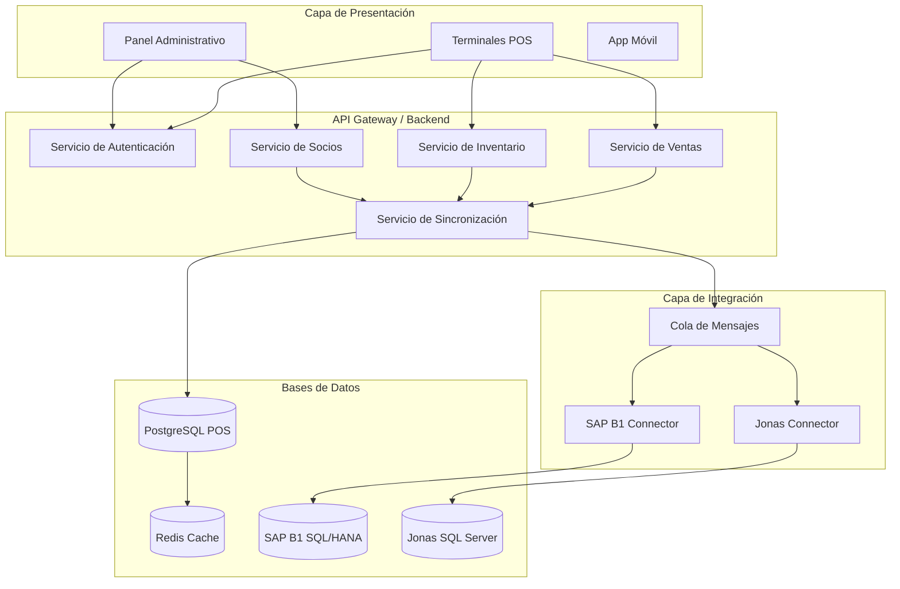
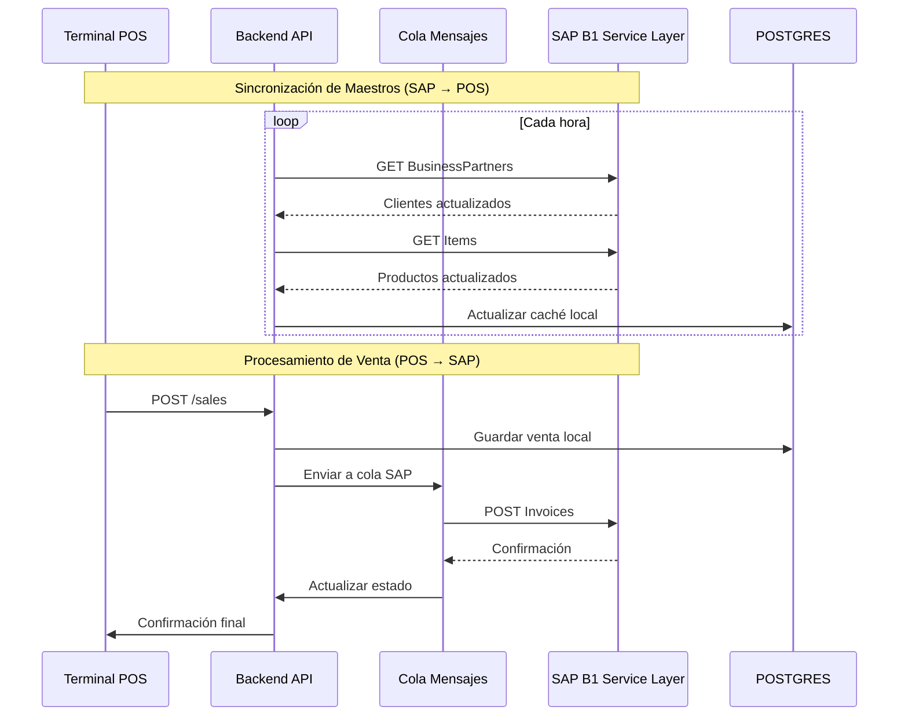
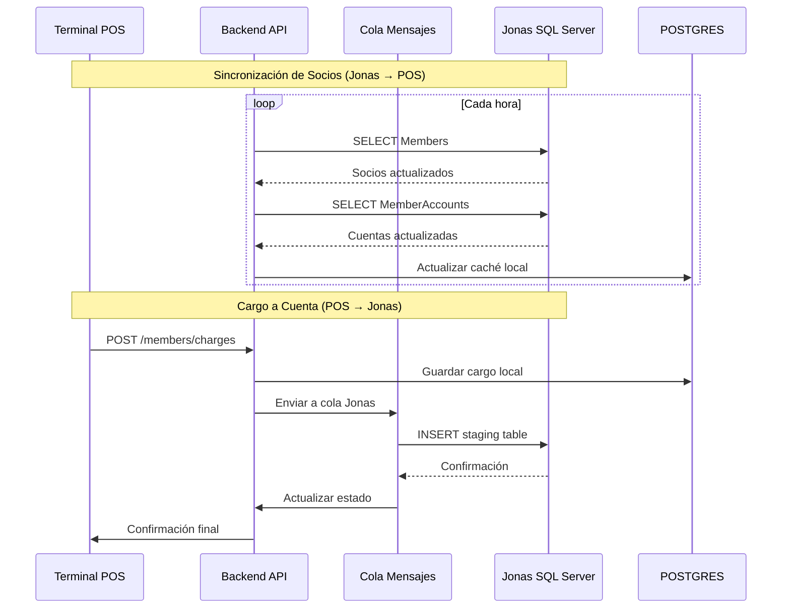
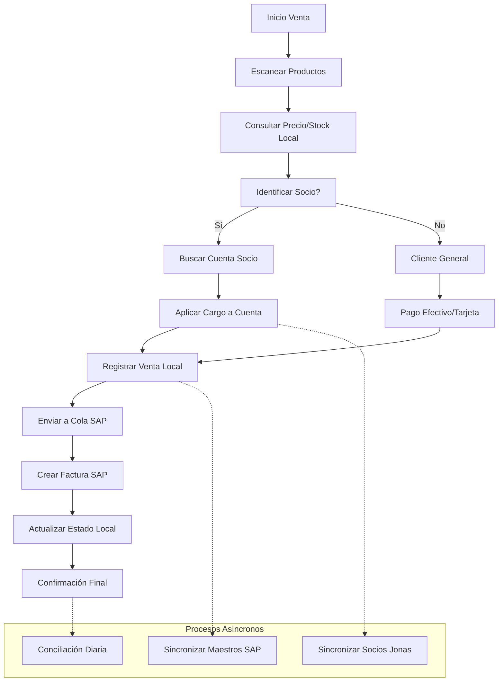

# Análisis de Integración con SAP Business One y Jonas Software
## Country Club POS - Estrategia de Integración ERP
### Fecha: Febrero 2026 | Versión: 1.0

---

## 📋 Resumen Ejecutivo

Este documento analiza la integración del sistema Country Club POS con los sistemas ERP existentes: **SAP Business One** (ERP principal) y **Jonas Software** (ERP de construcción/servicios). Se define la arquitectura de integración, flujos de sincronización, modelo de datos adaptado y plan de implementación considerando PostgreSQL como base de datos aislada.

---

## 🎯 Objetivos de Integración

### 1. Integración con SAP Business One
- **Sincronización maestros**: Clientes, productos, precios, inventario
- **Envío de transacciones**: Ventas, pagos, facturas, notas de crédito
- **Recepción de actualizaciones**: Cambios de precios, nuevos productos
- **Conciliación financiera**: Cierre diario vs. SAP

### 2. Integración con Jonas Software
- **Lectura de datos**: Clientes del club, membresías, cuentas
- **Sincronización de cargos**: Cargos a cuentas de socios
- **Reportes consolidados**: Ventas del POS vs. servicios del club

---

## 🏗️ Arquitectura de Integración

### 3.1 Arquitectura General



### 3.2 Principios de Diseño

1. **Desacoplamiento**: POS funciona independientemente de ERPs
2. **Resiliencia**: Operación offline con sincronización diferida
3. **Consistencia Eventual**: Datos sincronizados de forma asíncrona
4. **Auditoría Completa**: Toda operación registrada en todos los sistemas
5. **Seguridad por Capas**: Autenticación y autorización en cada nivel

---

## 🔄 Estrategia de Sincronización

### 4.1 Sincronización con SAP Business One

#### 4.1.1 Entidades Principales de SAP B1

| Entidad SAP | Dirección | Frecuencia | Método |
|-------------|-----------|------------|--------|
| **BusinessPartners** | SAP → POS | Cada hora | Service Layer GET |
| **Items** | SAP → POS | Cada hora | Service Layer GET |
| **PriceLists** | SAP → POS | Cada hora | Service Layer GET |
| **Warehouses** | SAP → POS | Diario | Service Layer GET |
| **Invoices** | POS → SAP | Inmediato | Service Layer POST |
| **Payments** | POS → SAP | Inmediato | Service Layer POST |
| **CreditNotes** | POS → SAP | Inmediato | Service Layer POST |

#### 4.1.2 Flujo de Sincronización SAP



### 4.2 Sincronización con Jonas Software

#### 4.2.1 Entidades de Jonas (Acceso SQL Directo)

| Entidad Jonas | Dirección | Frecuencia | Método |
|---------------|-----------|------------|--------|
| **Members** | Jonas → POS | Cada hora | SQL SELECT |
| **MemberAccounts** | Jonas → POS | Cada hora | SQL SELECT |
| **Charges** | POS → Jonas | Inmediato | SQL INSERT (staging) |
| **Payments** | POS → Jonas | Inmediato | SQL INSERT (staging) |

#### 4.2.2 Flujo de Sincronización Jonas



---

## 🗄️ Modelo de Datos Adaptado

### 5.1 Extensiones al Modelo Existente

#### 5.1.1 Tablas de Integración SAP

```sql
-- Mapeo de productos SAP
CREATE TABLE sap_product_mappings (
    id UUID PRIMARY KEY DEFAULT gen_random_uuid(),
    local_product_id UUID REFERENCES products(id),
    sap_item_code VARCHAR(50) NOT NULL,
    sap_warehouse VARCHAR(20),
    last_sync_at TIMESTAMPTZ,
    sync_status VARCHAR(20) DEFAULT 'PENDING',
    created_at TIMESTAMPTZ DEFAULT NOW(),
    updated_at TIMESTAMPTZ DEFAULT NOW()
);

-- Mapeo de clientes SAP
CREATE TABLE sap_customer_mappings (
    id UUID PRIMARY KEY DEFAULT gen_random_uuid(),
    local_member_id UUID REFERENCES members(id),
    sap_card_code VARCHAR(50) NOT NULL,
    sap_group_code INTEGER,
    last_sync_at TIMESTAMPTZ,
    sync_status VARCHAR(20) DEFAULT 'PENDING',
    created_at TIMESTAMPTZ DEFAULT NOW(),
    updated_at TIMESTAMPTZ DEFAULT NOW()
);

-- Documentos SAP generados
CREATE TABLE sap_documents (
    id UUID PRIMARY KEY DEFAULT gen_random_uuid(),
    local_sale_id UUID REFERENCES sales(id),
    sap_doc_type VARCHAR(20) NOT NULL, -- 'Invoice', 'Payment', 'CreditNote'
    sap_doc_entry INTEGER NOT NULL,
    sap_doc_key UUID,
    sap_doc_number VARCHAR(50),
    sync_status VARCHAR(20) DEFAULT 'PENDING',
    sync_error TEXT,
    synced_at TIMESTAMPTZ,
    created_at TIMESTAMPTZ DEFAULT NOW(),
    updated_at TIMESTAMPTZ DEFAULT NOW()
);
```

#### 5.1.2 Tablas de Integración Jonas

```sql
-- Mapeo de socios Jonas
CREATE TABLE jonas_member_mappings (
    id UUID PRIMARY KEY DEFAULT gen_random_uuid(),
    local_member_id UUID REFERENCES members(id),
    jonas_member_id INTEGER NOT NULL,
    jonas_account_id INTEGER,
    last_sync_at TIMESTAMPTZ,
    sync_status VARCHAR(20) DEFAULT 'PENDING',
    created_at TIMESTAMPTZ DEFAULT NOW(),
    updated_at TIMESTAMPTZ DEFAULT NOW()
);

-- Cargos a cuentas Jonas
CREATE TABLE jonas_charges (
    id UUID PRIMARY KEY DEFAULT gen_random_uuid(),
    local_sale_id UUID REFERENCES sales(id),
    jonas_member_id INTEGER NOT NULL,
    jonas_account_id INTEGER,
    charge_amount DECIMAL(10,2) NOT NULL,
    charge_description TEXT,
    jonas_status VARCHAR(20) DEFAULT 'PENDING',
    jonas_reference VARCHAR(50),
    sync_error TEXT,
    synced_at TIMESTAMPTZ,
    created_at TIMESTAMPTZ DEFAULT NOW(),
    updated_at TIMESTAMPTZ DEFAULT NOW()
);
```

### 5.2 Tablas de Sincronización

```sql
-- Cola de sincronización
CREATE TABLE sync_queue (
    id UUID PRIMARY KEY DEFAULT gen_random_uuid(),
    entity_type VARCHAR(50) NOT NULL, -- 'sale', 'product', 'member'
    entity_id UUID NOT NULL,
    target_system VARCHAR(20) NOT NULL, -- 'SAP', 'JONAS'
    operation VARCHAR(20) NOT NULL, -- 'CREATE', 'UPDATE', 'DELETE'
    payload JSONB NOT NULL,
    status VARCHAR(20) DEFAULT 'PENDING',
    attempts INTEGER DEFAULT 0,
    max_attempts INTEGER DEFAULT 5,
    next_attempt_at TIMESTAMPTZ DEFAULT NOW(),
    error_message TEXT,
    created_at TIMESTAMPTZ DEFAULT NOW(),
    updated_at TIMESTAMPTZ DEFAULT NOW()
);

-- Log de sincronización
CREATE TABLE sync_logs (
    id UUID PRIMARY KEY DEFAULT gen_random_uuid(),
    sync_queue_id UUID REFERENCES sync_queue(id),
    target_system VARCHAR(20) NOT NULL,
    operation VARCHAR(20) NOT NULL,
    status VARCHAR(20) NOT NULL,
    request_payload JSONB,
    response_payload JSONB,
    error_message TEXT,
    duration_ms INTEGER,
    created_at TIMESTAMPTZ DEFAULT NOW()
);
```

---

## 🔌 Conectores de Integración

### 6.1 SAP Business One Connector

```typescript
// src/integrations/sap/sap-connector.ts
export class SAPB1Connector {
  private baseUrl: string;
  private sessionId: string;
  private retryConfig = { maxRetries: 3, delay: 1000 };

  constructor(config: SAPConfig) {
    this.baseUrl = `${config.host}:${config.port}/b1s/v1`;
  }

  async authenticate(): Promise<void> {
    try {
      const response = await fetch(`${this.baseUrl}/Login`, {
        method: 'POST',
        headers: { 'Content-Type': 'application/json' },
        body: JSON.stringify({
          CompanyDB: this.config.companyDB,
          UserName: this.config.username,
          Password: this.config.password
        })
      });

      if (!response.ok) {
        throw new Error(`SAP auth failed: ${response.statusText}`);
      }

      const data = await response.json();
      this.sessionId = data.SessionId;
    } catch (error) {
      throw new Error(`SAP authentication error: ${error.message}`);
    }
  }

  async getBusinessPartners(): Promise<SAPBusinessPartner[]> {
    return this.withRetry(async () => {
      const response = await fetch(
        `${this.baseUrl}/BusinessPartners?$filter=CardType eq 'cCustomer' and Valid eq 'tYES'`,
        {
          headers: { 'Cookie': `B1SESSION=${this.sessionId}` }
        }
      );

      if (!response.ok) {
        throw new Error(`Failed to get business partners: ${response.statusText}`);
      }

      const data = await response.json();
      return data.value;
    });
  }

  async getItems(): Promise<SAPItem[]> {
    return this.withRetry(async () => {
      const response = await fetch(
        `${this.baseUrl}/Items?$filter=ItemType eq 'itItems' and Valid eq 'tYES'&$select=ItemCode,ItemName,ItemPrices,QuantityOnStock`,
        {
          headers: { 'Cookie': `B1SESSION=${this.sessionId}` }
        }
      );

      if (!response.ok) {
        throw new Error(`Failed to get items: ${response.statusText}`);
      }

      const data = await response.json();
      return data.value;
    });
  }

  async createInvoice(invoiceData: SAPInvoice): Promise<SAPDocument> {
    return this.withRetry(async () => {
      const response = await fetch(`${this.baseUrl}/Invoices`, {
        method: 'POST',
        headers: {
          'Content-Type': 'application/json',
          'Cookie': `B1SESSION=${this.sessionId}`
        },
        body: JSON.stringify(invoiceData)
      });

      if (!response.ok) {
        const error = await response.text();
        throw new Error(`Failed to create invoice: ${error}`);
      }

      return await response.json();
    });
  }

  private async withRetry<T>(operation: () => Promise<T>): Promise<T> {
    let lastError: Error;

    for (let attempt = 1; attempt <= this.retryConfig.maxRetries; attempt++) {
      try {
        return await operation();
      } catch (error) {
        lastError = error;
        
        if (attempt < this.retryConfig.maxRetries) {
          await this.delay(this.retryConfig.delay * attempt);
        }
      }
    }

    throw lastError;
  }

  private delay(ms: number): Promise<void> {
    return new Promise(resolve => setTimeout(resolve, ms));
  }
}
```

### 6.2 Jonas Software Connector

```typescript
// src/integrations/jonas/jonas-connector.ts
export class JonasConnector {
  private pool: Pool;
  private config: JonasConfig;

  constructor(config: JonasConfig) {
    this.config = config;
    this.pool = new Pool({
      host: config.host,
      port: config.port,
      database: config.database,
      user: config.username,
      password: config.password,
      ssl: config.ssl
    });
  }

  async getMembers(): Promise<JonasMember[]> {
    const query = `
      SELECT 
        MemberID, FirstName, LastName, Email, Phone,
        MemberNumber, Status, JoinDate
      FROM Members 
      WHERE Status = 'Active'
      ORDER BY LastName, FirstName
    `;

    const result = await this.pool.query(query);
    return result.rows;
  }

  async getMemberAccounts(): Promise<JonasMemberAccount[]> {
    const query = `
      SELECT 
        ma.AccountID, ma.MemberID, ma.AccountName, 
        ma.AccountType, ma.CreditLimit, ma.CurrentBalance
      FROM MemberAccounts ma
      INNER JOIN Members m ON ma.MemberID = m.MemberID
      WHERE m.Status = 'Active' AND ma.Status = 'Active'
    `;

    const result = await this.pool.query(query);
    return result.rows;
  }

  async insertCharge(charge: JonasCharge): Promise<string> {
    const client = await this.pool.connect();
    
    try {
      await client.query('BEGIN');

      // Insertar en tabla de staging
      const insertQuery = `
        INSERT INTO POS_ChargeStaging (
          SaleID, MemberID, AccountID, Amount, 
          Description, POSReference, CreatedAt
        ) VALUES ($1, $2, $3, $4, $5, $6, GETDATE())
        OUTPUT INSERTED.StagingID
      `;

      const result = await client.query(insertQuery, [
        charge.saleId,
        charge.memberId,
        charge.accountId,
        charge.amount,
        charge.description,
        charge.posReference
      ]);

      await client.query('COMMIT');
      
      return result.rows[0].StagingID;
    } catch (error) {
      await client.query('ROLLBACK');
      throw new Error(`Failed to insert charge: ${error.message}`);
    } finally {
      client.release();
    }
  }

  async close(): Promise<void> {
    await this.pool.end();
  }
}
```

---

## 📊 Flujo de Negocio Integrado

### 7.1 Flujo de Venta con Integración



### 7.2 Manejo de Errores y Reintentos

```typescript
// src/services/sync-service.ts
export class SyncService {
  async processSyncQueue(): Promise<void> {
    const pendingItems = await this.getPendingSyncItems();
    
    for (const item of pendingItems) {
      try {
        await this.processSyncItem(item);
        await this.markAsCompleted(item.id);
      } catch (error) {
        await this.handleSyncError(item, error);
      }
    }
  }

  private async processSyncItem(item: SyncQueueItem): Promise<void> {
    switch (item.target_system) {
      case 'SAP':
        await this.processSAPSync(item);
        break;
      case 'JONAS':
        await this.processJonasSync(item);
        break;
    }
  }

  private async processSAPSync(item: SyncQueueItem): Promise<void> {
    const sapConnector = new SAPB1Connector(this.sapConfig);
    await sapConnector.authenticate();

    switch (item.entity_type) {
      case 'sale':
        const sale = await this.getSale(item.entity_id);
        const sapInvoice = this.mapToSAPInvoice(sale);
        await sapConnector.createInvoice(sapInvoice);
        break;
      // Otros casos...
    }
  }

  private async handleSyncError(item: SyncQueueItem, error: Error): Promise<void> {
    const newAttempts = item.attempts + 1;
    
    if (newAttempts >= item.max_attempts) {
      await this.markAsFailed(item.id, error.message);
      // Notificar administrador
      await this.notifyAdmin(item, error);
    } else {
      const nextAttempt = new Date(Date.now() + (Math.pow(2, newAttempts) * 1000));
      await this.scheduleRetry(item.id, newAttempts, nextAttempt);
    }
  }
}
```

---

## 🛡️ Seguridad y Consideraciones

### 8.1 Seguridad de Conexiones

#### SAP Business One
- **Autenticación**: B1SESSION cookie con timeout configurable
- **HTTPS**: TLS 1.2+ obligatorio
- **Rate Limiting**: Respetar límites de SAP Service Layer
- **IP Whitelist**: Restringir acceso a IPs conocidas

#### Jonas Software
- **Conexión Directa**: SQL Server con credenciales de solo lectura
- **VPN**: Túnel seguro para acceso a base de datos
- **Staging Tables**: Escritura solo en tablas intermedias
- **Auditoría**: Todo acceso logged

### 8.2 Manejo de Datos Sensibles

```typescript
// Configuración segura de credenciales
export const secureConfig = {
  sap: {
    host: process.env.SAP_HOST,
    port: process.env.SAP_PORT,
    companyDB: process.env.SAP_COMPANY_DB,
    username: process.env.SAP_USERNAME,
    password: process.env.SAP_PASSWORD, // Encriptado en runtime
    ssl: { rejectUnauthorized: true }
  },
  jonas: {
    host: process.env.JONAS_HOST,
    port: process.env.JONAS_PORT,
    database: process.env.JONAS_DATABASE,
    username: process.env.JONAS_USERNAME,
    password: process.env.JONAS_PASSWORD, // Encriptado en runtime
    ssl: { rejectUnauthorized: true },
    connectionTimeout: 10000,
    requestTimeout: 30000
  }
};
```

---

## 📈 Monitoreo y Reportes

### 9.1 Métricas de Integración

| Métrica | Descripción | Umbral |
|---------|-------------|--------|
| **Sync Success Rate** | % de sincronizaciones exitosas | > 95% |
| **Sync Latency** | Tiempo promedio de sincronización | < 30s |
| **Queue Depth** | Items pendientes en cola | < 100 |
| **Error Rate** | % de errores por sistema | < 5% |
| **Connection Health** | Disponibilidad de conexiones | > 99% |

### 9.2 Dashboard de Integración

```typescript
// src/components/integration-dashboard.tsx
export function IntegrationDashboard() {
  const { data: metrics } = useQuery('integration-metrics', getIntegrationMetrics);
  
  return (
    <div className="grid grid-cols-4 gap-4">
      <MetricCard
        title="SAP Sync Status"
        value={metrics?.sap.successRate}
        format="percentage"
        status={metrics?.sap.successRate > 95 ? 'success' : 'warning'}
      />
      <MetricCard
        title="Jonas Sync Status"
        value={metrics?.jonas.successRate}
        format="percentage"
        status={metrics?.jonas.successRate > 95 ? 'success' : 'warning'}
      />
      <MetricCard
        title="Queue Depth"
        value={metrics?.queueDepth}
        format="number"
        status={metrics?.queueDepth < 100 ? 'success' : 'error'}
      />
      <MetricCard
        title="Last Sync"
        value={metrics?.lastSyncAt}
        format="datetime"
        status="info"
      />
    </div>
  );
}
```

---

## 🚀 Plan de Implementación

### 10.1 Fases de Implementación

| Fase | Duración | Entregables | Dependencias |
|------|----------|-------------|--------------|
| **Fase 0** | 2 semanas | Configuración ambientes, credenciales | Acceso a sistemas |
| **Fase 1** | 3 semanas | Conectores básicos, sincronización maestros | Documentación APIs |
| **Fase 2** | 4 semanas | Sincronización de transacciones | Conectores funcionando |
| **Fase 3** | 3 semanas | Manejo de errores, reintentos | Fase 2 completa |
| **Fase 4** | 2 semanas | Monitoreo, reportes, dashboard | Fase 3 completa |
| **Fase 5** | 2 semanas | Testing integral, UAT | Todas las fases |

### 10.2 Riesgos y Mitigación

| Riesgo | Probabilidad | Impacto | Mitigación |
|--------|--------------|---------|------------|
| Jonas no permite acceso BD | Alta | Crítico | Contactar Jonas antes de iniciar |
| SAP licencias insuficientes | Media | Alto | Verificar licencias Service Layer |
| Cambios en APIs SAP | Media | Medio | Versionado de conectores |
| Performance sincronización | Baja | Medio | Testing de carga, optimización |

---

## 📝 Próximos Pasos

1. **Contactar Jonas Software** para confirmar acceso a base de datos
2. **Obtener credenciales SAP** y configurar ambiente sandbox
3. **Definir fuente de verdad** principal (SAP vs Jonas)
4. **Seleccionar PAC** para timbrado CFDI
5. **Documentar flujos actuales** de negocio
6. **Setup inicial** de PostgreSQL y estructura de bases de datos

---

## 📚 Referencias y Recursos

### SAP Business One
- [Service Layer API Reference](https://help.sap.com/doc/056f69366b5345a386bb8149f1700c19/10.0/en-US/Service%20Layer%20API%20Reference.html)
- [Working with Service Layer PDF](https://help.sap.com/doc/fc2f5477516c404c8bf9ad1315a17238/10.0/en-US/Working_with_SAP_Business_One_Service_Layer.pdf)

### Jonas Software
- [Jonas Construction Software](https://www.jonasconstruction.com/)
- [Jonas Enterprise Modules](https://construction.clubhouseonline-e3.com/Products/Enterprise/Enterprise-Modules)

---

*Este documento establece la base técnica para la integración del Country Club POS con los sistemas ERP existentes, asegurando operación continua y sincronización confiable de datos.*
