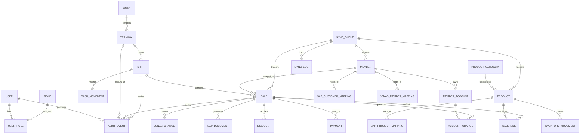

# Modelo de Datos Integrado - Country Club POS
## Con Integración SAP Business One y Jonas Software
### Fecha: Febrero 2026 | Versión: 1.0

---

## 📋 Resumen

Este documento presenta el modelo de datos completo para el Country Club POS, extendiendo el modelo original con las tablas necesarias para la integración con SAP Business One y Jonas Software, manteniendo PostgreSQL como base de datos aislada.

---

## 🗄️ Estructura General de la Base de Datos

### Diagrama de Relaciones Extendido



---

## 📊 Tablas Core del POS (Existentes)

### 1. Gestión de Usuarios y Roles

```sql
-- Usuarios del sistema
CREATE TABLE users (
    id UUID PRIMARY KEY DEFAULT gen_random_uuid(),
    username VARCHAR(50) UNIQUE NOT NULL,
    password_hash VARCHAR(255) NOT NULL,
    email VARCHAR(255) UNIQUE NOT NULL,
    first_name VARCHAR(100) NOT NULL,
    last_name VARCHAR(100) NOT NULL,
    active BOOLEAN DEFAULT true,
    created_at TIMESTAMPTZ DEFAULT NOW(),
    updated_at TIMESTAMPTZ DEFAULT NOW(),
    last_login_at TIMESTAMPTZ,
    created_by UUID REFERENCES users(id),
    updated_by UUID REFERENCES users(id)
);

-- Roles del sistema
CREATE TABLE roles (
    id UUID PRIMARY KEY DEFAULT gen_random_uuid(),
    name VARCHAR(50) UNIQUE NOT NULL,
    description TEXT,
    active BOOLEAN DEFAULT true,
    created_at TIMESTAMPTZ DEFAULT NOW(),
    updated_at TIMESTAMPTZ DEFAULT NOW()
);

-- Asignación de roles a usuarios
CREATE TABLE user_roles (
    user_id UUID REFERENCES users(id) ON DELETE CASCADE,
    role_id UUID REFERENCES roles(id) ON DELETE CASCADE,
    assigned_at TIMESTAMPTZ DEFAULT NOW(),
    assigned_by UUID REFERENCES users(id),
    PRIMARY KEY (user_id, role_id)
);
```

### 2. Estructura Operativa

```sql
-- Áreas del club (restaurant, bar, tienda, etc.)
CREATE TABLE areas (
    id UUID PRIMARY KEY DEFAULT gen_random_uuid(),
    code VARCHAR(20) UNIQUE NOT NULL,
    name VARCHAR(100) NOT NULL,
    description TEXT,
    active BOOLEAN DEFAULT true,
    created_at TIMESTAMPTZ DEFAULT NOW(),
    updated_at TIMESTAMPTZ DEFAULT NOW()
);

-- Terminales POS
CREATE TABLE terminals (
    id UUID PRIMARY KEY DEFAULT gen_random_uuid(),
    code VARCHAR(20) UNIQUE NOT NULL,
    name VARCHAR(100) NOT NULL,
    area_id UUID REFERENCES areas(id),
    location VARCHAR(100),
    active BOOLEAN DEFAULT true,
    created_at TIMESTAMPTZ DEFAULT NOW(),
    updated_at TIMESTAMPTZ DEFAULT NOW()
);

-- Turnos de caja
CREATE TABLE shifts (
    id UUID PRIMARY KEY DEFAULT gen_random_uuid(),
    terminal_id UUID REFERENCES terminals(id),
    opened_by_user_id UUID REFERENCES users(id),
    closed_by_user_id UUID REFERENCES users(id),
    status VARCHAR(20) DEFAULT 'OPEN', -- OPEN, CLOSED
    opening_float DECIMAL(10,2) NOT NULL,
    closing_float DECIMAL(10,2),
    opened_at TIMESTAMPTZ DEFAULT NOW(),
    closed_at TIMESTAMPTZ,
    notes TEXT
);

-- Movimientos de efectivo
CREATE TABLE cash_movements (
    id UUID PRIMARY KEY DEFAULT gen_random_uuid(),
    shift_id UUID REFERENCES shifts(id),
    created_by_user_id UUID REFERENCES users(id),
    type VARCHAR(20) NOT NULL, -- IN, OUT, SAFE_DROP, BANK_DEPOSIT
    amount DECIMAL(10,2) NOT NULL,
    reason TEXT,
    reference VARCHAR(100),
    created_at TIMESTAMPTZ DEFAULT NOW()
);
```

### 3. Socios y Cuentas

```sql
-- Socios del club
CREATE TABLE members (
    id UUID PRIMARY KEY DEFAULT gen_random_uuid(),
    member_number VARCHAR(50) UNIQUE NOT NULL,
    first_name VARCHAR(100) NOT NULL,
    last_name VARCHAR(100) NOT NULL,
    email VARCHAR(255),
    phone VARCHAR(50),
    status VARCHAR(20) DEFAULT 'ACTIVE', -- ACTIVE, INACTIVE, SUSPENDED
    join_date DATE NOT NULL,
    birth_date DATE,
    created_at TIMESTAMPTZ DEFAULT NOW(),
    updated_at TIMESTAMPTZ DEFAULT NOW()
);

-- Cuentas de socios
CREATE TABLE member_accounts (
    id UUID PRIMARY KEY DEFAULT gen_random_uuid(),
    member_id UUID REFERENCES members(id) ON DELETE CASCADE,
    name VARCHAR(100) NOT NULL,
    type VARCHAR(20) NOT NULL, -- CHARGE, CREDIT, PREPAID
    credit_limit DECIMAL(10,2),
    current_balance DECIMAL(10,2) DEFAULT 0,
    active BOOLEAN DEFAULT true,
    created_at TIMESTAMPTZ DEFAULT NOW(),
    updated_at TIMESTAMPTZ DEFAULT NOW()
);

-- Cargos a cuentas
CREATE TABLE account_charges (
    id UUID PRIMARY KEY DEFAULT gen_random_uuid(),
    member_account_id UUID REFERENCES member_accounts(id),
    sale_id UUID REFERENCES sales(id),
    amount DECIMAL(10,2) NOT NULL,
    description TEXT,
    status VARCHAR(20) DEFAULT 'PENDING', -- PENDING, APPROVED, REJECTED
    authorized_by_user_id UUID REFERENCES users(id),
    authorized_at TIMESTAMPTZ,
    created_at TIMESTAMPTZ DEFAULT NOW()
);
```

### 4. Productos e Inventario

```sql
-- Categorías de productos
CREATE TABLE product_categories (
    id UUID PRIMARY KEY DEFAULT gen_random_uuid(),
    name VARCHAR(100) UNIQUE NOT NULL,
    description TEXT,
    parent_category_id UUID REFERENCES product_categories(id),
    active BOOLEAN DEFAULT true,
    created_at TIMESTAMPTZ DEFAULT NOW(),
    updated_at TIMESTAMPTZ DEFAULT NOW()
);

-- Productos
CREATE TABLE products (
    id UUID PRIMARY KEY DEFAULT gen_random_uuid(),
    sku VARCHAR(50) UNIQUE NOT NULL,
    name VARCHAR(200) NOT NULL,
    description TEXT,
    category_id UUID REFERENCES product_categories(id),
    price DECIMAL(10,2) NOT NULL,
    cost DECIMAL(10,2),
    tax_rate DECIMAL(8,4) DEFAULT 0.16,
    track_inventory BOOLEAN DEFAULT true,
    current_stock DECIMAL(12,4) DEFAULT 0,
    min_stock_level DECIMAL(12,4),
    active BOOLEAN DEFAULT true,
    created_at TIMESTAMPTZ DEFAULT NOW(),
    updated_at TIMESTAMPTZ DEFAULT NOW()
);

-- Movimientos de inventario
CREATE TABLE inventory_movements (
    id UUID PRIMARY KEY DEFAULT gen_random_uuid(),
    product_id UUID REFERENCES products(id),
    shift_id UUID REFERENCES shifts(id),
    created_by_user_id UUID REFERENCES users(id),
    type VARCHAR(20) NOT NULL, -- SALE, PURCHASE, ADJUSTMENT, TRANSFER
    quantity DECIMAL(12,4) NOT NULL,
    unit_cost DECIMAL(10,2),
    reason TEXT,
    reference VARCHAR(100),
    created_at TIMESTAMPTZ DEFAULT NOW()
);
```

### 5. Ventas y Pagos

```sql
-- Ventas
CREATE TABLE sales (
    id UUID PRIMARY KEY DEFAULT gen_random_uuid(),
    folio VARCHAR(50) UNIQUE NOT NULL,
    terminal_id UUID REFERENCES terminals(id),
    shift_id UUID REFERENCES shifts(id),
    member_id UUID REFERENCES members(id),
    created_by_user_id UUID REFERENCES users(id),
    status VARCHAR(20) DEFAULT 'ACTIVE', -- ACTIVE, VOIDED, REFUNDED
    subtotal DECIMAL(10,2) NOT NULL,
    tax_amount DECIMAL(10,2) DEFAULT 0,
    discount_amount DECIMAL(10,2) DEFAULT 0,
    total_amount DECIMAL(10,2) NOT NULL,
    tip_amount DECIMAL(10,2) DEFAULT 0,
    notes TEXT,
    created_at TIMESTAMPTZ DEFAULT NOW(),
    updated_at TIMESTAMPTZ DEFAULT NOW(),
    paid_at TIMESTAMPTZ,
    voided_at TIMESTAMPTZ,
    void_reason TEXT,
    voided_by_user_id UUID REFERENCES users(id)
);

-- Líneas de venta
CREATE TABLE sale_lines (
    id UUID PRIMARY KEY DEFAULT gen_random_uuid(),
    sale_id UUID REFERENCES sales(id) ON DELETE CASCADE,
    product_id UUID REFERENCES products(id),
    quantity DECIMAL(12,4) NOT NULL,
    unit_price DECIMAL(10,2) NOT NULL,
    tax_rate DECIMAL(8,4) DEFAULT 0.16,
    line_total DECIMAL(10,2) NOT NULL,
    modifiers JSONB, -- Modificadores, personalizaciones
    notes TEXT,
    created_at TIMESTAMPTZ DEFAULT NOW(),
    updated_at TIMESTAMPTZ DEFAULT NOW()
);

-- Pagos
CREATE TABLE payments (
    id UUID PRIMARY KEY DEFAULT gen_random_uuid(),
    sale_id UUID REFERENCES sales(id) ON DELETE CASCADE,
    method VARCHAR(20) NOT NULL, -- CASH, CARD, MEMBER_ACCOUNT, MIXED
    amount DECIMAL(10,2) NOT NULL,
    reference VARCHAR(100), -- Número de tarjeta, folio, etc.
    authorization_code VARCHAR(100),
    status VARCHAR(20) DEFAULT 'PENDING', -- PENDING, CAPTURED, VOIDED
    captured_at TIMESTAMPTZ,
    created_at TIMESTAMPTZ DEFAULT NOW(),
    updated_at TIMESTAMPTZ DEFAULT NOW()
);

-- Descuentos
CREATE TABLE discounts (
    id UUID PRIMARY KEY DEFAULT gen_random_uuid(),
    sale_id UUID REFERENCES sales(id) ON DELETE CASCADE,
    created_by_user_id UUID REFERENCES users(id),
    type VARCHAR(20) NOT NULL, -- PERCENTAGE, AMOUNT
    amount DECIMAL(10,2) NOT NULL,
    percentage DECIMAL(5,2), -- Solo si type = PERCENTAGE
    reason TEXT,
    approved_by_user_id UUID REFERENCES users(id),
    approved_at TIMESTAMPTZ,
    created_at TIMESTAMPTZ DEFAULT NOW()
);
```

---

## 🔌 Tablas de Integración SAP Business One

### 6. Mapeos de Entidades SAP

```sql
-- Mapeo de productos con SAP
CREATE TABLE sap_product_mappings (
    id UUID PRIMARY KEY DEFAULT gen_random_uuid(),
    local_product_id UUID REFERENCES products(id) ON DELETE CASCADE,
    sap_item_code VARCHAR(50) NOT NULL,
    sap_warehouse VARCHAR(20),
    sap_price_list INTEGER,
    last_sync_at TIMESTAMPTZ,
    sync_status VARCHAR(20) DEFAULT 'PENDING', -- PENDING, SYNCED, ERROR
    sync_error TEXT,
    created_at TIMESTAMPTZ DEFAULT NOW(),
    updated_at TIMESTAMPTZ DEFAULT NOW(),
    UNIQUE(local_product_id),
    UNIQUE(sap_item_code)
);

-- Mapeo de clientes/socios con SAP
CREATE TABLE sap_customer_mappings (
    id UUID PRIMARY KEY DEFAULT gen_random_uuid(),
    local_member_id UUID REFERENCES members(id) ON DELETE CASCADE,
    sap_card_code VARCHAR(50) NOT NULL,
    sap_group_code INTEGER,
    sap_list_num INTEGER,
    last_sync_at TIMESTAMPTZ,
    sync_status VARCHAR(20) DEFAULT 'PENDING',
    sync_error TEXT,
    created_at TIMESTAMPTZ DEFAULT NOW(),
    updated_at TIMESTAMPTZ DEFAULT NOW(),
    UNIQUE(local_member_id),
    UNIQUE(sap_card_code)
);

-- Mapeo de terminales con SAP
CREATE TABLE sap_terminal_mappings (
    id UUID PRIMARY KEY DEFAULT gen_random_uuid(),
    local_terminal_id UUID REFERENCES terminals(id) ON DELETE CASCADE,
    sap_warehouse VARCHAR(20) NOT NULL,
    sap_cost_center VARCHAR(20),
    last_sync_at TIMESTAMPTZ,
    sync_status VARCHAR(20) DEFAULT 'PENDING',
    created_at TIMESTAMPTZ DEFAULT NOW(),
    updated_at TIMESTAMPTZ DEFAULT NOW(),
    UNIQUE(local_terminal_id)
);
```

### 7. Documentos SAP Generados

```sql
-- Documentos generados en SAP
CREATE TABLE sap_documents (
    id UUID PRIMARY KEY DEFAULT gen_random_uuid(),
    local_sale_id UUID REFERENCES sales(id) ON DELETE CASCADE,
    sap_doc_type VARCHAR(20) NOT NULL, -- INVOICE, CREDIT_NOTE, PAYMENT
    sap_doc_entry INTEGER NOT NULL,
    sap_doc_key UUID,
    sap_doc_number VARCHAR(50),
    sap_series INTEGER,
    sap_fiscal_year INTEGER,
    sync_status VARCHAR(20) DEFAULT 'PENDING',
    sync_error TEXT,
    synced_at TIMESTAMPTZ,
    created_at TIMESTAMPTZ DEFAULT NOW(),
    updated_at TIMESTAMPTZ DEFAULT NOW()
);

-- Líneas de documentos SAP
CREATE TABLE sap_document_lines (
    id UUID PRIMARY KEY DEFAULT gen_random_uuid(),
    sap_document_id UUID REFERENCES sap_documents(id) ON DELETE CASCADE,
    local_sale_line_id UUID REFERENCES sale_lines(id),
    sap_item_code VARCHAR(50),
    sap_whs_code VARCHAR(20),
    quantity DECIMAL(12,4) NOT NULL,
    unit_price DECIMAL(10,2) NOT NULL,
    tax_rate DECIMAL(8,4),
    line_total DECIMAL(10,2) NOT NULL,
    created_at TIMESTAMPTZ DEFAULT NOW()
);

-- Pagos SAP
CREATE TABLE sap_payments (
    id UUID PRIMARY KEY DEFAULT gen_random_uuid(),
    local_payment_id UUID REFERENCES payments(id) ON DELETE CASCADE,
    sap_doc_entry INTEGER NOT NULL,
    sap_payment_method VARCHAR(20),
    sap_check_number VARCHAR(50),
    sap_bank_code VARCHAR(20),
    sync_status VARCHAR(20) DEFAULT 'PENDING',
    sync_error TEXT,
    synced_at TIMESTAMPTZ,
    created_at TIMESTAMPTZ DEFAULT NOW(),
    updated_at TIMESTAMPTZ DEFAULT NOW()
);
```

---

## 🏗️ Tablas de Integración Jonas Software

### 8. Mapeos de Entidades Jonas

```sql
-- Mapeo de socios con Jonas
CREATE TABLE jonas_member_mappings (
    id UUID PRIMARY KEY DEFAULT gen_random_uuid(),
    local_member_id UUID REFERENCES members(id) ON DELETE CASCADE,
    jonas_member_id INTEGER NOT NULL,
    jonas_account_id INTEGER,
    jonas_member_type VARCHAR(20),
    last_sync_at TIMESTAMPTZ,
    sync_status VARCHAR(20) DEFAULT 'PENDING',
    sync_error TEXT,
    created_at TIMESTAMPTZ DEFAULT NOW(),
    updated_at TIMESTAMPTZ DEFAULT NOW(),
    UNIQUE(local_member_id),
    UNIQUE(jonas_member_id)
);

-- Mapeo de cuentas con Jonas
CREATE TABLE jonas_account_mappings (
    id UUID PRIMARY KEY DEFAULT gen_random_uuid(),
    local_account_id UUID REFERENCES member_accounts(id) ON DELETE CASCADE,
    jonas_account_id INTEGER NOT NULL,
    jonas_account_type VARCHAR(20),
    jonas_gl_account VARCHAR(20),
    last_sync_at TIMESTAMPTZ,
    sync_status VARCHAR(20) DEFAULT 'PENDING',
    created_at TIMESTAMPTZ DEFAULT NOW(),
    updated_at TIMESTAMPTZ DEFAULT NOW(),
    UNIQUE(local_account_id),
    UNIQUE(jonas_account_id)
);
```

### 9. Cargos y Transacciones Jonas

```sql
-- Cargos a cuentas Jonas
CREATE TABLE jonas_charges (
    id UUID PRIMARY KEY DEFAULT gen_random_uuid(),
    local_sale_id UUID REFERENCES sales(id) ON DELETE CASCADE,
    jonas_member_id INTEGER NOT NULL,
    jonas_account_id INTEGER NOT NULL,
    charge_amount DECIMAL(10,2) NOT NULL,
    charge_description TEXT,
    charge_type VARCHAR(20) DEFAULT 'POS_SALE',
    jonas_status VARCHAR(20) DEFAULT 'PENDING', -- PENDING, POSTED, REJECTED
    jonas_reference VARCHAR(50),
    jonas_gl_transaction_id INTEGER,
    sync_error TEXT,
    synced_at TIMESTAMPTZ,
    created_at TIMESTAMPTZ DEFAULT NOW(),
    updated_at TIMESTAMPTZ DEFAULT NOW()
);

-- Pagos de cuentas Jonas
CREATE TABLE jonas_account_payments (
    id UUID PRIMARY KEY DEFAULT gen_random_uuid(),
    local_payment_id UUID REFERENCES payments(id) ON DELETE CASCADE,
    jonas_member_id INTEGER NOT NULL,
    jonas_account_id INTEGER NOT NULL,
    payment_amount DECIMAL(10,2) NOT NULL,
    payment_method VARCHAR(20),
    jonas_status VARCHAR(20) DEFAULT 'PENDING',
    jonas_reference VARCHAR(50),
    sync_error TEXT,
    synced_at TIMESTAMPTZ,
    created_at TIMESTAMPTZ DEFAULT NOW(),
    updated_at TIMESTAMPTZ DEFAULT NOW()
);
```

---

## 🔄 Tablas de Sincronización

### 10. Cola de Sincronización

```sql
-- Cola principal de sincronización
CREATE TABLE sync_queue (
    id UUID PRIMARY KEY DEFAULT gen_random_uuid(),
    entity_type VARCHAR(50) NOT NULL, -- sale, product, member, payment
    entity_id UUID NOT NULL,
    target_system VARCHAR(20) NOT NULL, -- SAP, JONAS
    operation VARCHAR(20) NOT NULL, -- CREATE, UPDATE, DELETE
    priority INTEGER DEFAULT 0, -- 0=Normal, 1=High, 2=Urgent
    payload JSONB NOT NULL,
    status VARCHAR(20) DEFAULT 'PENDING', -- PENDING, PROCESSING, COMPLETED, FAILED
    attempts INTEGER DEFAULT 0,
    max_attempts INTEGER DEFAULT 5,
    next_attempt_at TIMESTAMPTZ DEFAULT NOW(),
    error_message TEXT,
    created_at TIMESTAMPTZ DEFAULT NOW(),
    updated_at TIMESTAMPTZ DEFAULT NOW(),
    processed_at TIMESTAMPTZ
);

-- Logs detallados de sincronización
CREATE TABLE sync_logs (
    id UUID PRIMARY KEY DEFAULT gen_random_uuid(),
    sync_queue_id UUID REFERENCES sync_queue(id),
    target_system VARCHAR(20) NOT NULL,
    operation VARCHAR(20) NOT NULL,
    status VARCHAR(20) NOT NULL,
    request_payload JSONB,
    response_payload JSONB,
    error_message TEXT,
    duration_ms INTEGER,
    created_at TIMESTAMPTZ DEFAULT NOW()
);

-- Configuración de sincronización
CREATE TABLE sync_configurations (
    id UUID PRIMARY KEY DEFAULT gen_random_uuid(),
    target_system VARCHAR(20) NOT NULL,
    entity_type VARCHAR(50) NOT NULL,
    sync_enabled BOOLEAN DEFAULT true,
    sync_frequency_minutes INTEGER DEFAULT 60,
    batch_size INTEGER DEFAULT 100,
    retry_policy JSONB,
    last_sync_at TIMESTAMPTZ,
    created_at TIMESTAMPTZ DEFAULT NOW(),
    updated_at TIMESTAMPTZ DEFAULT NOW(),
    UNIQUE(target_system, entity_type)
);
```

### 11. Estado de Sincronización

```sql
-- Resumen de sincronización por día
CREATE TABLE sync_daily_summaries (
    id UUID PRIMARY KEY DEFAULT gen_random_uuid(),
    summary_date DATE NOT NULL,
    target_system VARCHAR(20) NOT NULL,
    total_processed INTEGER DEFAULT 0,
    total_successful INTEGER DEFAULT 0,
    total_failed INTEGER DEFAULT 0,
    avg_duration_ms INTEGER,
    created_at TIMESTAMPTZ DEFAULT NOW(),
    updated_at TIMESTAMPTZ DEFAULT NOW(),
    UNIQUE(summary_date, target_system)
);

-- Métricas de rendimiento
CREATE TABLE sync_metrics (
    id UUID PRIMARY KEY DEFAULT gen_random_uuid(),
    metric_date DATE NOT NULL,
    target_system VARCHAR(20) NOT NULL,
    entity_type VARCHAR(50) NOT NULL,
    total_operations INTEGER DEFAULT 0,
    successful_operations INTEGER DEFAULT 0,
    failed_operations INTEGER DEFAULT 0,
    avg_processing_time_ms INTEGER,
    max_processing_time_ms INTEGER,
    min_processing_time_ms INTEGER,
    created_at TIMESTAMPTZ DEFAULT NOW(),
    UNIQUE(metric_date, target_system, entity_type)
);
```

---

## 📋 Tablas de Auditoría Extendida

### 12. Eventos de Auditoría

```sql
-- Eventos de auditoría del sistema
CREATE TABLE audit_events (
    id UUID PRIMARY KEY DEFAULT gen_random_uuid(),
    event_at TIMESTAMPTZ DEFAULT NOW(),
    action VARCHAR(100) NOT NULL,
    entity_type VARCHAR(50),
    entity_id UUID,
    actor_user_id UUID REFERENCES users(id),
    terminal_id UUID REFERENCES terminals(id),
    payload JSONB,
    ip_address INET,
    user_agent TEXT,
    session_id UUID,
    prev_hash VARCHAR(64), -- Para integridad de cadena
    hash VARCHAR(64), -- Hash del evento actual
    created_at TIMESTAMPTZ DEFAULT NOW()
);

-- Eventos de sincronización auditados
CREATE TABLE sync_audit_events (
    id UUID PRIMARY KEY DEFAULT gen_random_uuid(),
    event_at TIMESTAMPTZ DEFAULT NOW(),
    sync_queue_id UUID REFERENCES sync_queue(id),
    target_system VARCHAR(20) NOT NULL,
    action VARCHAR(100) NOT NULL,
    entity_type VARCHAR(50),
    entity_id UUID,
    status_before VARCHAR(20),
    status_after VARCHAR(20),
    error_details TEXT,
    actor_user_id UUID REFERENCES users(id),
    created_at TIMESTAMPTZ DEFAULT NOW()
);
```

---

## 🎛️ Tablas de Configuración y Control

### 13. Configuración del Sistema

```sql
-- Configuración general del sistema
CREATE TABLE system_configurations (
    id UUID PRIMARY KEY DEFAULT gen_random_uuid(),
    config_key VARCHAR(100) UNIQUE NOT NULL,
    config_value JSONB NOT NULL,
    description TEXT,
    is_encrypted BOOLEAN DEFAULT false,
    created_at TIMESTAMPTZ DEFAULT NOW(),
    updated_at TIMESTAMPTZ DEFAULT NOW()
);

-- Configuración de integración
CREATE TABLE integration_configurations (
    id UUID PRIMARY KEY DEFAULT gen_random_uuid(),
    integration_name VARCHAR(50) NOT NULL, -- SAP, JONAS
    config_type VARCHAR(50) NOT NULL, -- CONNECTION, MAPPING, BUSINESS_RULES
    config_data JSONB NOT NULL,
    is_active BOOLEAN DEFAULT true,
    created_at TIMESTAMPTZ DEFAULT NOW(),
    updated_at TIMESTAMPTZ DEFAULT NOW(),
    UNIQUE(integration_name, config_type)
);
```

---

## 📊 Índices y Optimización

### 14. Índices Principales

```sql
-- Índices para rendimiento de consultas
CREATE INDEX idx_sales_folio ON sales(folio);
CREATE INDEX idx_sales_date ON sales(created_at);
CREATE INDEX idx_sales_status ON sales(status);
CREATE INDEX idx_sales_terminal_shift ON sales(terminal_id, shift_id);

CREATE INDEX idx_sale_lines_sale ON sale_lines(sale_id);
CREATE INDEX idx_sale_lines_product ON sale_lines(product_id);

CREATE INDEX idx_products_sku ON products(sku);
CREATE INDEX idx_products_category ON products(category_id);
CREATE INDEX idx_products_active ON products(active);

CREATE INDEX idx_members_number ON members(member_number);
CREATE INDEX idx_members_status ON members(status);

CREATE INDEX idx_payments_sale ON payments(sale_id);
CREATE INDEX idx_payments_status ON payments(status);

-- Índices para sincronización
CREATE INDEX idx_sync_queue_status ON sync_queue(status, next_attempt_at);
CREATE INDEX idx_sync_queue_entity ON sync_queue(entity_type, entity_id);
CREATE INDEX idx_sync_queue_system ON sync_queue(target_system, status);

CREATE INDEX idx_sync_logs_queue ON sync_logs(sync_queue_id);
CREATE INDEX idx_sync_logs_date ON sync_logs(created_at);

-- Índices para integración SAP
CREATE INDEX idx_sap_mappings_product ON sap_product_mappings(local_product_id);
CREATE INDEX idx_sap_mappings_customer ON sap_customer_mappings(local_member_id);
CREATE INDEX idx_sap_documents_sale ON sap_documents(local_sale_id);
CREATE INDEX idx_sap_documents_status ON sap_documents(sync_status);

-- Índices para integración Jonas
CREATE INDEX idx_jonas_mappings_member ON jonas_member_mappings(local_member_id);
CREATE INDEX idx_jonas_charges_sale ON jonas_charges(local_sale_id);
CREATE INDEX idx_jonas_charges_status ON jonas_charges(jonas_status);

-- Índices para auditoría
CREATE INDEX idx_audit_events_date ON audit_events(event_at);
CREATE INDEX idx_audit_events_action ON audit_events(action);
CREATE INDEX idx_audit_events_entity ON audit_events(entity_type, entity_id);
CREATE INDEX idx_audit_events_user ON audit_events(actor_user_id);
```

### 15. Triggers y Funciones

```sql
-- Función para actualizar timestamps
CREATE OR REPLACE FUNCTION update_updated_at_column()
RETURNS TRIGGER AS $$
BEGIN
    NEW.updated_at = NOW();
    RETURN NEW;
END;
$$ language 'plpgsql';

-- Triggers para timestamps
CREATE TRIGGER update_users_updated_at BEFORE UPDATE ON users
    FOR EACH ROW EXECUTE FUNCTION update_updated_at_column();

CREATE TRIGGER update_products_updated_at BEFORE UPDATE ON products
    FOR EACH ROW EXECUTE FUNCTION update_updated_at_column();

CREATE TRIGGER update_members_updated_at BEFORE UPDATE ON members
    FOR EACH ROW EXECUTE FUNCTION update_updated_at_column();

-- Trigger para generar folios de venta
CREATE OR REPLACE FUNCTION generate_sale_folio()
RETURNS TRIGGER AS $$
BEGIN
    IF NEW.folio IS NULL THEN
        NEW.folio := 'POS-' || TO_CHAR(NOW(), 'YYYYMMDD') || '-' || 
                     LPAD(NEXTVAL('sale_folio_seq')::text, 4, '0');
    END IF;
    RETURN NEW;
END;
$$ language 'plpgsql';

CREATE SEQUENCE sale_folio_seq START 1;

CREATE TRIGGER generate_sale_folio_trigger BEFORE INSERT ON sales
    FOR EACH ROW EXECUTE FUNCTION generate_sale_folio();

-- Trigger para encolar sincronización
CREATE OR REPLACE FUNCTION enqueue_sync()
RETURNS TRIGGER AS $$
BEGIN
    -- Encolar para SAP si es una venta
    IF TG_TABLE_NAME = 'sales' AND TG_OP = 'INSERT' THEN
        INSERT INTO sync_queue (entity_type, entity_id, target_system, operation, payload)
        VALUES ('sale', NEW.id, 'SAP', 'CREATE', 
                json_build_object('sale_id', NEW.id, 'folio', NEW.folio));
        
        -- Encolar para Jonas si tiene cargo a socio
        IF NEW.member_id IS NOT NULL THEN
            INSERT INTO sync_queue (entity_type, entity_id, target_system, operation, payload)
            VALUES ('sale', NEW.id, 'JONAS', 'CREATE',
                    json_build_object('sale_id', NEW.id, 'member_id', NEW.member_id));
        END IF;
    END IF;
    
    RETURN NEW;
END;
$$ language 'plpgsql';

CREATE TRIGGER enqueue_sync_trigger AFTER INSERT ON sales
    FOR EACH ROW EXECUTE FUNCTION enqueue_sync();
```

---

## 🔐 Restricciones y Validaciones

### 16. Check Constraints

```sql
-- Validaciones para ventas
ALTER TABLE sales ADD CONSTRAINT check_sales_total_positive 
    CHECK (total_amount >= 0);

ALTER TABLE sales ADD CONSTRAINT check_sales_dates 
    CHECK (paid_at IS NULL OR paid_at >= created_at);

-- Validaciones para productos
ALTER TABLE products ADD CONSTRAINT check_products_price_positive 
    CHECK (price >= 0);

ALTER TABLE products ADD CONSTRAINT check_products_stock_positive 
    CHECK (current_stock >= 0);

-- Validaciones para pagos
ALTER TABLE payments ADD CONSTRAINT check_payments_amount_positive 
    CHECK (amount >= 0);

-- Validaciones para sincronización
ALTER TABLE sync_queue ADD CONSTRAINT check_sync_attempts 
    CHECK (attempts >= 0 AND attempts <= max_attempts);

ALTER TABLE sync_queue ADD CONSTRAINT check_sync_priority 
    CHECK (priority >= 0 AND priority <= 2);
```

### 17. Foreign Keys con ON DELETE

```sql
-- Manejo de eliminación en cascada
ALTER TABLE user_roles DROP CONSTRAINT user_roles_user_id_fkey;
ALTER TABLE user_roles ADD CONSTRAINT user_roles_user_id_fkey
    FOREIGN KEY (user_id) REFERENCES users(id) ON DELETE CASCADE;

ALTER TABLE user_roles DROP CONSTRAINT user_roles_role_id_fkey;
ALTER TABLE user_roles ADD CONSTRAINT user_roles_role_id_fkey
    FOREIGN KEY (role_id) REFERENCES roles(id) ON DELETE CASCADE;

-- Para líneas de venta
ALTER TABLE sale_lines DROP CONSTRAINT sale_lines_sale_id_fkey;
ALTER TABLE sale_lines ADD CONSTRAINT sale_lines_sale_id_fkey
    FOREIGN KEY (sale_id) REFERENCES sales(id) ON DELETE CASCADE;

-- Para pagos
ALTER TABLE payments DROP CONSTRAINT payments_sale_id_fkey;
ALTER TABLE payments ADD CONSTRAINT payments_sale_id_fkey
    FOREIGN KEY (sale_id) REFERENCES sales(id) ON DELETE CASCADE;
```

---

## 📈 Vistas y Reportes

### 18. Vistas Útiles

```sql
-- Vista de ventas con detalles
CREATE VIEW sales_detail_view AS
SELECT 
    s.id,
    s.folio,
    s.created_at,
    s.total_amount,
    s.status,
    t.name as terminal_name,
    u.username as created_by,
    m.member_number,
    CONCAT(m.first_name, ' ', m.last_name) as member_name,
    COUNT(sl.id) as line_count,
    SUM(p.amount) as total_paid
FROM sales s
LEFT JOIN terminals t ON s.terminal_id = t.id
LEFT JOIN users u ON s.created_by_user_id = u.id
LEFT JOIN members m ON s.member_id = m.id
LEFT JOIN sale_lines sl ON s.id = sl.sale_id
LEFT JOIN payments p ON s.id = p.sale_id
GROUP BY s.id, s.folio, s.created_at, s.total_amount, s.status,
         t.name, u.username, m.member_number, m.first_name, m.last_name;

-- Vista de estado de sincronización
CREATE VIEW sync_status_view AS
SELECT 
    target_system,
    status,
    COUNT(*) as count,
    MIN(created_at) as oldest_created,
    MAX(created_at) as newest_created,
    AVG(attempts) as avg_attempts
FROM sync_queue
GROUP BY target_system, status;

-- Vista de productos con mapeos
CREATE VIEW products_integration_view AS
SELECT 
    p.id,
    p.sku,
    p.name,
    p.price,
    p.current_stock,
    sapm.sap_item_code,
    sapm.sync_status as sap_sync_status,
    jmm.jonas_member_id,
    jmm.sync_status as jonas_sync_status
FROM products p
LEFT JOIN sap_product_mappings sapm ON p.id = sapm.local_product_id
LEFT JOIN jonas_member_mappings jmm ON p.id = jmm.local_member_id;
```

---

## 🎯 Consideraciones Finales

### 19. Particionamiento (Para Alto Volumen)

```sql
-- Particionar tabla de ventas por mes (opcional para alto volumen)
-- CREATE TABLE sales_y2024m01 PARTITION OF sales
--     FOR VALUES FROM ('2024-01-01') TO ('2024-02-01');

-- Particionar tabla de auditoría por mes
-- CREATE TABLE audit_events_y2024m01 PARTITION OF audit_events
--     FOR VALUES FROM ('2024-01-01') TO ('2024-02-01');
```

### 20. Políticas de Retención

```sql
-- Política para limpiar logs antiguos (ejecutar periódicamente)
-- DELETE FROM audit_events WHERE event_at < NOW() - INTERVAL '2 years';
-- DELETE FROM sync_logs WHERE created_at < NOW() - INTERVAL '6 months';
-- DELETE FROM sync_queue WHERE status = 'COMPLETED' AND processed_at < NOW() - INTERVAL '30 days';
```

Este modelo de datos integrado proporciona una base sólida para el Country Club POS con capacidades completas de integración con SAP Business One y Jonas Software, manteniendo la independencia y resiliencia del sistema.
