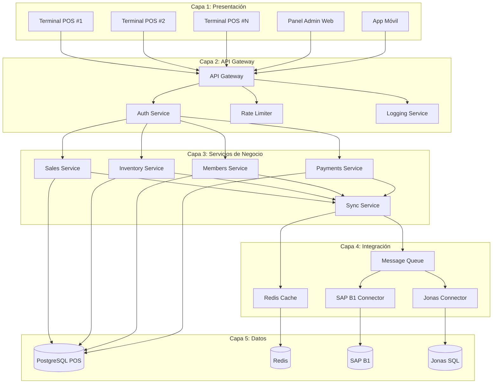
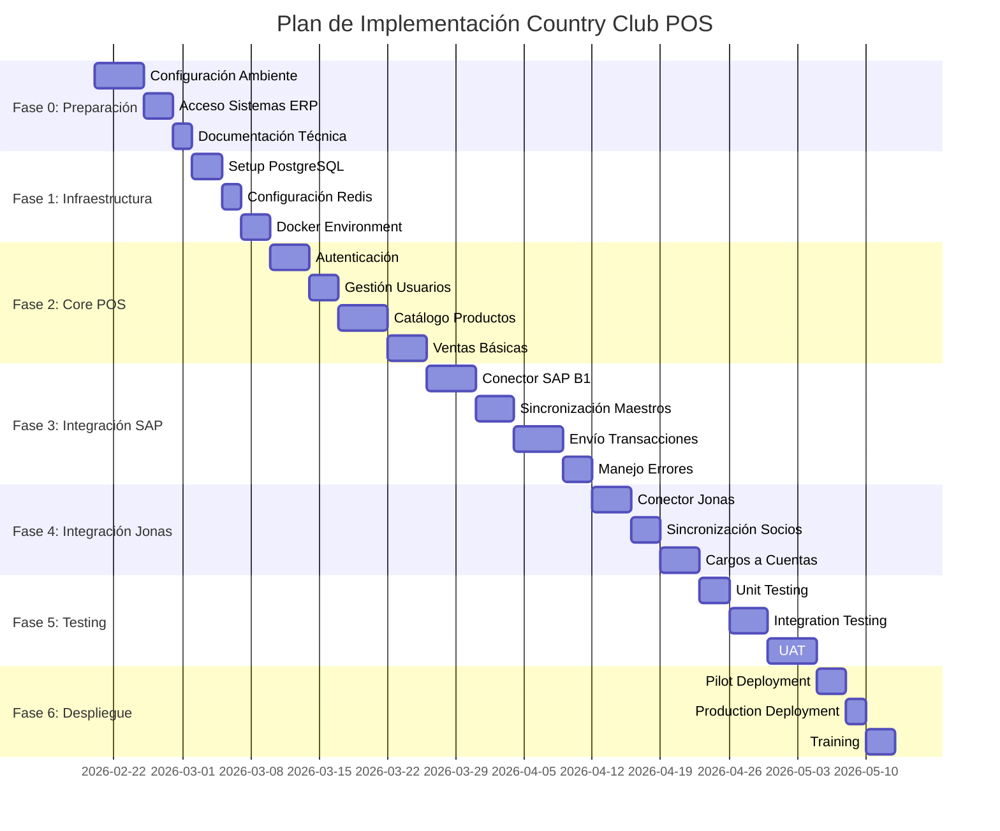

# Plan de Implementación de Integración
## Country Club POS con SAP Business One y Jonas Software
### Fecha: Febrero 2026 | Versión: 1.0

---

## 📋 Resumen Ejecutivo

Este documento establece el plan detallado para implementar la integración del Country Club POS con SAP Business One (ERP principal) y Jonas Software (ERP de construcción/servicios), utilizando PostgreSQL como base de datos aislada y siguiendo las mejores prácticas de integración empresarial.

---

## 🎯 Objetivos del Proyecto

### 1. Objetivos Principales
- **Integración bidireccional** con SAP Business One para ventas, inventario y finanzas
- **Sincronización de datos** con Jonas Software para socios y cargos a cuentas
- **Operación offline-first** con sincronización diferida
- **Auditoría completa** de todas las transacciones
- **Alta disponibilidad** y resiliencia del sistema

### 2. Métricas de Éxito
- **99.5% uptime** del sistema POS
- **95% success rate** en sincronizaciones
- **<30 segundos** latencia promedio de sincronización
- **<5 minutos** tiempo de recuperación ante fallos

---

## 🏗️ Arquitectura de Implementación

### 3.1 Arquitectura por Capas



### 3.2 Tecnologías Seleccionadas

| Componente | Tecnología | Justificación |
|-------------|------------|---------------|
| **Frontend** | Next.js 14 + TypeScript | Moderno, tipado, PWA-ready |
| **Backend** | Node.js + Express | JavaScript full-stack, ecosistema maduro |
| **Base de Datos** | PostgreSQL + Redis | ACID, escalable, caché rápido |
| **Cola de Mensajes** | Redis Bull Queue | Simple, confiable, buen performance |
| **API SAP** | SAP Service Layer (REST) | Recomendado por SAP, estándar OData |
| **Acceso Jonas** | SQL Server Direct | Única opción viable sin API pública |
| **Contenerización** | Docker + Docker Compose | Portabilidad, consistencia |
| **Monitoreo** | Prometheus + Grafana | Observabilidad completa |

---

## 📅 Plan de Fases de Implementación

### 4.1 Timeline General



### 4.2 Detalle de Fases

#### Fase 0: Preparación (1 semana)
**Objetivo**: Configurar ambiente y obtener accesos

**Tareas**:
- [ ] Configurar servidor de desarrollo
- [ ] Instalar PostgreSQL y Redis
- [ ] Obtener credenciales SAP Service Layer
- [ ] Obtener acceso a base de datos Jonas
- [ ] Configurar repositorio Git y pipelines
- [ ] Documentar flujos de negocio actuales

**Entregables**:
- Ambiente de desarrollo funcional
- Acceso confirmado a sistemas ERP
- Documentación inicial de flujos

#### Fase 1: Infraestructura (1 semana)
**Objetivo**: Establecer base técnica

**Tareas**:
- [ ] Configurar PostgreSQL con esquema completo
- [ ] Configurar Redis para caché y colas
- [ ] Setup Docker Compose para desarrollo
- [ ] Configurar CI/CD básico
- [ ] Implementar logging estructurado
- [ ] Configurar monitoreo básico

**Entregables**:
- Base de datos configurada
- Ambiente Docker funcional
- Pipeline CI/CD básico

#### Fase 2: Core POS (2 semanas)
**Objetivo**: Implementar funcionalidad básica del POS

**Tareas**:
- [ ] Implementar sistema de autenticación JWT
- [ ] Crear gestión de usuarios y roles
- [ ] Implementar catálogo de productos
- [ ] Desarrollar flujo de ventas básico
- [ ] Implementar gestión de pagos
- [ ] Crear interfaz POS responsive

**Entregables**:
- Sistema de autenticación funcional
- Catálogo de productos operacional
- Flujo de ventas básico trabajando

#### Fase 3: Integración SAP (2.5 semanas)
**Objetivo**: Conectar con SAP Business One

**Tareas**:
- [ ] Desarrollar conector SAP Service Layer
- [ ] Implementar sincronización de maestros (productos, clientes)
- [ ] Desarrollar envío de transacciones (ventas, facturas)
- [ ] Implementar manejo de errores y reintentos
- [ ] Crear dashboard de estado de sincronización

**Entregables**:
- Conector SAP funcional
- Sincronización bidireccional trabajando
- Dashboard de monitoreo

#### Fase 4: Integración Jonas (1.5 semanas)
**Objetivo**: Conectar con Jonas Software

**Tareas**:
- [ ] Desarrollar conector Jonas SQL Server
- [ ] Implementar sincronización de socios
- [ ] Desarrollar cargos a cuentas
- [ ] Implementar validaciones de negocio Jonas
- [ ] Testing de integración

**Entregables**:
- Conector Jonas funcional
- Sincronización de socios trabajando
- Cargos a cuentas operativos

#### Fase 5: Testing (2 semanas)
**Objetivo**: Asegurar calidad y estabilidad

**Tareas**:
- [ ] Escribir tests unitarios (cobertura >80%)
- [ ] Implementar tests de integración
- [ ] Realizar pruebas de carga
- [ ] Ejecutar pruebas de seguridad
- [ ] Realizar User Acceptance Testing (UAT)

**Entregables**:
- Suite de tests completa
- Reportes de pruebas de carga
- Certificación UAT

#### Fase 6: Despliegue (1 semana)
**Objetivo**: Poner en producción

**Tareas**:
- [ ] Despliegue piloto en un terminal
- [ ] Capacitación a usuarios clave
- [ ] Despliegue completo en producción
- [ ] Monitoreo post-despliegue
- [ ] Documentación final y handover

**Entregables**:
- Sistema en producción
- Usuarios capacitados
- Documentación completa

---

## 👥 Recursos y Responsabilidades

### 5.1 Estructura del Equipo

| Rol | Responsabilidades | Tiempo Dedicación |
|------|------------------|-------------------|
| **Project Manager** | Coordinación general, gestión de riesgos | 100% |
| **Backend Developer** | API, conectores, lógica de negocio | 100% |
| **Frontend Developer** | UI/UX, aplicación POS | 100% |
| **Database Administrator** | PostgreSQL, optimización, backups | 50% |
| **SAP Specialist** | Configuración Service Layer, validación | 30% |
| **Jonas Specialist** | Acceso BD, validación de datos | 30% |
| **QA Engineer** | Testing, automatización, UAT | 100% |
| **DevOps Engineer** | Infraestructura, CI/CD, monitoreo | 50% |

### 5.2 Stakeholders Clave

| Stakeholder | Rol en Proyecto | Expectativas |
|-------------|----------------|-------------|
| **Gerente de TI** | Patrocinador técnico | Sistema estable, documentado |
| **Gerente de Operaciones** | Usuario principal | Flujo de ventas eficiente |
| **Contador** | Validación fiscal | Cumplimiento CFDI, conciliación |
| **Gerente del Club** | Decisor de negocio | Mejora en servicio a socios |
| **SAP Administrator** | Soporte técnico | Integración sin problemas |

---

## ⚠️ Gestión de Riesgos

### 6.1 Matriz de Riesgos

| Riesgo | Probabilidad | Impacto | Severidad | Mitigación |
|--------|--------------|-----------|------------|------------|
| Jonas no permite acceso BD | Alta | Crítico | **ALTO** | Contactar Jonas ANTES de Fase 4 |
| SAP licencias insuficientes | Media | Alto | **MEDIO** | Verificar licencias en Fase 0 |
| Cambios en APIs SAP | Baja | Medio | **BAJO** | Versionado de conectores |
| Performance sincronización | Media | Medio | **MEDIO** | Testing de carga, optimización |
| Resistencia al cambio | Alta | Medio | **MEDIO** | Capacitación temprana, UAT |
| Pérdida de datos | Baja | Crítico | **MEDIO** | Backups automáticos, testing |

### 6.2 Plan de Contingencia

#### Escenario 1: Jonas no permite acceso directo
**Acciones Inmediatas**:
1. Evaluar opciones de API REST de terceros
2. Considerar exportación CSV periódica
3. Desarrollar interfaz manual para cargos
4. Negociar con Jonas para acceso futuro

#### Escenario 2: SAP Service Layer no disponible
**Acciones Inmediatas**:
1. Activar modo offline completo
2. Implementar cola local robusta
3. Notificar a usuarios del modo limitado
4. Monitorear disponibilidad de SAP

#### Escenario 3: Performance degradado
**Acciones Inmediatas**:
1. Identificar cuellos de botella
2. Escalar recursos si necesario
3. Optimizar consultas SQL
4. Implementar caché adicional

---

## 📊 Métricas y KPIs

### 7.1 Métricas Técnicas

| Métrica | Objetivo | Medición |
|---------|-----------|-----------|
| **Uptime del Sistema** | >99.5% | Monitoreo continuo |
| **Tiempo de Respuesta API** | <500ms (p95) | APM |
| **Tasa de Éxito Sincronización** | >95% | Logs de sincronización |
| **Cobertura de Tests** | >80% | Reports de tests |
| **Tiempo de Recuperación** | <5 min | Monitoreo de incidentes |

### 7.2 Métricas de Negocio

| Métrica | Objetivo | Medición |
|---------|-----------|-----------|
| **Velocidad de Atención** | <2 min por venta | Sistema POS |
| **Precisión de Inventario** | >98% | Conciliación física |
| **Satisfacción de Usuarios** | >4.5/5 | Encuestas |
| **Reducción de Errores** | >50% vs. actual | Auditoría |
| **Adopción del Sistema** | >90% de cajeros | Logs de uso |

---

## 🔧 Herramientas y Tecnologías

### 8.1 Stack de Desarrollo

```yaml
Frontend:
  Framework: Next.js 14 (App Router)
  Language: TypeScript
  Styling: TailwindCSS
  State: Zustand
  Forms: React Hook Form
  UI: Headless UI + Lucide Icons

Backend:
  Runtime: Node.js 18+
  Framework: Express.js
  Language: TypeScript
  ORM: Prisma
  Validation: Zod
  Auth: JWT + Refresh Tokens

Database:
  Primary: PostgreSQL 15+
  Cache: Redis 7+
  Migrations: Prisma Migrate
  Backup: pg_dump + WAL-E

Integration:
  SAP: Service Layer (OData v3)
  Jonas: SQL Server Direct
  Queue: Redis Bull Queue
  HTTP: Axios + Retry

DevOps:
  Container: Docker + Docker Compose
  CI/CD: GitHub Actions
  Monitoring: Prometheus + Grafana
  Logging: Winston + ELK Stack

Testing:
  Unit: Jest + Testing Library
  Integration: Supertest
  E2E: Playwright
  Load: k6
```

### 8.2 Configuración de Desarrollo

```bash
# Estructura de directorios
countryclub-pos/
├── src/
│   ├── app/                 # Next.js App Router
│   ├── components/          # React components
│   ├── lib/                # Utilities y configuración
│   ├── services/           # Servicios de negocio
│   ├── integrations/       # Conectores ERP
│   └── types/             # TypeScript types
├── prisma/                # Schema y migraciones
├── tests/                 # Tests
├── docker/                # Docker files
└── docs/                  # Documentación

# Scripts de desarrollo
npm run dev              # Servidor desarrollo
npm run build            # Build producción
npm run test             # Ejecutar tests
npm run lint             # Linting
npm run db:migrate       # Migraciones BD
npm run db:seed          # Datos iniciales
npm run docker:dev       # Ambiente Docker desarrollo
```

---

## 📋 Checklist de Implementación

### 9.1 Pre-Implementación

#### Ambiente Técnico
- [ ] Servidor con 16GB RAM, 4 CPU, 500GB SSD
- [ ] PostgreSQL 15+ instalado y configurado
- [ ] Redis 7+ instalado y configurado
- [ ] Docker y Docker Compose instalados
- [ ] Node.js 18+ instalado
- [ ] Git configurado con SSH keys

#### Accesos y Credenciales
- [ ] Credenciales SAP Service Layer
- [ ] Acceso a base de datos Jonas
- [ ] Licencias SAP verificadas
- [ ] Acceso a repositorios Git
- [ ] Cuentas de servicios (email, notificaciones)

#### Documentación
- [ ] Flujos de negocio documentados
- [ ] Requerimientos funcionales aprobados
- [ ] Esquema de base de datos validado
- [ ] Plan de pruebas definido

### 9.2 Durante Implementación

#### Desarrollo
- [ ] Código siguiendo estándares del equipo
- [ ] Tests unitarios para cada módulo
- [ ] Revisión de código (peer review)
- [ ] Documentación de APIs
- [ ] Logs estructurados implementados

#### Integración
- [ ] Conectores con manejo de errores
- [ ] Reintentos configurados
- [ ] Monitoreo de estado de sincronización
- [ ] Validaciones de negocio implementadas
- [ ] Testing de integración completo

#### Calidad
- [ ] Cobertura de tests >80%
- [ ] Pruebas de carga ejecutadas
- [ ] Pruebas de seguridad realizadas
- [ ] Performance validada
- [ ] UAT con usuarios reales

### 9.3 Post-Implementación

#### Despliegue
- [ ] Backup completo del sistema
- [ ] Despliegue gradual (canary)
- [ ] Monitoreo intensivo primeras 48h
- [ ] Rollback plan preparado
- [ ] Documentación de emergencia

#### Capacitación
- [ ] Manual de usuario final
- [ ] Sesiones de capacitación
- [ ] Videos tutoriales
- [ ] Soporte post-lanzamiento
- [ ] Canal de comunicación abierto

---

## 📈 Monitoreo y Mantenimiento

### 10.1 Dashboard de Monitoreo

```typescript
// Métricas clave a monitorear
interface MonitoringMetrics {
  // Sistema
  systemHealth: {
    uptime: number;           // %
    responseTime: number;     // ms
    errorRate: number;        // %
    throughput: number;       // req/s
  };
  
  // Base de Datos
  database: {
    connections: number;      // activas
    queryTime: number;        // ms avg
    deadlocks: number;        // count/hour
    replicationLag: number;   // seconds
  };
  
  // Integración
  integration: {
    sapSuccessRate: number;   // %
    jonasSuccessRate: number; // %
    queueDepth: number;       // items
    lastSync: Date;          // timestamp
  };
  
  // Negocio
  business: {
    activeUsers: number;     // concurrentes
    salesPerHour: number;    // avg
    avgTicketAmount: number;  // currency
    inventoryAccuracy: number; // %
  };
}
```

### 10.2 Alertas Configuradas

| Alerta | Condición | Severidad | Acción |
|---------|-----------|------------|---------|
| Sistema caído | uptime < 99% | Crítica | Notificación inmediata |
| Cola saturada | queueDepth > 1000 | Alta | Escalar recursos |
| Error SAP | sapSuccessRate < 90% | Alta | Revisar conexión |
| BD lenta | queryTime > 1000ms | Media | Optimizar queries |
| Batería baja | battery < 20% | Baja | Cambiar dispositivo |

---

## 🎓 Capacitación y Documentación

### 11.1 Plan de Capacitación

#### Módulo 1: Operación Básica (4 horas)
- Introducción al sistema
- Login y navegación
- Catálogo de productos
- Flujo de venta básico
- Pagos y cierres

#### Módulo 2: Operación Avanzada (4 horas)
- Descuentos y autorizaciones
- Cargos a socios
- Manejo de devoluciones
- Reportes básicos

#### Módulo 3: Administración (6 horas)
- Gestión de usuarios
- Configuración de productos
- Monitoreo del sistema
- Solución de problemas

#### Módulo 4: Integración (2 horas)
- Estado de sincronización
- Manejo de errores
- Procedimientos de emergencia

### 11.2 Documentación Entregable

- **Manual de Usuario Final** (PDF + Web)
- **Guía de Administrador** (PDF + Web)
- **Referencia de APIs** (OpenAPI/Swagger)
- **Diagramas de Arquitectura** (Mermaid)
- **Procedimientos de Emergencia** (Checklists)
- **Videos Tutoriales** (MP4, 5-10 min cada uno)

---

## 📝 Entregables Finales

### 12.1 Productos de Software

1. **Aplicación POS Web** (Next.js + TypeScript)
2. **API Backend** (Node.js + Express)
3. **Conector SAP B1** (Service Layer)
4. **Conector Jonas** (SQL Server Direct)
5. **Dashboard Administrativo** (React + Charts)
6. **Sistema de Monitoreo** (Grafana + Prometheus)

### 12.2 Documentación Técnica

1. **Arquitectura del Sistema** (diagramas + descripción)
2. **Modelo de Datos** (ERD + diccionario)
3. **API Documentation** (OpenAPI + ejemplos)
4. **Guía de Despliegue** (Docker + scripts)
5. **Plan de Mantenimiento** (procedimientos + SLA)

### 12.3 Activos de Configuración

1. **Base de Datos PostgreSQL** (esquema + datos iniciales)
2. **Configuración Docker** (docker-compose + Dockerfiles)
3. **CI/CD Pipeline** (GitHub Actions)
4. **Monitoreo** (dashboards + alertas)
5. **Backup Scripts** (automatización)

---

## 🚀 Próximos Pasos

### Inmediato (Esta semana)
1. **Confirmar acceso** a sistemas ERP
2. **Setup ambiente** de desarrollo
3. **Asignar equipo** del proyecto
4. **Definir alcance** detallado MVP

### Corto Plazo (Próximas 2 semanas)
1. **Iniciar Fase 0** de preparación
2. **Configurar infraestructura** básica
3. **Desarrollar prototipo** inicial
4. **Validar arquitectura** con stakeholders

### Mediano Plazo (Próximo mes)
1. **Implementar core** del POS
2. **Desarrollar conectores** ERP
3. **Realizar pruebas** integrales
4. **Preparar despliegue** piloto

---

## 📞 Soporte y Contacto

### Equipo del Proyecto
- **Project Manager**: [Nombre] - [email] - [teléfono]
- **Tech Lead**: [Nombre] - [email] - [teléfono]
- **SAP Specialist**: [Nombre] - [email] - [teléfono]
- **Jonas Specialist**: [Nombre] - [email] - [teléfono]

### Canales de Comunicación
- **Slack**: #countryclub-pos
- **Email**: pos-project@countryclubmerida.com
- **Jira**: https://countryclub.atlassian.net
- **Repository**: https://github.com/countryclubmerida/pos-system

---

*Este plan establece la hoja de ruta completa para la implementación exitosa del Country Club POS con integración a SAP Business One y Jonas Software, asegurando entrega a tiempo, dentro de presupuesto y con la calidad esperada.*
