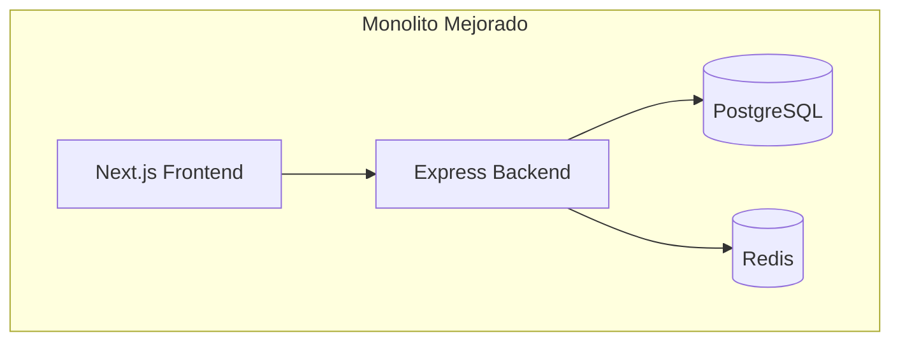
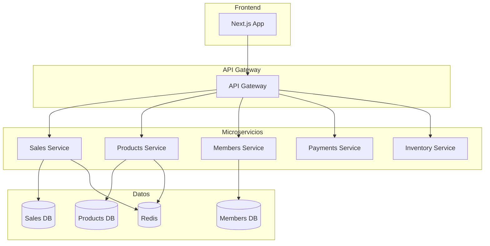
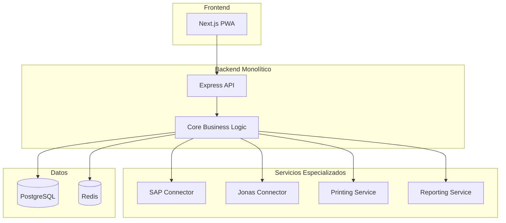

# Alternativas Arquitectónicas - Country Club POS
## Opciones de Implementación y Tecnologías Alternativas
### Fecha: Febrero 2026 | Versión: 1.0

---

## 📋 Resumen Ejecutivo

Este documento explora alternativas arquitectónicas y tecnológicas para el sistema Country Club POS, evaluando diferentes enfoques de implementación, stacks tecnológicos y patrones de diseño para optimizar rendimiento, escalabilidad y mantenibilidad.

---

## 🏗️ Alternativas de Arquitectura General

### 1. Arquitectura Monolítica Mejorada

#### 1.1 Descripción


**Características:**
- Single codebase con frontend y backend juntos
- Despliegue simple y rápido
- Comunicación interna sin overhead de red
- Fácil debugging y testing

**Ventajas:**
- ✅ Desarrollo rápido y sencillo
- ✅ Despliegue simplificado
- ✅ Menor complejidad operativa
- ✅ Compartición de código y tipos

**Desventajas:**
- ❌ Escalabilidad limitada
- ❌ Acoplamiento alto
- ❌ Dificultad para escalar componentes individualmente
- ❌ Impacto de fallos en todo el sistema

#### 1.2 Implementación
```typescript
// Estructura de proyecto monolítica
countryclub-pos/
├── src/
│   ├── app/              # Next.js App Router
│   ├── pages/api/        # API Routes
│   ├── lib/              # Utilidades compartidas
│   ├── components/       # Componentes React
│   └── types/           # Tipos TypeScript
├── prisma/
├── public/
└── package.json

// Ejemplo de API route en monolito
// src/pages/api/sales/index.ts
import { NextApiRequest, NextApiResponse } from 'next';
import { prisma } from '@/lib/prisma';

export default async function handler(
  req: NextApiRequest,
  res: NextApiResponse
) {
  if (req.method === 'GET') {
    const sales = await prisma.sale.findMany({
      include: { lines: true, payments: true }
    });
    return res.json(sales);
  }
  
  if (req.method === 'POST') {
    const sale = await prisma.sale.create({
      data: req.body,
      include: { lines: true, payments: true }
    });
    return res.json(sale);
  }
}
```

### 2. Arquitectura Microservicios

#### 2.1 Descripción


**Características:**
- Servicios independientes con responsabilidades específicas
- Cada servicio tiene su propia base de datos
- Comunicación vía APIs REST/GraphQL
- Despliegue independiente por servicio

**Ventajas:**
- ✅ Escalabilidad granular
- ✅ Independencia tecnológica
- ✅ Aislamiento de fallos
- ✅ Despliegue continuo por servicio

**Desventajas:**
- ❌ Complejidad operativa alta
- ❌ Overhead de comunicación
- ❌ Dificultad en debugging distribuido
- ❌ Mayor infraestructura requerida

#### 2.2 Implementación
```typescript
// Estructura de microservicios
countryclub-pos/
├── frontend/                 # Next.js App
├── api-gateway/             # Gateway central
├── services/
│   ├── sales/              # Servicio de ventas
│   ├── products/           # Servicio de productos
│   ├── members/            # Servicio de socios
│   ├── payments/           # Servicio de pagos
│   └── inventory/          # Servicio de inventario
└── shared/                 # Librerías compartidas

// Ejemplo de servicio de ventas
// services/sales/src/app.ts
import express from 'express';
import { PrismaClient } from '@prisma/client';

const app = express();
const prisma = new PrismaClient();

app.get('/sales', async (req, res) => {
  const sales = await prisma.sale.findMany();
  res.json(sales);
});

app.post('/sales', async (req, res) => {
  const sale = await prisma.sale.create({ data: req.body });
  res.json(sale);
});

app.listen(3001, () => {
  console.log('Sales service running on port 3001');
});
```

### 3. Arquitectura Serverless

#### 3.1 Descripción
```mermaid
graph TB
    subgraph "Frontend"
        UI[Next.js Static App]
    end
    
    subgraph "Serverless Functions"
        SALES_FN[/api/sales]
        PRODUCTS_FN[/api/products]
        MEMBERS_FN[/api/members]
        PAYMENTS_FN[/api/payments]
    end
    
    subgraph "Managed Services"
        DB[(PostgreSQL)]
        CACHE[(Redis)]
        STORAGE[Object Storage]
        QUEUE[Message Queue]
    end
    
    UI --> SALES_FN
    UI --> PRODUCTS_FN
    UI --> MEMBERS_FN
    UI --> PAYMENTS_FN
    
    SALES_FN --> DB
    SALES_FN --> CACHE
    PRODUCTS_FN --> DB
    PAYMENTS_FN --> QUEUE
```

**Características:**
- Funciones auto-escalables bajo demanda
- Pago por uso real
- Sin servidores que administrar
- Integración con servicios managed

**Ventajas:**
- ✅ Escalabilidad infinita automática
- ✅ Costo optimizado por uso
- ✅ Cero mantenimiento de infraestructura
- ✅ Alta disponibilidad por defecto

**Desventajas:**
- ❌ Cold starts
- ❌ Límites de ejecución
- ❌ Vendor lock-in
- ❌ Complejidad en testing local

#### 3.2 Implementación
```typescript
// Estructura serverless con Vercel
countryclub-pos/
├── src/
│   ├── app/              # Next.js App Router
│   └── pages/api/        # Serverless Functions
├── package.json
└── vercel.json

// Ejemplo de función serverless
// src/pages/api/sales/index.ts
import { NextApiRequest, NextApiResponse } from 'next';
import { PrismaClient } from '@prisma/client';

let prisma: PrismaClient;

if (process.env.NODE_ENV === 'production') {
  prisma = new PrismaClient();
} else {
  if (!global.prisma) {
    global.prisma = new PrismaClient();
  }
  prisma = global.prisma;
}

export default async function handler(
  req: NextApiRequest,
  res: NextApiResponse
) {
  try {
    switch (req.method) {
      case 'GET':
        const sales = await prisma.sale.findMany({
          include: { lines: true }
        });
        return res.status(200).json(sales);
        
      case 'POST':
        const sale = await prisma.sale.create({
          data: req.body,
          include: { lines: true }
        });
        return res.status(201).json(sale);
        
      default:
        return res.status(405).json({ error: 'Method not allowed' });
    }
  } catch (error) {
    console.error('Sales API error:', error);
    return res.status(500).json({ error: 'Internal server error' });
  }
}
```

---

## 🛠️ Alternativas de Stack Tecnológico

### 1. Frontend Alternatives

#### 1.1 React vs Vue.js vs Svelte

| Característica | React | Vue.js | Svelte |
|----------------|-------|---------|--------|
| **Learning Curve** | Media | Baja | Muy Baja |
| **Performance** | Alta | Alta | Muy Alta |
| **Bundle Size** | Medio | Bajo | Muy Bajo |
| **Ecosystem** | Muy Grande | Grande | Medio |
| **TypeScript** | Excelente | Bueno | Bueno |
| **SSR/SSG** | Next.js | Nuxt | SvelteKit |

**Recomendación para POS:** **React + Next.js**
- Mayor ecosistema y comunidad
- Mejor soporte para TypeScript
- Más opciones de librerías especializadas en POS

#### 1.2 Implementación Vue.js Alternative
```vue
<!-- Ejemplo de componente de venta en Vue.js -->
<template>
  <div class="pos-screen">
    <div class="product-search">
      <input 
        v-model="searchTerm"
        @input="debouncedSearch"
        placeholder="Buscar producto..."
        class="search-input"
      />
    </div>
    
    <div class="product-list">
      <VirtualList
        :items="filteredProducts"
        :item-height="80"
        v-slot="{ item }"
      >
        <ProductItem 
          :product="item"
          @add-to-sale="addToSale"
        />
      </VirtualList>
    </div>
    
    <div class="current-sale">
      <SaleItems 
        :items="currentSale.items"
        @update-item="updateItem"
        @remove-item="removeItem"
      />
      <SaleSummary :total="currentSale.total" />
    </div>
  </div>
</template>

<script setup lang="ts">
import { ref, computed, onMounted } from 'vue';
import { debounce } from 'lodash-es';

interface Product {
  id: string;
  name: string;
  price: number;
  sku: string;
}

interface SaleItem extends Product {
  quantity: number;
  subtotal: number;
}

const searchTerm = ref('');
const products = ref<Product[]>([]);
const currentSale = ref<{
  items: SaleItem[];
  total: number;
}>({
  items: [],
  total: 0
});

const filteredProducts = computed(() => {
  return products.value.filter(product =>
    product.name.toLowerCase().includes(searchTerm.value.toLowerCase()) ||
    product.sku.toLowerCase().includes(searchTerm.value.toLowerCase())
  );
});

const debouncedSearch = debounce(() => {
  searchProducts();
}, 300);

const searchProducts = async () => {
  // Lógica de búsqueda
};

const addToSale = (product: Product) => {
  const existingItem = currentSale.value.items.find(
    item => item.id === product.id
  );
  
  if (existingItem) {
    existingItem.quantity += 1;
    existingItem.subtotal = existingItem.quantity * existingItem.price;
  } else {
    currentSale.value.items.push({
      ...product,
      quantity: 1,
      subtotal: product.price
    });
  }
  
  updateTotal();
};

const updateTotal = () => {
  currentSale.value.total = currentSale.value.items.reduce(
    (sum, item) => sum + item.subtotal,
    0
  );
};

onMounted(() => {
  loadProducts();
});
</script>
```

### 2. Backend Alternatives

#### 2.1 Node.js vs .NET Core vs Python FastAPI

| Característica | Node.js | .NET Core | Python FastAPI |
|----------------|---------|-----------|----------------|
| **Performance** | Alta | Muy Alta | Media |
| **Type Safety** | TypeScript | Nativo | Opcional |
| **Ecosystem** | Muy Grande | Grande | Grande |
| **Learning Curve** | Baja | Media | Baja |
| **Deployment** | Simple | Complejo | Simple |
| **Database Support** | Excelente | Excelente | Bueno |

**Recomendación para POS:** **Node.js + TypeScript**
- Consistencia con frontend (JavaScript)
- Mejor para I/O operations (típico en POS)
- Mayor flexibilidad y velocidad de desarrollo

#### 2.2 Implementación .NET Core Alternative
```csharp
// Ejemplo de API de ventas en .NET Core
// Services/Sales/SalesController.cs
using Microsoft.AspNetCore.Mvc;
using Microsoft.EntityFrameworkCore;
using System.Threading.Tasks;

[ApiController]
[Route("api/[controller]")]
public class SalesController : ControllerBase
{
    private readonly POSDbContext _context;
    private readonly ILogger<SalesController> _logger;

    public SalesController(
        POSDbContext context,
        ILogger<SalesController> logger)
    {
        _context = context;
        _logger = logger;
    }

    [HttpGet]
    public async Task<ActionResult<IEnumerable<Sale>>> GetSales()
    {
        var sales = await _context.Sales
            .Include(s => s.Lines)
            .Include(s => s.Payments)
            .ToListAsync();
        
        return Ok(sales);
    }

    [HttpPost]
    public async Task<ActionResult<Sale>> CreateSale(CreateSaleDto dto)
    {
        try
        {
            var sale = new Sale
            {
                Folio = await GenerateFolio(),
                TerminalId = dto.TerminalId,
                CreatedByUserId = dto.CreatedByUserId,
                Status = "ACTIVE",
                CreatedAt = DateTime.UtcNow,
                Lines = dto.Lines.Select(l => new SaleLine
                {
                    ProductId = l.ProductId,
                    Quantity = l.Quantity,
                    UnitPrice = l.UnitPrice,
                    LineTotal = l.Quantity * l.UnitPrice,
                    CreatedAt = DateTime.UtcNow
                }).ToList(),
                Payments = dto.Payments.Select(p => new Payment
                {
                    Method = p.Method,
                    Amount = p.Amount,
                    Status = "PENDING",
                    CreatedAt = DateTime.UtcNow
                }).ToList()
            };

            // Calcular totales
            sale.Subtotal = sale.Lines.Sum(l => l.LineTotal);
            sale.TaxAmount = sale.Subtotal * 0.16m;
            sale.TotalAmount = sale.Subtotal + sale.TaxAmount;

            _context.Sales.Add(sale);
            await _context.SaveChangesAsync();

            _logger.LogInformation("Sale created: {SaleId}", sale.Id);

            return CreatedAtAction(nameof(GetSale), new { id = sale.Id }, sale);
        }
        catch (Exception ex)
        {
            _logger.LogError(ex, "Error creating sale");
            return StatusCode(500, "Internal server error");
        }
    }

    [HttpGet("{id}")]
    public async Task<ActionResult<Sale>> GetSale(Guid id)
    {
        var sale = await _context.Sales
            .Include(s => s.Lines)
            .Include(s => s.Payments)
            .FirstOrDefaultAsync(s => s.Id == id);

        if (sale == null)
        {
            return NotFound();
        }

        return Ok(sale);
    }

    private async Task<string> GenerateFolio()
    {
        var date = DateTime.Now.ToString("yyyyMMdd");
        var count = await _context.Sales
            .CountAsync(s => s.CreatedAt.Date == DateTime.Today);
        
        return $"POS-{date}-{(count + 1).ToString("D4")}";
    }
}

// Models/Sale.cs
using System;
using System.Collections.Generic;

public class Sale
{
    public Guid Id { get; set; }
    public string Folio { get; set; }
    public Guid TerminalId { get; set; }
    public Guid CreatedByUserId { get; set; }
    public string Status { get; set; }
    public decimal Subtotal { get; set; }
    public decimal TaxAmount { get; set; }
    public decimal TotalAmount { get; set; }
    public DateTime CreatedAt { get; set; }
    public DateTime? UpdatedAt { get; set; }
    
    // Navigation properties
    public List<SaleLine> Lines { get; set; } = new List<SaleLine>();
    public List<Payment> Payments { get; set; } = new List<Payment>();
}
```

### 3. Database Alternatives

#### 3.1 PostgreSQL vs MySQL vs MongoDB

| Característica | PostgreSQL | MySQL | MongoDB |
|----------------|------------|--------|----------|
| **ACID Compliance** | Completo | Completo | Parcial |
| **JSON Support** | Excelente | Bueno | Nativo |
| **Performance** | Alta | Alta | Alta |
| **Scalability** | Vertical | Vertical | Horizontal |
| **Complex Queries** | Excelente | Bueno | Limitado |
| **Ecosystem** | Excelente | Excelente | Bueno |

**Recomendación para POS:** **PostgreSQL**
- Mejor soporte para transacciones ACID (crítico para POS)
- Excelente soporte para JSON (para datos flexibles)
- Mayor robustez y confiabilidad
- Mejor para consultas complejas de reporting

#### 3.2 Implementación con MongoDB Alternative
```typescript
// Esquema de venta en MongoDB
// models/Sale.ts
import { Schema, model, Document } from 'mongoose';

interface ISale extends Document {
  folio: string;
  terminalId: string;
  createdByUserId: string;
  status: 'ACTIVE' | 'VOIDED' | 'REFUNDED';
  subtotal: number;
  taxAmount: number;
  totalAmount: number;
  lines: ISaleLine[];
  payments: IPayment[];
  createdAt: Date;
  updatedAt?: Date;
}

interface ISaleLine {
  productId: string;
  quantity: number;
  unitPrice: number;
  lineTotal: number;
  modifiers?: any[];
  notes?: string;
}

interface IPayment {
  method: 'CASH' | 'CARD' | 'MEMBER_ACCOUNT';
  amount: number;
  reference?: string;
  status: 'PENDING' | 'CAPTURED' | 'VOIDED';
}

const SaleSchema = new Schema<ISale>({
  folio: { type: String, required: true, unique: true },
  terminalId: { type: String, required: true },
  createdByUserId: { type: String, required: true },
  status: { 
    type: String, 
    enum: ['ACTIVE', 'VOIDED', 'REFUNDED'], 
    default: 'ACTIVE' 
  },
  subtotal: { type: Number, required: true },
  taxAmount: { type: Number, default: 0 },
  totalAmount: { type: Number, required: true },
  lines: [{
    productId: { type: String, required: true },
    quantity: { type: Number, required: true },
    unitPrice: { type: Number, required: true },
    lineTotal: { type: Number, required: true },
    modifiers: [Schema.Types.Mixed],
    notes: String
  }],
  payments: [{
    method: { 
      type: String, 
      enum: ['CASH', 'CARD', 'MEMBER_ACCOUNT'], 
      required: true 
    },
    amount: { type: Number, required: true },
    reference: String,
    status: { 
      type: String, 
      enum: ['PENDING', 'CAPTURED', 'VOIDED'], 
      default: 'PENDING' 
    }
  }],
  createdAt: { type: Date, default: Date.now },
  updatedAt: { type: Date }
});

// Índices para rendimiento
SaleSchema.index({ folio: 1 });
SaleSchema.index({ terminalId: 1, createdAt: -1 });
SaleSchema.index({ status: 1, createdAt: -1 });
SaleSchema.index({ createdByUserId: 1, createdAt: -1 });

export const Sale = model<ISale>('Sale', SaleSchema);

// Servicio de ventas con MongoDB
// services/SaleService.ts
import { Sale } from '../models/Sale';

export class SaleService {
  async createSale(saleData: Partial<ISale>): Promise<ISale> {
    // Generar folio único
    const folio = await this.generateFolio();
    
    const sale = new Sale({
      ...saleData,
      folio,
      createdAt: new Date()
    });
    
    return await sale.save();
  }
  
  async getSales(filters: {
    terminalId?: string;
    status?: string;
    dateFrom?: Date;
    dateTo?: Date;
    page?: number;
    limit?: number;
  }): Promise<{ sales: ISale[]; total: number }> {
    const query: any = {};
    
    if (filters.terminalId) {
      query.terminalId = filters.terminalId;
    }
    
    if (filters.status) {
      query.status = filters.status;
    }
    
    if (filters.dateFrom || filters.dateTo) {
      query.createdAt = {};
      if (filters.dateFrom) {
        query.createdAt.$gte = filters.dateFrom;
      }
      if (filters.dateTo) {
        query.createdAt.$lte = filters.dateTo;
      }
    }
    
    const page = filters.page || 1;
    const limit = filters.limit || 20;
    const skip = (page - 1) * limit;
    
    const [sales, total] = await Promise.all([
      Sale.find(query)
        .sort({ createdAt: -1 })
        .skip(skip)
        .limit(limit)
        .lean(),
      Sale.countDocuments(query)
    ]);
    
    return { sales, total };
  }
  
  private async generateFolio(): Promise<string> {
    const today = new Date();
    const dateStr = today.toISOString().slice(0, 10).replace(/-/g, '');
    
    const count = await Sale.countDocuments({
      createdAt: {
        $gte: today.setHours(0, 0, 0, 0),
        $lt: today.setHours(23, 59, 59, 999)
      }
    });
    
    return `POS-${dateStr}-${(count + 1).toString().padStart(4, '0')}`;
  }
}
```

---

## 🔄 Patrones de Diseño Alternativos

### 1. CQRS (Command Query Responsibility Segregation)

#### 1.1 Descripción
Separar las operaciones de lectura (queries) de las de escritura (commands) en modelos diferentes.

```typescript
// Implementación de CQRS para ventas
// Commands (Escritura)
interface CreateSaleCommand {
  terminalId: string;
  createdByUserId: string;
  lines: SaleLineData[];
  payments: PaymentData[];
}

class CreateSaleHandler {
  async handle(command: CreateSaleCommand): Promise<string> {
    // Lógica de creación de venta
    const sale = await this.saleRepository.create(command);
    
    // Publicar eventos
    await this.eventBus.publish(new SaleCreatedEvent(sale));
    
    return sale.id;
  }
}

// Queries (Lectura)
interface GetSalesQuery {
  terminalId?: string;
  dateFrom?: Date;
  dateTo?: Date;
  page?: number;
  limit?: number;
}

class GetSalesHandler {
  async handle(query: GetSalesQuery): Promise<SaleReadModel[]> {
    // Lógica de lectura optimizada
    return await this.saleReadRepository.find(query);
  }
}

// Read Model optimizado para consultas
interface SaleReadModel {
  id: string;
  folio: string;
  terminalName: string;
  cashierName: string;
  totalAmount: number;
  status: string;
  createdAt: Date;
  lineCount: number;
  paymentMethods: string[];
}
```

### 2. Event Sourcing

#### 2.1 Descripción
Almacenar todos los cambios como eventos en lugar de estado actual.

```typescript
// Implementación de Event Sourcing
interface SaleEvent {
  id: string;
  type: string;
  aggregateId: string;
  data: any;
  timestamp: Date;
  version: number;
}

class SaleAggregate {
  private id: string;
  private version: number;
  private events: SaleEvent[] = [];
  private state: SaleState;

  constructor(events: SaleEvent[] = []) {
    this.version = 0;
    this.state = new SaleState();
    
    for (const event of events) {
      this.apply(event);
    }
  }

  static create(data: CreateSaleData): SaleAggregate {
    const aggregate = new SaleAggregate();
    const event = new SaleCreatedEvent({
      aggregateId: generateId(),
      data,
      timestamp: new Date(),
      version: 1
    });
    
    aggregate.apply(event);
    return aggregate;
  }

  addLine(lineData: SaleLineData): void {
    const event = new SaleLineAddedEvent({
      aggregateId: this.id,
      data: lineData,
      timestamp: new Date(),
      version: this.version + 1
    });
    
    this.apply(event);
  }

  private apply(event: SaleEvent): void {
    switch (event.type) {
      case 'SaleCreated':
        this.state = new SaleState(event.data);
        this.id = event.aggregateId;
        break;
        
      case 'SaleLineAdded':
        this.state.addLine(event.data);
        break;
        
      case 'SaleVoided':
        this.state.void();
        break;
    }
    
    this.events.push(event);
    this.version = event.version;
  }

  getUncommittedEvents(): SaleEvent[] {
    return this.events;
  }

  markEventsAsCommitted(): void {
    this.events = [];
  }
}
```

### 3. Saga Pattern

#### 3.1 Descripción
Manejar transacciones distribuidas a través de una secuencia de operaciones compensables.

```typescript
// Implementación de Saga para proceso de venta
class SaleSaga {
  async execute(saleData: CreateSaleData): Promise<void> {
    const saga = new Saga();
    
    try {
      // Paso 1: Crear venta
      const sale = await saga.executeStep(
        () => this.saleService.create(saleData),
        (sale) => this.saleService.delete(sale.id)
      );
      
      // Paso 2: Actualizar inventario
      await saga.executeStep(
        () => this.inventoryService.reserve(sale.lines),
        (reservation) => this.inventoryService.release(reservation.id)
      );
      
      // Paso 3: Procesar pagos
      await saga.executeStep(
        () => this.paymentService.process(sale.payments),
        (payments) => this.paymentService.refund(payments)
      );
      
      // Paso 4: Enviar a ERP
      await saga.executeStep(
        () => this.erpService.sendSale(sale),
        (erpSale) => this.erpService.cancelSale(erpSale.id)
      );
      
      // Paso 5: Imprimir ticket
      await saga.executeStep(
        () => this.printerService.print(sale),
        () => { /* No se puede des-imprimir */ }
      );
      
    } catch (error) {
      // La saga automáticamente ejecuta las compensaciones
      throw error;
    }
  }
}

class Saga {
  private compensations: (() => Promise<void>)[] = [];
  
  async executeStep<T>(
    execute: () => Promise<T>,
    compensate: (result: T) => Promise<void>
  ): Promise<T> {
    const result = await execute();
    this.compensations.push(() => compensate(result));
    return result;
  }
  
  async compensate(): Promise<void> {
    // Ejecutar compensaciones en orden inverso
    for (let i = this.compensations.length - 1; i >= 0; i--) {
      try {
        await this.compensations[i]();
      } catch (error) {
        console.error('Compensation failed:', error);
      }
    }
    this.compensations = [];
  }
}
```

---

## 📊 Comparación de Alternativas

### 1. Matriz de Decisión

| Criterio | Monolítico | Microservicios | Serverless |
|----------|------------|-----------------|------------|
| **Complejidad Desarrollo** | Baja | Alta | Media |
| **Time to Market** | Rápido | Lento | Medio |
| **Escalabilidad** | Limitada | Excelente | Automática |
| **Costo Infraestructura** | Bajo | Alto | Optimizado |
| **Mantenimiento** | Simple | Complejo | Medio |
| **Testing** | Simple | Complejo | Medio |
| **Despliegue** | Simple | Complejo | Simple |
| **Resiliencia** | Media | Alta | Alta |

### 2. Recomendación por Escenario

#### Escenario 1: MVP Rápido (3-4 meses)
**Recomendación:** **Monolítico Mejorado**
- Prioridad: velocidad de desarrollo
- Equipo pequeño (3-5 personas)
- Budget limitado
- Requisitos cambiantes

#### Escenario 2: Sistema a Escala (6+ meses)
**Recomendación:** **Microservicios**
- Prioridad: escalabilidad y mantenibilidad
- Equipo mediano (8+ personas)
- Budget adecuado
- Requisitos estables

#### Escenario 3: Startup con Trafico Variable
**Recomendación:** **Serverless**
- Prioridad: costo optimizado
- Equipo pequeño (2-4 personas)
- Trafico impredecible
- Necesidad de escalabilidad automática

---

## 🎯 Recomendación Final para Country Club POS

### Arquitectura Híbrida Recomendada



### Justificación

1. **Fase 1**: Monolítico para desarrollo rápido del MVP
2. **Fase 2**: Extraer servicios especializados (integración ERPs)
3. **Fase 3**: Migrar a microservicios si es necesario
4. **Flexibilidad**: Permite evolucionar según necesidades

### Stack Tecnológico Final

- **Frontend**: Next.js 14 + TypeScript + TailwindCSS
- **Backend**: Node.js + Express + TypeScript
- **Database**: PostgreSQL + Redis
- **Integración**: Conectores especializados para SAP/Jonas
- **Despliegue**: Docker + Kubernetes (futuro)

Esta arquitectura híbrida ofrece el balance perfecto entre velocidad de desarrollo, mantenibilidad y capacidad de evolución a largo plazo.
